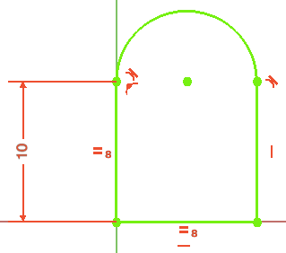
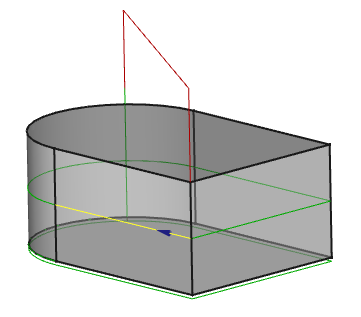

# Path Postprocessor Customization
## Introduction

FreeCAD uses as internal representation for the generated paths, so called G-codes. They can describe such things as: speed and feed rates, stopping the motor etc\... But the most important thing is the movements they describe. These movements are rather simple: They can be straight lines or they can be circular arcs. More sophisticated curves such as B-splines are already approximated by FreeCAD\'s  [Path Workbench](Path_Workbench.md).

## What the postprocessor can do for you 

Many mills use G-codes as well to control the milling process. They may look almost like the internal codes, but there may be some differences:

-   the machine can have a special startup sequence
-   it can have a special stop sequence
-   arcs can be defined with a relative or an absolute center
-   it may require line numbers in a certain format
-   it can used so called canned cycles for predefined subprocesses such as drilling
-   you might prefer your G-code output in either metric or imperial units.
-   it might be useful to perform a set of moves prior to calling for a tool change to make the action easier for the operator
-   you might wish to include comments for readability or suppress them to keep the program small
-   you might wish to include a custom header to identify or document the program for future reference.
-   \...

Furthermore there are other languages to control a mill, such as HPGL, DXF, or others.

The postprocessor is a program which translates the internal codes into a complete file, that can be uploaded to your machine.

## Preparation for writing your own postprocessor 

You may start with a very simple model showing how your machine reads straight lines and arcs. Prepare it with any program suitable for your machine.

A file for such paths starting at (0,0,0) and going towards Y would be helpful. Make sure it is the tool itself moving along this path, i.e. no tool radius compensation must be applied.



The path in FreeCAD would look like this. Please note the small blue arrow, it indicates the starting direction. For a very first go you may provide only one level in the XY-plane.



You can then have a look at the file and compare it to the output of existing postprocessors such as {{FileName|linux_cnc_post.py}} or {{FileName|grbl_post.py}} and try yourself to adapt them or you upload your to the [Path forum](https://forum.freecadweb.org/viewforum.php?f=15) to get some help.

## Naming convention 

For a file format {{FileName|<filename>}} the postprocessor should get the name {{FileName|<filename>_post.py}}. Please note that the postfix and extension, {{FileName|_post.py}}, have to be lower case.

If you are testing, place it in your macro directory. If it functions well, please consider providing it for others to benefit (post it to the FreeCAD Path forum) so that it can be included in the FreeCAD distribution going forward.

## Other existing postprocessors 

For comparison you may look at the postprocessors which come with your FreeCAD installation. They are located under the directory /Mod/Path/PathScripts/post. Widely used are the [linuxcnc](http://linuxcnc.org/) and the [grbl](https://github.com/grbl/grbl) postprocessors. Studying their code can give helpful insights.

## Programming your own postprocessor 

This post discusses some internals from the linuxcnc postprocessors. The same strucure is used in other postprocessors as well.

Looking at linux\_cnc\_post.py, you\'ll see the export function (as of 0.19.20514 its at line 156)

 
```python
def export(objectslist, filename, argstring):
    # pylint: disable=global-statement
    ...
    gcode = ""
    ...
    ...
``` it collects step by step in the variable \"gcode\" the processed G-codes and handles the overall exporting of post-processable objects (operations, tools, jobs ,etc). Export handles the high level stuff like comments and coolant but any objects that have multiple path commands (tool changes and operations) it delegates to the parse function (as of 0.19.20514 its at line 288).

 
```python
def parse(pathobj):
    ...
    out = ""
    lastcommand = None
    ...
    ...
``` Similarly to the \"export\" function collects parse the G-codes in the variable \"out\". In the variable \"command\" the commands as seen in the Path workbench\'s \"inspect G-code\" function are stored and can be investigated for further processing.

 
```python
        for c in pathobj.Path.Commands:

            command = c.Name
``` It recognizes the different G, M, F, S, and other G-codes. By remembering the last command in the variable \"lastcommand\" it can suppress subsequent repetitions of modal commands.

Both parse and export are just formatting strings and concatenating them together into what will be the final output.

You\'ll see that both functions also call the \"linenumber()\" function. If the user wants line numbers, the linenumber function returns the string to stick in to the appropriate spot, otherwise it returns an empty string so nothing is added.

## Related

-    [Path PostProcess](Path_Post.md)


 {{Path_Tools_navi}}

---
[documentation index](../README.md) > [Path](Path_Workbench.md) > Path Postprocessor Customization
