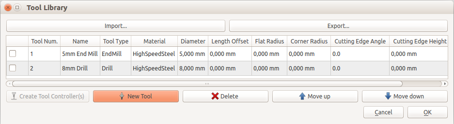

---
- GuiCommand:
   Name:Path ToolLibraryEdit
   MenuLocation:Path → Tool Manager
   Workbenches:[Path](Path_Workbench.md)
   Shortcut:**P** **T**
   SeeAlso:
---

# Path ToolLibraryEdit

## Description

The ** [Tool Manager/Editor](Path_ToolLibraryEdit.md)** allows to edit the different tools of the tooltable contained in the machine object of a ** [Path Job](Path_Job.md)**. This tooltable is used by the different operations contained in the project to obtain necessary information about the current tool.

It serves for the selection of a tool which you want to use in your job as well.

  

The handling is straight forward:

-   Import\...: Imports a tooltable from an XML-file. {{Note|Warning|This is currently partly broken and does not work if you have never had an xml file before.}}
-   Export\...: Exports the tooltable to an XML-file.
-   New Tool: opens a dialog where you can enter the parameters of your tool.
-   Delete: deletes the currently selected lines.{{Note|Warning|The tools are deleted from your tooltable even if you cancel the dialog}}
-   Move up: You cannot edit the tool number, instead you can move the selected line up to decrease it\'s tool number
-   Move down: You can move the selected line down to increase it\'s tool number

-   Create Tool Controller(s): If you check one or more of the checkboxes to the left in the tools list, this button becomes active. If you click it, the selected tools will be inserted in your current job.

## Usage

1.  Select a ** [Path Job](Path_Job.md)
**
2.  Invoke the Tool Manager using several methods:
    -   Press the ** [Tool Manager](Path_ToolLibraryEdit.md)** button in the toolbar.
    -   Using the **P** then **T** keyboard shortcut.
    -   Using the **Path → Tool Manager** entry from the top menu.
3.  Create new tools or adjust the properties of existing tools.
    Set at least the diameter, FreeCAD needs it to calculate the radius compensation. As of <small>(v0.17)</small>  this is the only value used for path creation. However, if you wish to use the simulation tool later, add cutting edge angle and cutting edge height as well.
    

## Options

-   The tools can be reordered by using the move up/move down buttons
-   Complete tooltables can be imported from XML files (FreeCAD\'s own tooltable format) or from HeeksCAD tooltables

 {{Path_Tools_navi}}

---
 [documentation index](../README.md) > [Path](Path_Workbench.md) > Path ToolLibraryEdit
