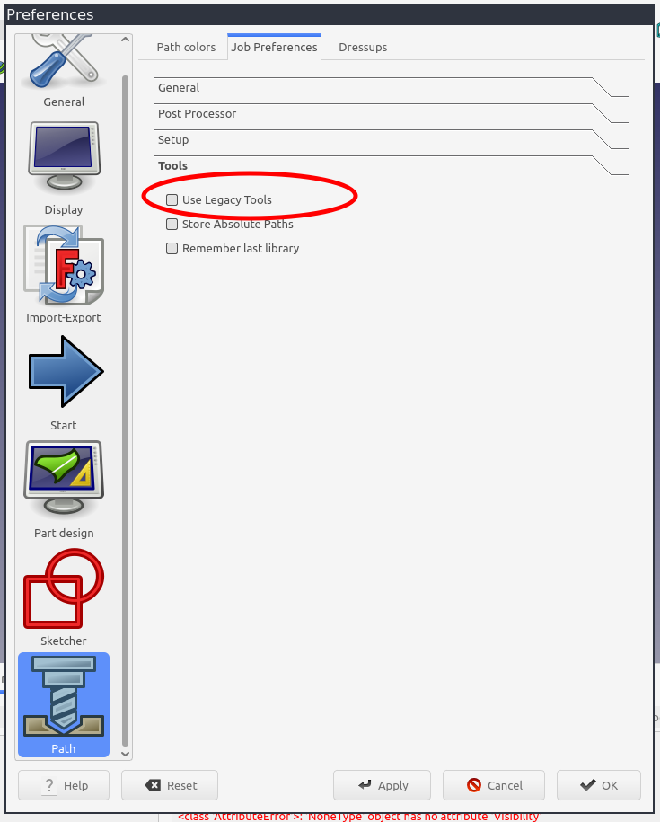

# Path Tools
## Description

This page describes the ToolBit architecture used in the [Path Workbench](Path_Workbench.md) which became the default for FreeCAD v 0.19. For the older \'Legacy\' tool system see [Path ToolLibraryEdit](Path_ToolLibraryEdit.md). Tools in the Path workbench are handled differently than in other CAM packages.

There are several concepts that the user needs to understand:

-   [Path ToolShapes](Path_ToolShape.md): are templates for creating toolbits. Toolshapes are FreeCAD documents that model the tool using named constraints. The toolshape is an *abstract* tool template from which tool instances (called toolbits) are created. For example, all endmills will share the same toolshape file.

-   [Path ToolBits](Path_ToolBit.md): are instances of a toolshape. A toolbit will have *specific* values for each of the named constraints in the toolshape. A toolbit is used in a Path Job through a Tool Controller (TC). The same toolbit can exist in multiple libraries.

-   [Path ToolBit Library](Path_ToolBit_Library.md): contains an arbitrary collection of toolbits. The specific tools in a library is entirely up to the user. Possible use cases for libraries:
    -   A hobbyist user may have only one library for all of the tools they own.
    -   A library may contain all the tools used for a specific material like aluminum or wood.
    -   A library may have toolbits for working on specific material.
    -   A library may hold toolbits from a specific supplier.
    -   A library may correspond to an automatic tool changer layout.

A [Tool Controller](Path_ToolController.md) controls how a tool is used in a Path Job. A controller combines the toolbit with properties for spindle speed, direction and Horizontal/Vertical feed rates.

## Dialogs

The user will interact via path menu with the tool management system in two different workflows. Each workflow has dedicated GUI elements.

-    ** [Toolbit Dock](Path_ToolBitDock.md)**view indicated at the box top as *Tool selector*, for using tools in a Path Job by creating Tool Controllers.

-    ** [Toolbit Library Manager](Path_ToolBitLibraryOpen.md)**for managing the user\'s Toolbit collection with *Create Toolbit*, *Add Existing* and *Remove* buttons.

## Organization

When FreeCAD is installed an example hierarchy of tool libraries and toolbits is created in the installation directory at:

-   On Linux it is usually {{FileName|/usr/lib64/FreeCAD/Mod/Path/Tools}}
-   On Windows it is usually {{FileName|C:\Program Files\FreeCAD\Mod\Path\Tools}}
-   On macOS it is usually {{FileName|/Applications/FreeCAD/Mod/Path/Tools}} {{ColoredText||Red|--> has to be revised}}

    Tools
      + Bit
      + Library
      + Shape

It is always recommended to store the new created toolbits and libraries in a safe location to avoid them being overwritten on a program upgrade. Even custom toolshapes can be stored in arbitrary locations where they can be backed up. The user is encouraged, however, to use a comparable logical structure as shown above to keep toolbits and libraries well organized. When the Tool library Manager is opened, Path checks the location of the working directory. If the location is not writeable or is the same as the example/default location, Path will prompt the user to select or create a new working directory.

## Options

References to Tool Bits and their shapes can either be stored with an absolute path or with a relative path to the search path. Generally it is recommended to use relative paths due to their flexibility and robustness to layout changes. Should multiple tools or tool shapes with the same name exist in different directories it can be required to use absolute paths.

See [Path Preferences](Path_Preferences.md) to choose whether absolute or relative paths are used.

## Migrating from Legacy Tools 

If you have been using FreeCAD Path workbench for a while, you may need to adjust your preferences before you can use the Toolbit system. If pressing the Tool Library button on the toolbar shows the legacy dialog, go to the page below in [Path Preferences](Path_Preferences.md) and disable legacy tools.
You have to restart FreeCAD to make the change valid.

## Getting Started with Tools in FC 0.19 

Read the \Migrating from Legacy Tools\ section above. The steps below will walk you through the process of getting a ToolBit into your particular ** [Path Job](Path_Job.md)**.

In short, the process begins with a Tool Shape (profile) file that contains only a FreeCAD sketch of half the tool\'s physical shape (profile). This tool shape file is then used as the basis to create a ToolBit file containing the 3D representation of the ToolBit or cutter. One or more ToolBits are assigned to any number of Tool Libraries as needed by the user. This structure and workflow allows for sharing of Tool Shapes, ToolBits, and entire Tool Libraries - a giant leap forward from the Legacy tool management system in place prior to version 0.19.

### Verify or create a Tool Shape 

Getting a cutter or tool into a Path Job for use in operations starts with a [Tool Shape](Path_ToolShape.md). This step of verification or creation of a Tool Shape is not necessary if you already have an existing ToolBit available.

#### Verify your desired Tool Shape exists 

-   FreeCAD includes a set of common tool shapes with each distribution. Visit the [ToolShapes](Path_ToolShape.md) page to see the list of included, common tool shapes.
-   You might have additional tool shape files available in your personal files.
-   Be mindful of the greater ToolBit system [organization](Path_Tools#Organization.md) as mentioned above.

#### Create a new Tool Shape 

:   Follow the instructions outlined in the [Usage](Path_ToolShape#Usage.md) section of the [Tool Shape](Path_ToolShape.md) page to create a custom tool shape.

### Load or create a ToolBit 

Once the desired tool shape(profile) exists, you need to create a [tool bit](Path_ToolBit.md) using the tool shape (profile).

1.  In the  [Path Workbench](Path_Workbench.md) menu bar, navigate to **Path → Create Tool**.
2.  In the [Tool Bit](Path_ToolBit.md) creation task panel that appears, give the new tool bit a name and select the corresponding tool shape file as the basis for this new tool bit.
3.  A thumbnail of the selected tool shape should appear along with a list of parameters.
4.  Set the Bit Parameters as desired.
5.  Click **OK** to save the new tool bit.
6.  The new Tool Bit will appear in the FreeCAD object tree.

### Save the new ToolBit 

1.  Locate and select the new tool bit in the object tree in the main FreeCAD window.
2.  In the  [Path Workbench](Path_Workbench.md) menu bar, navigate to, and select, **Path → Save Tool as...**.
3.  A pop-up window will appear.
4.  Navigate to the folder where you wish to save the new tool bit file.
5.  Enter a file name for the tool bit.
6.  Click the **Save** button.

### Register the ToolBit in a Tool Library 

1.  In the  [Path Workbench](Path_Workbench.md) menu bar, navigate to **Path → Open ToolBit Library editor**.
2.  The [ToolBit Library Manager](Path_ToolBitLibraryOpen.md) window will open.
3.  At the top of this window, verify or set the path to the folder containing your existing tool libraries, or the location you want to store your tool libraries.
4.  Under the path entry, on the left is the Tool Libraries list area. Click on an existing tool library you wish to use as the destination for your new tool bit, or click the green plus icon to create new Tool Library in the folder identified above.
5.  On the right side of the Tool Library editor window is the Tool Bit list and action buttons for the currently selected tool library. Click the **Add ToolBit** icon.
6.  In the file navigation window that opens, navigate to your new tool bit, select it, and click the **Open** button. The new tool bit will be added to the active tool library.
7.  Be sure to click the **Save Table** button at the bottom of the Tool Library window in order to save the changes.
8.  Leave this ToolBit Library window open for the next step.
9.  Once your ToolBits are created and saved in a ToolBit Library, you may reuse them.

### Add a ToolBit Tool Controller to a Job 

1.  In the open Tool Library window, locate and activate the desired tool library.
2.  Select the desired tool bit(s) to be added to the Job. Select multiple by holding down the CTRL key when selecting.
3.  Click the **Add Tool Controller(s) to Job** button.
4.  Close the ToolBit Library

## Related

-   [Path ToolBit](Path_ToolBit.md)
-   [Path ToolBitLibraryOpen](Path_ToolBitLibraryOpen.md)

 {{Path_Tools_navi}}

---
 [documentation index](../README.md) > [Path](Path_Workbench.md) > Path Tools
