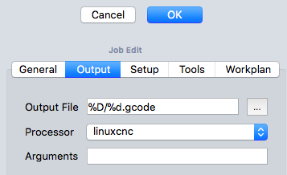
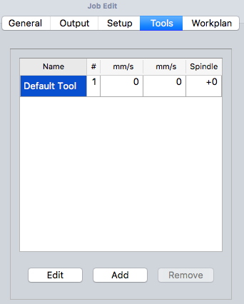
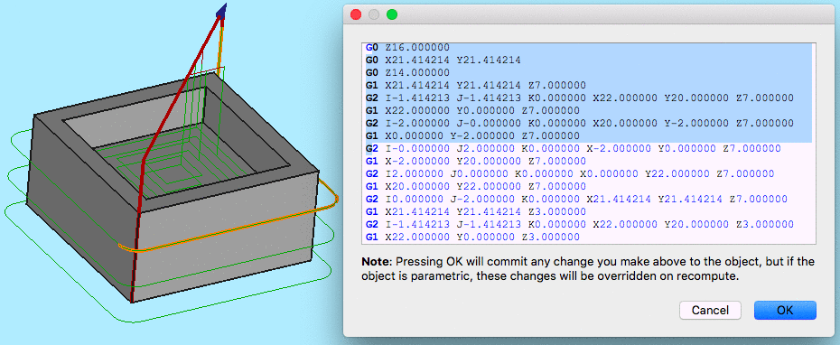

# Path Walkthrough for the Impatient

 

## Aim

Demonstrating the creation of a  [Path Workbench](Path_Workbench.md) Job derived from a 3D Model. Then generating dialect-correct G-Code for a target CNC mill.

## The 3D Model 

1\. The Project begins with a simple FreeCAD model designed in the  [Part Design](PartDesign_Workbench.md) a cube with a rectangular pocket,

:   

:   
    
*Above: Created  in the  [Part Design](PartDesign_Workbench.md) including a Body, a Box with a Pocket, based on a Sketch oriented in the 
***_XY_plane.**
    

2\. With the 3D Model completed, switch to the  [Path Workbench](Path_Workbench.md) via the [Workbench selector](Std_Workbench.md) (drop-down menu)

## The Job 

3\. Now we create a [Path Job](Path_Job.md) by either of the following methods:

-   Press the **_[Job](Path_Job.md)** button from the toolbar.
-   Using the **P** then **F** keyboard shortcut.
-   Using the **Path → Job** entry from the top menu.

:   

    :   
        
*Above: [Path Job](Path_Job.md) creation dialog*
        

4\. This opens a Job creation dialog. Within this dialog, click **OK** to accept the Body as the Base Model, with no Template.

### Job Setup 

5\. The Job Edit window opens in the Task window, and the model view Window shows the Stock as a wire frame cube surrounding the Base Body. The Setup Tab is selected.

### Job Output 

6\. The Output tab defines the output file path, name, extension, and the Postprocessor. For advanced users, Post Processor Arguments can be customized (mouse over to show tooltips of common arguments).

:   
:   
    
*Above: [Path Job](Path_Job.md) Edit dialog with the Output tab selected*
    

### Job Tools 

:   
:   
    
*Above: [Path Job](Path_Job.md) Edit dialog with the Tools tab selected*
    

7\. Modify the Default tool by selecting it and clicking the **Edit** button. This opens the Tool Controller edit window.

:   
:   
    
*Above: [Path Job](Path_Job.md) Tool Controller subpanel Edit dialog*
    

8\. The name given to the tool and the tool number correspond with the tool number of the machine. In the dialog (see above) it\'s Tool Nr. 4. The tool controller is configured for horizontal and vertical feed rates of `2mm/s` and a spindle speed of `2000 rpm`.

9\. Select the Tool subpanel of the Tool controller. Set the diameter (and if you wish to use the  [Path Simulation](Path_Simulator.md) tool later: add a cutting edge angle and cutting edge height).

:   
:   
    
*Above: [Path Job](Path_Job.md) Tool controller 'Tool' subpanel dialog*
    

10\. The values are confirmed with **OK**

Note: For easy access, all the tools can be predefined and selected from the [Tool manager](Path_ToolLibraryEdit.md).

### Job Workplan 

The Workplan tab initially is shown as empty. It is then populated by the sequence of Job Operations, Partial Path Commands, and Path Dressups. The sequence of these items is ordered here.

This tree is shown after the Job\'s configuration once the Path Job is unfolded:

:   

## The Path Operations 

11\. Two operations will be added to generate milling paths for this Path Job. The [Profile](Path_Profile.md) operation creates a path around the box and the [Pocket](Path_Pocket_Shape.md) operation creates a path for the inner pocket.

12\. For now we will keep it simple. The  [Profile](Path_Profile.md) button opens the Contour panel. After confirming with **OK** using the default values, see the green path around the object is visible.

13\. Selecting the bottom of the pocket and then the  [Pocket](Path_Pocket_Shape.md) button opens the Pocket Shape window. The default values for Base Geometry, Depths, and Heights are used, and the Operation subpanel is selected, and the Step Over Percent is set at 50.

:   
:   
    
*Above: Pocket Shape dialog with the Operation subpanel selected*
    

14\. The pattern is changed to \"Offset\" and the Job Operation is confirmed for the pocket configuration with **OK**

The result is a model with two paths:

:   
:   
    
*Above: resulting with a model with two paths*
    

## Verifying Paths 

There are two ways to verify the created paths. The G-Code can be inspected, including highlighting the corresponding path segments. The milling process of the Path Job can also be simulated to demonstrate the idealized tool paths, required for the Tool geometries to mill the Stock.

To inspect the G-Code use the  [Path Inspect](Path_Inspect.md) tool. Selecting the corresponding G-Code lines within the G-Code Inspection window highlights individual path segments.

:   
:   
    
*Above: [Path Inspection](Path_Inspect.md) tool opens the G-Code Inspection dialog*
    

To start the simulation use the  [Path Simulator](Path_Simulator.md) tool.

Adjust speed and accuracy and start the simulation with the  (Play) button.

:   
:   
    
*Above: [Path Simulation](Path_Simulator.md) in progress*
    

If you want to end the simulation click the **Cancel** button, it will remove the stock created for the simulation. If you click **OK** this object will be kept in your Job.

## Postprocess the Job 

The final step to generate G-Code for the target mill is to postprocess the Job. This outputs the G-Codes to a file that can be uploaded to the target CNC machine controller. To invoke the Postprocessor:

-   Select the Job object in the [tree view](Tree_view.md)
-   Select the  [Path Postprocessing](Path_Post.md) tool to postprocess the file. This opens a G-Code window allowing inspection of the final output file before it is saved.

:   
:   
    
*Above: G-Code window allowing inspection of the final output file*
    

 {{Path Tools navi}}

---
 [documentation index](../README.md) > [Tutorials](Category_Tutorials.md) > [Path](Path_Workbench.md) > Path Walkthrough for the Impatient
