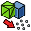

---
 GuiCommand:
   Name: Points Convert
   MenuLocation: Points , Convert to points...
   Workbenches: Points_Workbench
---

# Points Convert

## Description

The **Points Convert** command creates point clouds from shape objects or mesh objects.

Here a shape object refers any object with a **Shape** property. Objects created with the [Part](Part_Workbench.md) and [PartDesign](PartDesign_Workbench.md) workbench are shape objects. But so are objects created with the [Sketcher](Sketcher_Workbench.md) and [Draft](Draft_Workbench.md) workbench.

## Usage

1.  Select one or more objects.
2.  There are several ways to invoke the command:
    -   Press the ** [Convert to points...](Points_Convert.md)** button.
    -   Select the **Points →  Convert to points...** option from the menu.
3.  The **Distance** dialog box opens.
4.  Enter the **maximum distance**. The value must be in the {{Value|0.01}} - {{Value|10.00}} range.
5.  Press the **OK** button to close the dialog box and finish the command.

## Properties

Point cloud objects are [App GeoFeature](App_GeoFeature.md) objects with the following additional properties. Select the **Show all** option from the [Property editor](Property_editor.md) context menu to display the hidden properties.

### Data

{{TitleProperty|Base}}

-    **Points|PointsKernel|Hidden**: a Points Kernel associated with this object.

-    **Normal|NormalList|Hidden**: a list of normals. This property is only available for point clouds created with the [Points Convert](Points_Convert.md) command from mesh objects or shape objects with faces.

{{TitleProperty|Structured points}}

-    **Height|Integer**: the number of unique Y coordinates in the point cloud. This property is only available for point clouds created with the [Points Structure](Points_Structure.md) command.

-    **Width|Integer**: the number of unique X coordinates in the point cloud. This property is only available for point clouds created with the [Points Structure](Points_Structure.md) command.

### View

{{TitleProperty|Base}}

-    **Point Size|FloatConstraint**: the size in pixels of the points in the [3D view](3D_view.md).

 {{Points Tools navi}}

---
⏵ [documentation index](../README.md) > [Points](Points_Workbench.md) > Points Convert
