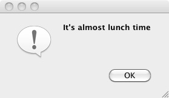
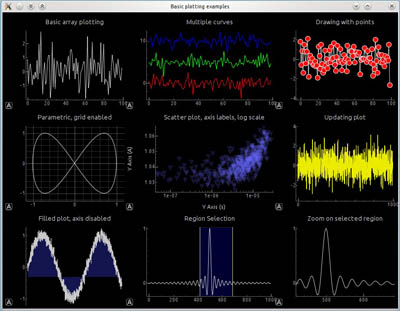

# PySide
 

 

## Introduction

The [PySide](PySide.md) library gives access to the cross-platform graphical user interface (GUI) toolkit Qt from [Python](Python.md). Qt is a collection of C++ libraries, but with the help of PySide, the same components can be used from [Python](Python.md). Every graphical interface that can be created in C++, can also be created and modified in Python. An advantage of using Python is that Qt interfaces can be developed and tested live, as we don\'t need to compile the source files.

When you install FreeCAD, you should get both Qt and PySide as part of the package. If you are [compiling](Compiling.md) yourself then you must verify that these two libraries are installed in order for FreeCAD to run correctly. Of course, PySide will only work if Qt is present.

In the past, FreeCAD used PyQt, another Qt binding for Python, but in 2013 ([1dc122dc9a](https://github.com/FreeCAD/FreeCAD/commit/1dc122dc9a)) the project migrated to PySide because it has a more permissible [license](licence.md).

For more information see:

-   [Wikipedia:PySide](http://en.wikipedia.org/wiki/PySide)
-   [Differences Between PySide and PyQt](http://qt-project.org/wiki/Differences_Between_PySide_and_PyQt)

    *Examples created with PySide. Left: a simple dialog. Right: a more complex dialog with graphs.*

## PySide in FreeCAD with Qt5 

FreeCAD was developed to be used with Python 2 and Qt4. As these two libraries became obsolete, FreeCAD transitioned to Python 3 and Qt5. In most cases this transition was done without needing to break backwards compatibility.

Normally, the `PySide` module provides support for Qt4, while `PySide2` provides support for Qt5. However, in FreeCAD there is no need to use `PySide2` directly, as a special `PySide` module is included to handle Qt5.

This  
```python
/usr/share/freecad/Ext/PySide
```

This module just imports the necessary classes from  
```python
PySide2.QtCore -> PySide.QtCore
PySide2.QtGui -> PySide.QtGui
PySide2.QtSvg -> PySide.QtSvg
PySide2.QtUiTools -> PySide.QtUiTools
```

The only unusual aspect is that the  
```python
PySide2.QtWidgets.QCheckBox -> PySide.QtGui.QCheckBox
```

[top](#top.md)

## Examples of PySide use 

-   [PySide Beginner Examples](PySide_Beginner_Examples.md), hello world, announcements, enter text, enter number.
-   [PySide Intermediate Examples](PySide_Intermediate_Examples.md), window sizing, hiding widgets, popup menus, mouse position, mouse events.
-   [PySide Advanced Examples](PySide_Advanced_Examples.md), many widgets.

The examples of PySide are divided into 3 parts, differentiated by level of exposure to PySide, Python and the FreeCAD internals. The first page has an overview on PySide; the second and third pages are mostly code examples at different levels.

It is expected that these examples are useful to get started, and afterwards the user can consult other resources online, or the official documentation.

[top](#top.md)

## Documentation

There are some differences in handling of widgets in Qt4 (PySide) and Qt5 (PySide2). The programmer should be aware of these incompatibilities, and should consult the official documentation if something doesn\'t seem to work as expected on a given platform. Nevertheless, Qt4 is considered obsolete, so most development should target Qt5 and Python 3.

The PySide documentation refers to the Python-style classes; however, since Qt is originally a C++ library, the same information should be available in the corresponding C++ reference.

-   [Qt Modules](https://doc.qt.io/qtforpython/modules.html) available from PySide2 (Qt5).
-   [All Qt classes by module](https://doc.qt.io/qt-5/modules-cpp.html) in Qt5 for C++.
-   [Qt Modules](https://deptinfo-ensip.univ-poitiers.fr/ENS/pyside-docs/index.html) available from PySide (Qt4).

[top](#top.md)

 {{Powerdocnavi}} 

[Category:Developer Documentation](Category:Developer_Documentation.md) [Category:Python Code](Category:Python_Code.md)
