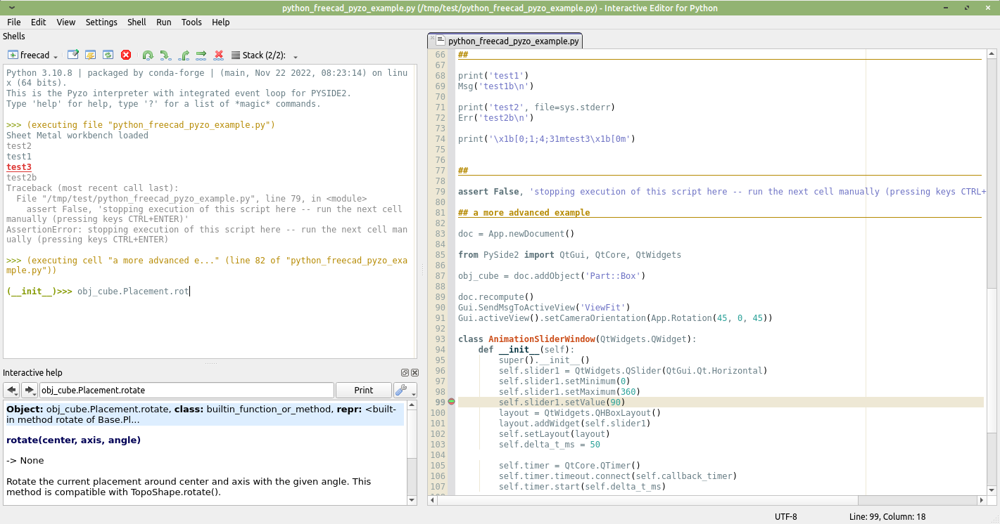
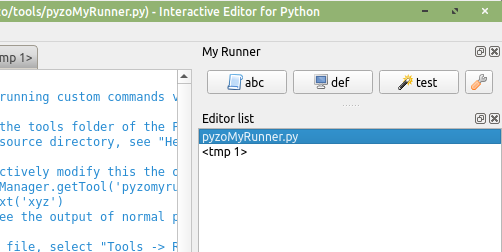

# Pyzo
## General Information 

### Motivation

Pyzo is a free and open-source Python IDE focused on interactivity and introspection, which makes it well-suited for engineering and scientific applications. This page describes how to use it in conjunction with FreeCAD.



### Pyzo

-   website: <https://pyzo.org>
-   GitHub repository: <https://github.com/pyzo/pyzo>
-   free and open-source (BSD)
-   fully coded in Python
-   available for Linux, MS Windows and macOS

### Versions

Unless otherwise noted, this page assumes the following software versions:

-   Pyzo 4.13.3
-   FreeCAD 0.21.1

## Set-Up and Configuration 

### Preparing a FreeCAD AppImage in Linux 

-   download the AppImage \--\> e.g.: FreeCAD_0.21.1-Linux-x86_64.AppImage
-   \$ chmod +x ./FreeCAD_0.21.1-Linux-x86_64.AppImage
-   \$ ./FreeCAD_0.21.1-Linux-x86_64.AppImage \--appimage-extract
-   \$ mv ./squashfs-root FreeCAD
-   \[some older Linux systems require: export FREECAD_USER_HOME=\$HOME\]
-   create a bash script **python_freecad.sh** in **./FreeCAD** (in the same directory as bash script **AppRun**)

:   
    {{Code|lang=bash|code=
    #!/bin/bash
    HERE="$(dirname "$(readlink -f "${0}")")"
    ${HERE}/AppRun python "$@"
    }}
    

### Installing Pyzo 

-   use the installer or extract the compressed archive from <https://github.com/pyzo/pyzo/releases>
-   or install it as a Python module: pip install pyzo (but the version on PyPI is currently not up to date)
-   or run it from source: Download the [Pyzo main branch as an archive](https://github.com/pyzo/pyzo/archive/refs/heads/main.zip), unpack the archive and then run {{Incode|python3 /path/to/pyzo-main/pyzolauncher.py}}. To use a specific Qt API instead of the automatically detected one, set environment variable \"QT_API\" before. Possible values are: pyside2, pyside6, pyqt5, pyqt6.

### Shell Configuration 

Start Pyzo and enter the shell configuration dialog via the Menu:
Shell -\> Edit shell configurations\...
Press the button \"Add config\" on the top right corner and fill out the form:

name
:   freecad (or something else)

exe \[for Windows\]

:   
    **C:\Program Files\FreeCAD 0.21\bin\python.exe**
    

exe \[for Linux\]

:   
    **/home/.../FreeCAD/python_freecad.sh**
    

exe \[for macOS\]

:   
    **/Applications/FreeCAD.app/Contents/Resources/bin/python**
    

:   Or, in case of this error: *Fatal Python error: take_gil: PyMUTEX(gil-\>mutex) failed*, try:

:   
    **/Applications/FreeCAD.app/Contents/Resources/bin/freecadcmd**
    

gui
:   PySide2

pythonPath \[for Windows and Linux\]
:   \[leave empty\]

pythonPath \[for macOS\]

:   
    **/Applications/FreeCAD.app/Contents/Resources/lib**
    

startupScript
:   select radio button \"Code to run at startup\"
:   enter the following code in the text field:
:   
    
```python
    from PySide2 import QtCore, QtWidgets
    QtCore.QCoreApplication.setAttribute(QtCore.Qt.AA_ShareOpenGLContexts, True)
    # optional switches:
    # QtWidgets.QApplication.setAttribute(QtCore.Qt.AA_EnableHighDpiScaling, True)
    # QtCore.QCoreApplication.setAttribute(QtCore.Qt.AA_UseHighDpiPixmaps, True)

    # AFTER_GUI - code below runs after integrating the GUI
    import os, sys
    if sys.platform == 'linux': # ... and using the (extracted) AppImage
        sys.path.append(os.environ['PATH_TO_FREECAD_LIBDIR'])
    # some older Linux systems require the following line:
    # os.environ['FREECAD_USER_HOME'] = os.environ['HOME']
    import FreeCAD as App
    import FreeCADGui as Gui
    __stdout_backup = sys.stdout
    Gui.showMainWindow()
    sys.stdout = __stdout_backup
    # do not delete __stdout_backup, otherwise FreeCAD might crash
    
```
    

environ:
:   enter the following environment variables:
:   
    {{Code|lang=text|code=
    PYZO_PROCESS_EVENTS_WHILE_DEBUGGING=1
    LC_NUMERIC=C
    }}
    

Finally, press button \"Done\" in the shell configuration dialog. Run a new \"freecad\" shell via Pyzo\'s \"Shell\" menu. This will start the FreeCAD Gui and a will open a FreeCAD Python shell in Pyzo.

On Linux, when not using an (extracted) AppImage, change {{Incode|sys.path.append(os.environ['PATH_TO_FREECAD_LIBDIR'])}} in the text field \"startupScript\" to e.g. {{Incode|sys.path.append('/builds/freecad-source/build/lib')}}, specifying the directory to the library files \"FreeCAD.so\" and \"FreeCADGui.so\". This library directory path could also be added to the field \"pythonPath\" in the Pyzo shell configuration dialog instead.

The environment variable entry {{Incode|PYZO_PROCESS_EVENTS_WHILE_DEBUGGING&#61;1}} will tell Pyzo to periodically update FreeCAD\'s Qt-GUI while FreeCAD is stopped during a breakpoint.

Do not remove the {{Incode|# AFTER_GUI}} comment in the startup code \-- this is a separator used by Pyzo to split the code into two blocks.

If you have an older Mac and pyzo fails to launch (e.g. pyzo 4.13.2 on OS-X 10.15), a possible work-around is to launch a patched pyzo 4.12.7 from the Terminal. See [FreeCAD forum message](https://forum.freecad.org/viewtopic.php?p=707159#p707159)

## General Pyzo Usage 

See <https://pyzo.org/guide.html> and run the Pyzo Wizard (Menu: Help -\> Pyzo Wizard) to get a short introduction.

Noteworthy information:

-   You can enter some \"magic\" commands in the Pyzo\'s Python shell, for example \"pip install pyerclip\". This also works with FreeCAD.
-   Ctrl+I in the shell (or clicking on the flash symbol) will send a KeyboardInterrupt. Ctrl+C is used for the normal copy function.
-   Press F5 or Ctrl+E to execute the whole file. But do not use \"Run file as script\" as this will restart the shell together with FreeCAD.
-   Press F9 to execute just the selected code.
-   Press Ctrl+Return to execute the current cell.
-   Right click on an editor tab will open a context menu.
-   Many keyboard shortcuts are similar to MATLAB.
-   The \"Logger\" tool (widget) has a shell to the Pyzo GUI\'s Python interpreter. You can fully access all objects there, for example copying a shell configuration via {{Incode|pyzo.config.shellConfigs2.insert(0, pyzo.config.shellConfigs2[1].copy())}}.
-   When there is a printed stack trace in Python shell, double click the filename to open the file at the specific line number.
-   When dealing with performance critical code, avoid printing too much to the shell as stream outputs directed to the Pyzo IDE will slow down the execution.
-   There is no{{Incode|__file__}} variable defined in the interactive mode, but as a workaround you can run {{Incode|import inspect; __file__ &#61; inspect.getfile(inspect.currentframe())}} to get it.
-   In Pyzo\'s \"About\" dialog (Help -\> About Pyzo) you can see the folder where Pyzo stores the settings.
-   Pyzo can be configured to be portable, e.g to run it from a usb pen-drive with encapsulated settings. To enable this, rename the folder \"\_settings\" in Pyzo\'s application folder to \"settings\".
-   You can directly modify Pyzo\'s source code even in the binary distribution because the binary is just a Python-Interpreter that runs the Python source code in the installation directory.

## Example Work Flows 

A normal workflow to automate FreeCAD operations is similar to using just FreeCAD. The shell in Pyzo has access to the same Python interpreter as the \"Python console\" panel in the FreeCAD GUI. Both can be used in a mixed fashion, whatever is more convenient in the situation.

Pyzo brings very nice features to this workflow, just to list some of them:

-   Write a new function in the editor, set a breakpoint and run the code. You can now work inside the function\'s scope and continue your workflow even manipulating objects manually in FreeCAD.
-   If you started an (almost) endless loop, you can easily interrupt the execution by pressing Ctrl+I in Pyzo or Shell -\> Interrupt in the menu.
-   You can have some code fragments prepared in the Pyzo editor tabs and execute individual cells. Try new commands and add them to the code editor to grow your new script.
-   The command history in the Pyzo shell is not cluttered with auto-generated commands but you can still access the automatically inserted comments in the FreeCAD Python panel.
-   If there was an exception which made your code abort execution, just do a post-mortem debug and watch all the variables in different stack layers to find out the cause of the error.

Have a look [here](https://forum.freecad.org/viewtopic.php?p=679419#p679419) and [here](https://forum.freecad.org/viewtopic.php?p=679580#p679580) to see this in action (with an older version where the FreeCAD start was not yet included in the Pyzo shell configuration).

## Advanced Topics 

### Creating a Custom Tool 



Pyzo includes a Plug-In concept to extend its features without patching its source code.

The following code example demonstrates how to create a custom panel containing buttons to perform various actions.


<div style="height:20em; width:100%; overflow:auto; border: 1px solid #000">


```python
"""
Simple example for running custom commands via some buttons

Place this file "pyzoMyRunner.py" either in the "tools" folder inside the
"Pyzo user data directory" or in the "tools" folder inside the "Pyzo source directory".
To obtain the "user data" or "source" directory, see "Help -> About Pyzo" in the menu.

You can interactively modify the object of this class in Pyzo's Logger tool:
    obj = pyzo.toolManager.getTool('pyzomyrunner')
    obj._btn1.setText('xyz')
And you will also see the output of normal print commands in the Logger tool.

After changing this file, select "Tools -> Reload tools" in Pyzo's menu.
"""

import pyzo
from pyzo.qt import QtCore, QtGui, QtWidgets  # noqa
from pyzo import translate

tool_name = translate("pyzoMyRunner", "My Runner")
tool_summary = "Run custom actions."


class PyzoMyRunner(QtWidgets.QWidget):
    def __init__(self, parent=None):
        super().__init__(parent)

        # Layout
        self._layout = QtWidgets.QHBoxLayout(self)
        self.setLayout(self._layout)

        # Widgets

        btn = QtWidgets.QPushButton(icon=pyzo.icons.script, text='abc')
        btn.clicked.connect(lambda: self.onButtonClicked('btn1'))
        btn.setShortcut('Ctrl+Shift+1')
        self._layout.addWidget(btn)
        self._btn1 = btn

        btn = QtWidgets.QPushButton(icon=pyzo.icons.monitor, text='def')
        btn.clicked.connect(lambda: self.onButtonClicked('btn2'))
        btn.setShortcut('Ctrl+Shift+2')
        self._layout.addWidget(btn)
        self._btn2 = btn

        btn = QtWidgets.QPushButton(icon=pyzo.icons.wand, text='test')
        btn.clicked.connect(lambda: self.onButtonClicked('btn3'))
        btn.setShortcut('Ctrl+Shift+3')
        self._layout.addWidget(btn)
        self._btn3 = btn

        btn = QtWidgets.QPushButton(icon=pyzo.icons.wrench_orange, text='')
        btn.clicked.connect(lambda: self.onButtonClicked('btn4'))
        btn.setShortcut('Ctrl+Shift+4')
        self._layout.addWidget(btn)
        self._btn4 = btn

        self._layout.addStretch()


    def onButtonClicked(self, s):
        print(self.__class__.__name__, 'onButtonClicked', s)
        if s == 'btn1':
            # manipulate the text of the current editor
            editor = pyzo.editors.getCurrentEditor()
            editor.insertPlainText('This text will be inserted\n'
                    'at the cursor pos of the current editor\n')
        elif s == 'btn2':
            # run a command in the current Python shell
            shell = pyzo.shells.getCurrentShell()
            shell.executeCode('myvar = 123\nprint(myvar + 4)', '<pyzomyrunner>')
        else:
            QtWidgets.QMessageBox.information(self, tool_name,'button "{}" clicked'.format(s))


    def close(self):
        pass # do some clean-up here if necessary

```


</div>

### Debugging Start-Up of FreeCAD Modules 

To debug the init script of a FreeCAD Mod, e.g. files such as **Mod/Draft/Init.py** or **Mod/Draft/InitGui.py** using breakpoints, we need to set a breakpoint in the code file. These init script files are not directly executed.

During startup, FreeCAD runs the Python scripts **src/App/FreeCADInit.py** and **src/Gui/FreeCADGuiInit.py**, and each of these reads the corresponding init scripts (App and Gui) of the Mod and executes them as a string with the code contents:


```python
with open(file=InstallFile, encoding="utf-8") as f:
    exec(f.read())
```

The interpreter has no more information about the filepath of the executed code. To include the filepath, we need to patch the lines above. FreeCAD version 0.22 or newer [already contain this patch](https://github.com/FreeCAD/FreeCAD/pull/10618).

This is not all. The scripts **src/App/FreeCADInit.py** and **src/Gui/FreeCADGuiInit.py** are not individual files anymore but resource files in libraries in the distributed binary versions of FreeCAD. Therefore we will extract them into files and replace the data in the libraries with a short Python script that will call our new out-sourced scripts. So we could also open these new files and set breakpoints there.

The following code will extract the scripts from the libraries, patch them and place the caller code back in the libraries:


<div style="height:20em; overflow:auto; border: 1px solid #000">


```python
import os
import sys
import shutil


lib_dirpath = '/home/.../FreeCAD/usr/lib' # example for linux os
# lib_dirpath = r'C:\ProgramData\FreeCAD\bin' # example for windows os

restore_original_libs = False
# restore_original_libs = True


lib_dirpath = os.path.abspath(lib_dirpath)
for appgui in ['App', 'Gui']:
    if sys.platform == 'linux':
        fp = os.path.join(lib_dirpath, 'libFreeCAD{}.so'.format(appgui))
    elif sys.platform == 'win32':
        fp = os.path.join(lib_dirpath, 'FreeCAD{}.dll'.format(appgui))
    else: raise NotImplementedError()

    fp_backup = fp + '.orig'

    if restore_original_libs:
        shutil.copy(fp_backup, fp)
        continue

    if not os.path.isfile(fp_backup):
        shutil.copy(fp, fp_backup)

    with open(fp_backup, 'rb') as fd:
        dd = fd.read()

    if appgui == 'App':
        needle = b'\n# FreeCAD init module\n'
        fp_py = fp + '.FreeCADInit.py'
    else:
        needle = b'\n# FreeCAD gui init module\n'
        fp_py = fp + '.FreeCADGuiInit.py'

    i_needle = dd.index(needle)
    assert dd.find(needle, i_needle + 1) == -1

    i_start = i_needle - dd[:i_needle][::-1].index(b'\x00')
    i_end = dd.index(b'\x00', i_needle)

    dd_code = dd[i_start:i_end]

    fp_py_orig = fp_py + '.orig'
    with open(fp_py_orig, 'wb') as fd:
        fd.write(dd_code)

    loader_code = '\n'.join([
        'fp = ' + repr(fp_py),
        'with open(fp, "rt", encoding="utf-8") as fd: source = fd.read()',
        'exec(compile(source, fp, "exec"))',
        ]).format(repr(fp_py))

    dd_code_new = loader_code.encode('utf-8')
    assert len(dd_code_new) <= len(dd_code)
    dd_code_new += b'\x00' * (len(dd_code) - len(dd_code_new))

    dd_new = dd[:i_start] + dd_code_new + dd[i_end:]
    assert len(dd_new) == len(dd)

    with open(fp, 'wb') as fd:
        fd.write(dd_new)


    tt_code = dd_code.decode('utf-8')

    needle = """
                with open(file=InstallFile, encoding="utf-8") as f:
                    exec(f.read())
    """

    needle_patched = """
                with open(InstallFile, 'rt', encoding='utf-8') as f:
                    exec(compile(f.read(), InstallFile, 'exec'))
    """

    if needle in tt_code:
        # older FreeCAD versions < 0.22 need to be patched
        tt_code = tt_code.replace(needle, needle_patched)
    else:
        assert needle_patched in tt_code

    with open(fp_py, 'wt', encoding='utf-8') as fd:
        fd.write(tt_code)

```


</div>

We can now, for example, open **Mod/Draft/Init.py** in Pyzo, set a breakpoint there in line 26 and start the FreeCAD shell in Pyzo. Execution will be interrupted at the breakpoint. We can switch the stack frames, view and manipulate variables and step/continue the code execution.

Init files for the GUI, such as \" in Pyzo and execute the line {{Incode|sys.stdout &#61; __stdout_backup}} in Pyzo\'s shell. Then we can switch back to the stack frame of interest. There is a quicker method, that uses the unformatted output stream: Execute {{Incode|sys.stdout &#61; sys.__stdout__}} and optionally {{Incode|sys.stderr &#61; sys.__stderr__}} from any stack frame.

## Known Limitations and Issues 

\... generally, when importing FreeCAD as a module in Python:

-   auto backups are not enabled \--\> save often
-   custom FreeCAD Qt-GUI color themes are not available

## Feedback

To ask questions about this topic, share ideas, give input, point out mistakes, etc, please write a message to [the initial topic in the FreeCAD forum](https://forum.freecad.org/viewtopic.php?t=78047) or create a new one.

## Miscellaneous Links 

-   [Official Pyzo Website](https://pyzo.org)
-   [Pyzo GitHub Repository](https://github.com/pyzo/pyzo)
-   [initial topic in the FreeCAD forum](https://forum.freecad.org/viewtopic.php?t=78047)
-   [Python_Development_Environment](Python_Development_Environment.md)
-   [Debugging#Python_Debugging](Debugging#Python_Debugging.md)
-   [Embedding_FreeCAD](Embedding_FreeCAD.md)


---
⏵ [documentation index](../README.md) > Pyzo
