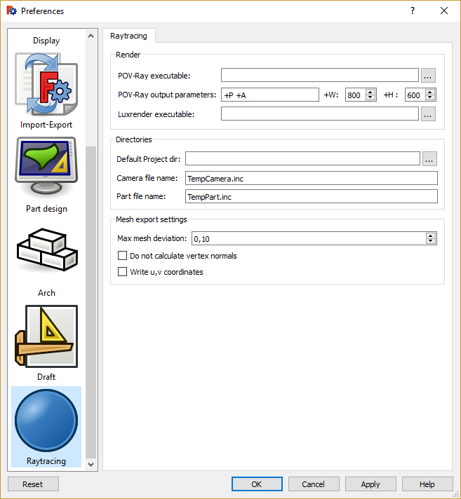

# Raytracing Preferences
The preferences screen of the [Raytracing Workbench](Raytracing_Workbench.md) are found in the [Preferences Editor](Preferences_Editor.md), **Edit → Preferences → Raytracing**.

There is only one tab: Raytracing.

## Raytracing

 {{Raytracing_Tools_navi}}  

[ Preferences](Category_Preferences.md)

---
[documentation index](../README.md) > [Preferences](Category_Preferences.md) > [Raytracing](Raytracing_Workbench.md) > Raytracing Preferences
