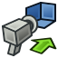

---
- GuiCommand:
   Name: Raytracing WriteCamera‏‎
   MenuLocation: Raytracing - Camera‏‎
   Workbenches: [Raytracing](Raytracing_Workbench.md)
   Shortcut: 
   SeeAlso: 
---

# Raytracing WriteCamera

## Description

Exports the current camera properties to a pov-file for use in a POV-Ray project.

## Usage

1.  Make sure that the view is set to [perspective view](Std_PerspectiveCamera.md)
2.  Choose **Raytracing** → **Utilities** →** Export camera to POV-Ray...** from the top menu.

## Limitations

## Notes

 {{Raytracing_Tools_navi}}

---
⏵ [documentation index](../README.md) > [Raytracing](Raytracing_Workbench.md) > Raytracing WriteCamera
