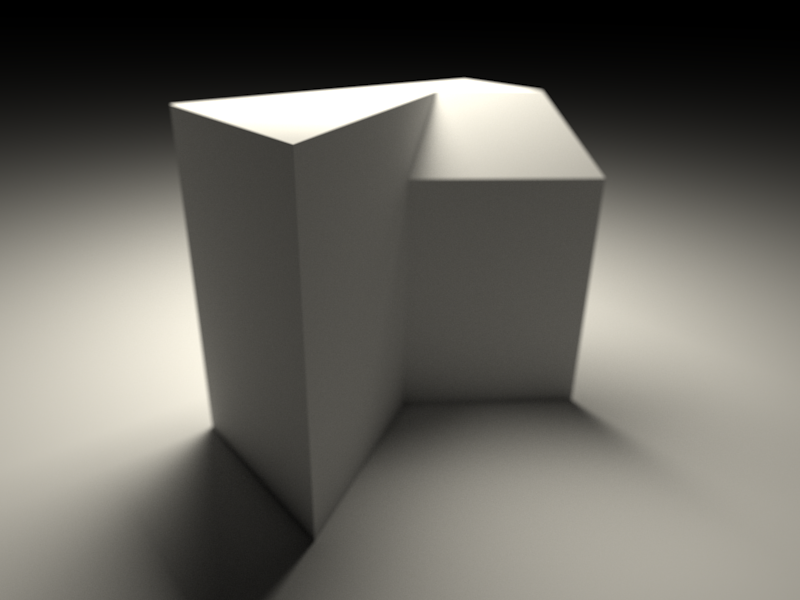

# Raytracing project
**
This roadmap is probably obsolete. For more information see [Development roadmap](Development_roadmap.md). 
If you are not involved with the development discussed here: 
!!! PLEASE DO NOT EDIT OR TRANSLATE !!!
**

**(2020) This page refers to an attempt to update the [Raytracing Workbench](Raytracing_Workbench.md), proposed around 2012. Its original author never completed the implementation so this information is outdated, and should not be considered current.

New development is happening in the [https://github.com/FreeCAD/FreeCAD-render Render Workbench], a complete Python replacement for the [Raytracing Workbench](Raytracing_Workbench.md).
**

 

This is the FreeCAD Raytracing development project. It follows the rules of the [Getting things done](https://en.wikipedia.org/wiki/Getting_Things_Done) process. The projects are collected in the [Development roadmap](Development_roadmap.md).

## Purpose and principles 

This project is to update the current render module [Raytracing](Raytracing_Workbench.md) that currently uses povray, a biased renderer which gives satisfactory results and allow more modern renderers such as Lux Render, Yafaray, Indigo renderers to be used.

Also to provide a generic interface to allow multiple render back-ends to be used to visualise Features within FreeCad. Providing a more generic programming interface will allow render plugins to be created more easily.

The interface will allow both open source and proprietary external renderers to be used by generating a compatible scene file and launching a separate process in the background. The output can then be previewed inside Freecad directly by opening the temporary output file (if available).

Each renderer will be a plugin into a generic interface and provide compatible materials and rendering modes.

## Outcome

Nice Visuals!!! Produce high quality outputs of parts within the Freecad document and provide a very simple interface with presets to allow quick initialisation for rendering and previews.

The user interface should allow more complex situations to be created and possibly previewed such as changing and modifying lights and positions. However, the aim is to not provide a full featured render suite.

## Brainstorming

A library of material \'must\' be created for each render plugin along with presets. Material properties can be changed. Scene presets should allow users with inexperience with Rendering to produce nice visuals in little time.

## Organising

The generic inteface is currently being created and to test the integration [Lux render](http://www.luxrender.net/en_GB/index), an unbiased renderer will be first implemented. Current work is being completed by mrlukeparry on his render branch [Github Render Branch](https://github.com/mrlukeparry/FreeCAD_sf_master/tree/raytracing).

**Currently it is possible to render objects to Lux Render:**

Featured is a part that was creating using PartDesign/Sketcher then rendered using the new render workbench being developed in Lux Render. Lux Render allows nice effects such as DOF to be created to improve realism.

## Next actions 

-   Create the Abstraction to provide the interface between renderers **(Done)**
-   Implement an interface for describing generic materials and collecting these **(Done)**
-   Implement an interface for describing render presets **(Done)**
-   Implement an interface for describing templates **(Done)**
-   Implement a feature to store all this information permanently **(WIP)**
-   Create a workbench environment for displaying the output **(Done)**
-   Create workbench tools for changing render properties **(Done)**
-   Create workbench tools for browsing, changing and applying materials to part features **(Done)**
-   Create automake scripts (WIP)
-   Remove any GUI dependencies from Raytracing/App **(Done)**
    -   Bounding Box data structure should not use coin3d SbBox3f **(Done)**
    -   QWidget Included in QProcess for some reason **(Fixed)**
-   Test compatibility with Windows (in progress)
    -   Update Libpack to include QT 4.7 - QT 4.8
    -   Remove compiler warnings and errors
-   Implement saving of Material Properties **(Done)**
-   Tidying the QML interface **(WIP)**
-   Creating Render Templates / Render Materials / Render Presets
-   Create a blender scene to lux template converter
-   Convert LuxBlender Materials .lbm (http://www.luxrender.net/lrmdb/en/material/) to useful Render Materials
-   Create python bindings for Render Materials, Cameras, Lights
-   Create a RenderCamera Document object
-   Allow scene template to be imported into the render feature.
-   User defined preset/material/template directories
-   Improve the View Provider
-   Convert Povray/Yafaray to use the new Render Module Infrastructure
-   Testing

 

[Category:Roadmap](Category:Roadmap.md)

---
[documentation index](../README.md) > [Raytracing](Raytracing_Workbench.md) > Raytracing project
