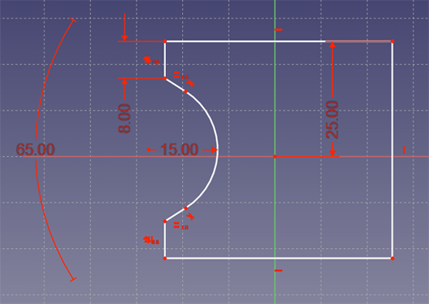

  This is a summary of the most interesting changes occured in FreeCAD since latest version. See [the Mantis changelog](http://www.freecadweb.org/tracker/changelog_page.php) on SourceForge for the complete list of changes.

Older versions: [0.12](Release_notes_012.md) - [0.11](Release_notes_011.md)

*modeled in FreeCAD by psicofil*

## General

-   **Color preferences**: Getting bored of the good old grey-shapes-on-black-lines FreeCAD default aspect? It is now changeable in the user preferences (Display -\> Color), together with several other default colors.
-   **Alignment**: two shapes can be aligned to each other with up to three points with this tool available in the Edit menu.

## Drawing module {#drawing_module}

-   **Clip feature**: A new [Drawing Clip](Drawing_Clip.md) object allows to place views of objects inside clipped rectangles on Drawing pages.
-   **Editable titleblocks**: When designing [Drawing templates](Drawing_templates.md), it is now possible to mark texts as editable. Those texts become then directly editable in FreeCAD.
-   **Annotation feature**: A new [Drawing Annotation](Drawing_Annotation.md) object, a simple feature to quickly place text blocks on a Drawing page.
-   **Orthographic Views**: A new [Drawing Orthographic Views](Drawing_Orthoviews.md) tool facilitate creation of multiple views all aligned to each other, according to first-angle or third-angle projection.
-   **Browser preview**: Since all SVG capabilities are not always supported by the internal Qt SVG viewer, this button allows you to check how a page looks like in the webkit browser, which fully supports the SVG format. This is provisory, until we definitely switch our SVG viewer to webkit\...
-   **DXF export**: you can now export a view of a page directly to a DXF file.
-   Some bug fixes now allow printing of pages to scale.

## Sketcher module {#sketcher_module}

-   **Point Creation**

Points can now be added and used as a feature within a sketch

-   **Sketch Origin**

User can now use the sketch\'s origin to define geometry as well as the sketch axes.

-   **Tangency and perpendicularity constraints for arcs and circles.**
-   **Constraints with respect to external (projected) geometry.**
-   **Improved counting of the sketch degrees of freedom.**
-   **Symmetry constraint with respect to a symmetry point** (midpoint constraint).

-   **Improved Datum Label and Constraint Visuals:**

-   -   Each constraint label (including arrows) will correctly scale to the size of the scene automatically to the 3D viewport
    -   Datum label text for Distance, Distance X, Distance Y and Radius can be freely positioned now with greater control.
    -   Small improvements to overlapping constraint icons and fix freezes.
    -   Datum Label text will reverse when the view is orientated from the opposite side.

-   **Fully constrained Sketches are now highlighted:**

-   **Rubber band selection:**

Geometry (Points, Lines and Curves) may be selected by dragging on the background to create a rectangular selection.

-   **Extended functionality of the polyline tool:** using the m key one can switch between arc and line mode and among free, tangent and perpendicular transitions from the previous segment.

-   **Map sketch to face** is a new tool to map (or remap) an existing sketch to the selected face on a solid. This allows the use of this sketch for features such as Pad and Pocket.

-   **Small Improvements:**
    -   When constructing geometry, tool tip with related information is shown next to cursor.
    -   **Sketch view** which sets the 3D view perpendicular to the sketch plane has now an icon in the Sketcher toolbar.

## Draft module {#draft_module}

-   **Taskmode**: The Taskview mode of the Draft module is now default. Fear not, if you liked the toolbar, it is still available in the Draft preferences settings.
-   **DXF importer**: The DXF importer now supports points (translate to [Draft Point](Draft_Point.md)) and leaders (translate to [Draft Wire](Draft_Wire.md))
-   **Brand-new snapping system**: The [snapping system](Draft_Snap.md) of the Draft module has been rewritten almost from scratch. It is now much easier to extend and use in other scripts and modules, has now new visuals with snap cursor icons, and a toolbar that allows to switch on/off individual snap locations or the whole snapping system.

-   **Better constraining**: When entering 3D points, besides the existing Shift-constraining, you can now constrain the movement in X, Y or Z direction by pressing the **X**, **Y** or **Z** keys. Pressing them again switches constraining off.
-   **Draft \<-\> Sketch conversion**: The Draft workbench now features a new [Draft2Sketch](Draft_Draft2Sketch.md) conversion tool, that converts selected Draft objects (or any flat shape) to Sketches, and vice-versa.
-   **Clone tool**: Make copies of selected objects with this handy tool. When the original changes, the clone gets updated automatically. The clone can be moved, rotated, and also has a scale property that allows you to change the size of the copy.
-   **SVG importer**: The SVG importer now has much better support of bezier curves. Global definition of user units is now respected and the geometry is scaled properly to millimeter. Support for new elements such as ellipses rounded rectangles has been added. The parser has been reworked and now handles paths from Adobe Illustrator.
-   **Curved corners**: Several Draft objects ([Wires](Draft_Wire.md), [Rectangles](Draft_Rectangle.md) and [Polygons](Draft_Polygon.md)) now have a **Fillet Radius** property, which curves their corners by the given radius value.

-   **2D view object**: The new [Shape2DView](Draft_Shape2DView.md) tool allows to quickly place a 2D view of a selected object in the document. You can specify the projection vector.

## Arch module {#arch_module}

-   **Draft integration**: The Arch and Draft modules are now tightly integrated. The Arch tools use the [Draft snapping](Draft_Snap.md) system, and all the Draft tools are present in the Arch workbench. In fact, if you like, you can now completely switch off the Draft module (Preferences -\> Draft -\> Hide the Draft workbench)
-   **New wall tool**: The [wall tool](Arch_Wall.md) has been greatly enhanced, and now features a direct drawing mode, that is activated when you press the Wall button with no object selected, that allows you to draw walls like you draw simple lines. In additions, walls now auto-connect when you snap to an existing wall.

-   **New roof tool**: A new [roof tool](Arch_Roof.md) is now available in the Arch module, that allows you to quickly create sloped roofs from a selected face.
-   **New window tool**: [Windows](Arch_Window.md) are now created directly on top of a flat shape that contains one or more wires, such as a rectangle or a sketch. If that shape was drawn directly on a wall face, the window will automatically cut an opening in the wall.
-   **New sections system**: It is now very simple to create 2D plans, sections and elevations from your model: Place a [Section Plane](Arch_SectionPlane.md) object, orient it the way you want, edit it to include the objects it must see, and you are done!
-   **New solid renderer**: In addition to the OpenCasCADe-based wireframe 2D renderer currently used by the [Drawing Workbench](Drawing_Workbench.md), the Arch module now features a new 2D renderer, that is able to render filled faces to a SVG Drawing sheet, giving much nicer 2D views.

-   **IFC import with [IfcOpenShell](http://www.ifcopenshell.org)**: The Arch module can now use [IfcOpenShell](http://www.ifcopenshell.org) if it is installed on your system. This allows for much more powerful IFC import, and all the contents of the IFC file are guaranteed to be imported.
-   **New floor and building objects**: Building and floors are now groups, so you can add and remove objects from them with a simple drag&drop from the tree view.
-   **New axes system**: A new [axes system](Arch_Axis.md) feature has been added, that allows to quickly layout complex axes systems. These axes can then be added to [Structure](Arch_Structure.md) objects, so they spread automatically on the grid nodes.

-   **Arch objects from meshes**: [Walls](Arch_Wall.md) and [structures](Arch_Structure.md) can now be made directly from a mesh, provided it is closed, solid and all edges are [manifold](http://doc.spatial.com/index.php/Manifold_and_Non-manifold_Objects). This allows for very quick transformation of geometry imported from other applications such as [blender](http://www.blender.org) into valid Arch objects.

## Part module {#part_module}

-   **Refine shape** is a new utility that cleans up faces after a few operations on a shape. It can be set to run automatically after boolean operations in the Preferences.
-   **New Loft tool** can extrude a complex set of surfaces or a solid shape through a series of sketches or Draft objects.
-   **New Sweep tool** can extrude a complex set of surfaces or a solid shape through a series of sketches or Draft objects and a trajectory (sketch, edge or Draft object).
-   **New Offset tool** can offset a single surface or a shape.
-   **New Thickness tool** can hollow out a solid shape by setting a wall thickness and opening one or more faces.
-   **Shape Builder** and **Create primitives** are now in the Part toolbar for quick access.

## Part Design module {#part_design_module}

-   **Pad** and **Pocket** are now more powerful thanks to more parameters, such as extrude to first/to last, up to face, 2 dimensions, symmetric to plane.
-   **Chamfer** and **Fillet** got an upgrade: selecting a face is now allowed, all the outer and inner edges of this face will be processed.
-   **Revolution**: a construction line can now be used as a revolution axis.
-   **New Groove tool**: cut matter from your solid by revolving a sketch.
-   **Linear pattern**, **Mirrored**, **Polar pattern** and **Multipattern** tools, that allow you to align and distribute pads and pockets on a feature.
-   A **Shaft Wizard** to help you design shaft objects

## Ship Design module {#ship_design_module}

-   New ship module ([tutorial](FreeCAD-Ship_s60_tutorial.md))

## 3D mice {#d_mice}

-   Support for 3D mice (Spaceball, Space Navigator) has been added to the Windows version.
-   A new **Spaceball Motion** tab in the Customize dialog allows for fine tuning your 3D mouse to the settings you want, directly from FreeCAD.

## OpenSCAD module {#openscad_module}

-   This brand new (experimental) module brings OpenSCAD files import capability into FreeCAD. This file format is wildly popular in the RepRap community and on digital designs sharing site Thingiverse.
-   OpenSCAD script can be executed from within FreeCAD, by OpenSCAD (if installed on your computer), with the result appearing in your FreeCAD document.
-   For more information see the [OpenSCAD Workbench](OpenSCAD_Workbench.md) page on the FreeCAD wiki

[Category:News{{\#translation:}}](Category:News.md) [Category:Documentation{{\#translation:}}](Category:Documentation.md) [Category:Releases{{\#translation:}}](Category:Releases.md)
