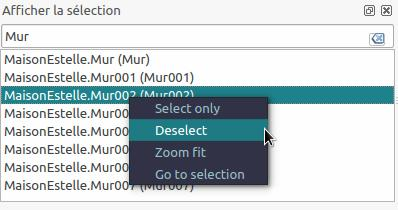
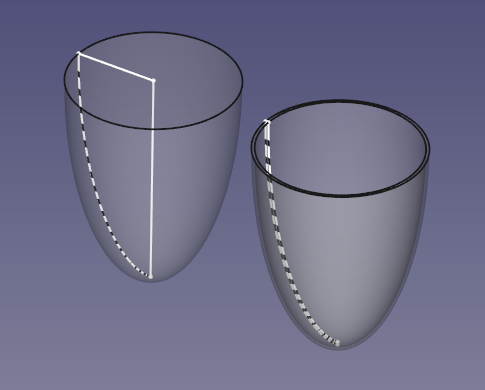
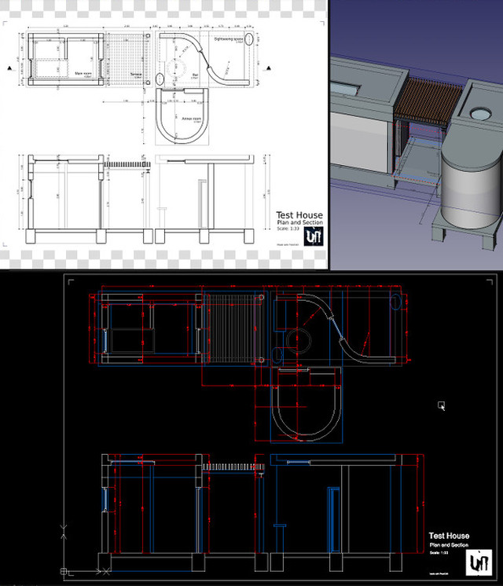
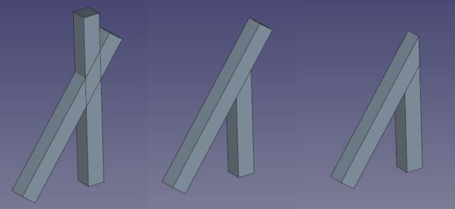
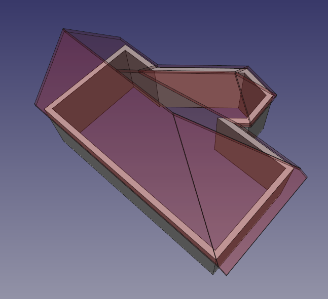
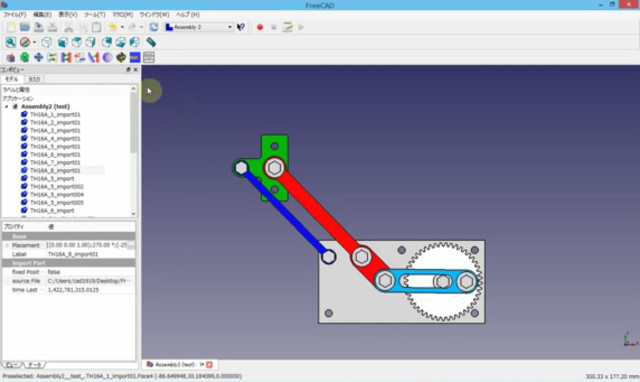
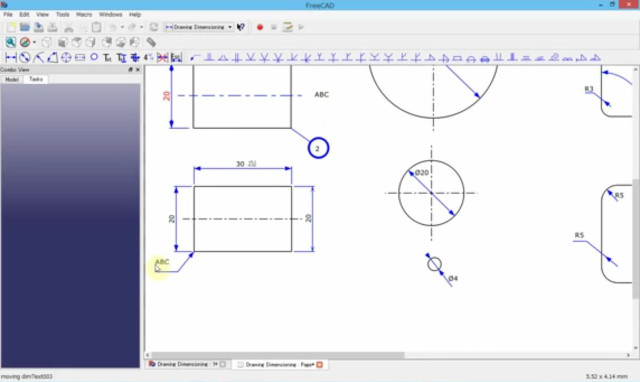

# Release notes 0.15
FreeCAD 0.15 was released on April 8, 2015. This is a summary of the most interesting changes. The complete list of changes can be found in the [Mantis changelog](http://www.freecadweb.org/tracker/changelog_page.php). Older versions at: [0.14](Release_notes_0.14.md) - [0.13](Release_notes_0.13.md) - [0.12](Release_notes_0.12.md) - [0.11](Release_notes_0.11.md)

  

Spark Plug Plane by r-frank

## General

### Search box in Selection view 

The selection window allow users to search inside the selected objects. Moreover you have now possibilities to select only one entity, unselect an entity, zoom fit on an entity and go to the entity in the tree view.

  

### Units support is spreading 

The new [units](Quantity.md) system of FreeCAD, introduced in version 0.14, is now used by almost all modules of FreeCAD, including the [Sketcher](Sketcher_Workbench.md), [Draft](Draft_Workbench.md) or [Arch](Arch_Workbench.md). A few areas still don\'t use it, but generally speaking, you can now count on proper units support throughout your whole workflow.

### Minor enhancements 

-   Import/Export now has an own section in the Edit \> Preferences section. Now all file formats are grouped into their own tab, which makes it easier for new users to find the right options.
-   Customized keyboard shortcuts now accept up to 4 keys.
-   FreeCAD now [supports the VR Occulus Rift device](http://forum.freecadweb.org/viewtopic.php?f=9&t=7715).
-   Support of custom global toolbars: Aside from adding custom toolbars with your own tools to any workbench, it is now also possible to add custom toolbars which will stay present on all workbenches.
-   New Lib Pack for Windows, with the latest OCE 0.17

## Part Workbench 

-   A couple of new geometric elements have been added: Parabola, ArcOfParabola, Hyperbola & ArcOfHyperbola

## Part Design & Sketcher Workbench 

### Ellipses

The [Sketcher](Sketcher_Workbench.md) gained proper support for ellipses. Those can be constructed in different ways, and can be used for any kind of subsequent operation.

  

### Enhanced selection tools 

The Sketcher also gained a series of new tools to help you diagnose, optimize or fix problems in your sketches. You can now, for example, easily select the elements associated with a constraint, or select the constraint associated with an element, or find conflicting or redundant constraints.

The Sketcher UI also gained some new panels, and now shows you a selectable list of elements of your sketch.

### Merging sketches 

It is now possible to merge several sketches into one with the click of a button.

### Enhanced sketch properties 

The properties view of sketch objects has also been enhanced, and named Datum constraints (distance, horizontal distance, vertical distance) inside the sketch will now appear and be editable directly in the properties view of the sketch, without the need to enter edit mode.

### Minor improvements 

-   Added more regular polygons to sketcher
-   Added new constraint: Symmetry constraint perpendicular to axis of symmetry

## Spreadsheet Workbench 

The [Spreadsheet Workbench](Spreadsheet_Workbench.md) has been completely recoded. FreeCAD now possesses a state-of-the-art, robust, feature-rich spreadsheet editor. A couple of functionalities found in the previous version of this workbench have been removed, such as the property controllers, but this is a complex issue requiring more time to design properly. At the present time, however, the new spreadsheet already offer far better possibilities to gather data from your model.

  

## Draft Workbench 

### Allow sticky fonts in ShapeString 

For those nostalgic for old CAD software, sticky fonts (in which letters are made of simple lines, not filled shapes) can now be used with the [ShapeString](Draft_ShapeString.md) tool.

  

### Minor improvements 

-   [Lines](Draft_Line.md) can now be defined by their length and angle in the current working plane
-   Relative extension lines for [dimensions](Draft_Snap_Dimensions.md)
-   Support for [sketcher ellipses](Sketcher_CompCreateConic.md)
-   [Array](Draft_Array.md) objects can now be fused

## Drawing Workbench 

### Export drawing pages to DXF 

The system used to export Drawing pages to DXF until now used a very complicated hack to convert the SVG code to FreeCAD object then back to DXF with the Draft exporters. Now, the export is done internally inside the Drawing module, which gives much faster and reliable results. DXF export now uses a [template system](Drawing_templates.md) similar to SVG sheets. If your Drawing page uses a certain SVG template, and a DXF template with the same name is found at the same location, it is used to generate the DXF file.

  

In the DXF file, the different views are placed as scaled blocks. This allows quickly restoring the 1:1 scale.

### Minor improvements 

-   It is now possible to reuse projection settings from an existing view when creating new draft views.

## Arch Workbench 

### Updated IFC importer/exporter 

FreeCAD\'s [IFC importer](Arch_IFC.md) has received a lot of work and testing, and a massive upgrade. The old, python-based importer, has been disabled (it is still usable from the python console, though), and FreeCAD now uses exclusively and intensively the newest, bleeding-edge [version 5](http://ifcopenshell.org/python.html) ([read more](http://ifcopenshell.org/pythonOCC/example1/) about it) of [IfcOpenShell](http://ifcopenshell.org/) that is now available on all main platforms (be sure to download the version that matches the python version used by your FreeCAD installation). We now benefit from a much faster and reliable import and export, a much simpler and cleaner code (read: easier to extend), and already a few additional goodies, such as better support for curve-based objects and IFC properties.

### New feature: Cut object with plane 

This new functionality, [Arch CutPlane](Arch_CutPlane.md), makes it possible to cut an object according to a plane defined by the face of another object. It is possible to cut the object behind or in front of the selected plane.

  

### New roof tool 

The [Roof](Arch_Roof.md) tool was completely redone and now makes it possible to define different slopes for each roof side. Moreover it is possible to define a thickness of roof, the length of the overflow.

  

### Panels

A new [Panel](Arch_Panel.md) object has been added to the [Arch Workbench](Arch_Workbench.md). It allows creation all kinds of panel-like objects, and will be specially useful for panel constructions such as the [wikihouse](http://www.wikihouse.cc/) or [popup house](http://www.popup-house.com/) projects.

  

### Furniture

The new [Arch Equipment](Arch_Equipment.md) object is designed to add all kinds of non-structural standalone objects to your architectural projects, such as lighting appliances, sanitary equipments or furniture.

### Minor enhancements 

-   The Basepoint of [Arch Frame](Arch_Frame.md) object can now be set to a specific vertex of the profile.

## External modules 

There has also been some very interesting work on new workbenches and macros, that are not integrated into the FreeCAD source code (yet!), but are easy to install on an existing FreeCAD 0.15 installation. Instructions are provided on the pages linked below:

### Assembly2

The [Assembly 2 workbench](https://github.com/hamish2014/FreeCAD_assembly2) provides tools to create multi-part assemblies, and is a very good alternative for the official Assembly workbench which is still under development (see [forum thread](http://forum.freecadweb.org/viewtopic.php?f=10&t=8577)).

  

### Drawing Dimensioning 

The [Drawing dimensioning workbench](https://github.com/hamish2014/FreeCAD_drawing_dimensioning) adds powerful dimensioning and annotation tools to the Drawing workbench (see [forum thread](http://forum.freecadweb.org/viewtopic.php?f=10&t=8395)).

  

### Work Features 

The [WorkFeature macro](https://github.com/Rentlau/WorkFeature) adds a wide range of helper objects such as alignment planes or axes, and tools to help you to position and align objects along those helper objects (see [forum thread](http://forum.freecadweb.org/viewtopic.php?f=22&t=9056)).

 

---
 [documentation index](../README.md) > [News](Category_News.md) > [Documentation](Category_Documentation.md) > [Releases](Category_Releases.md) > Release notes 0.15
