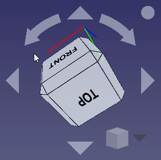
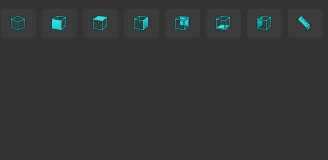
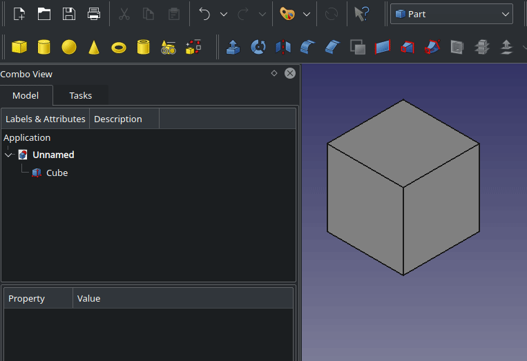
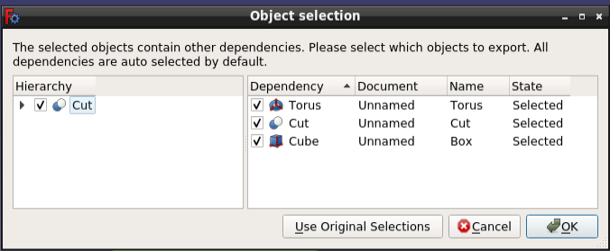

# Release notes 0.20
**This page tracks new features as they are added to the development version of FreeCAD, which is currently 0.20. When the 0.20 feature freeze happens, delete these messages, and don't add more features to this page. FreeCAD 0.20 is expected to be released in 202x.**

**!!! All images on this page must use the {{FileName|_relnotes_0.20** suffix !!!}}

Are features missing? Mention them in the [Release notes for v0.20](https://forum.freecadweb.org/viewtopic.php?f=10&t=56135) forum thread.

See [Help FreeCAD](Help_FreeCAD.md) for ways to contribute to FreeCAD.

 

**FreeCAD 0.20** was released on **DD Month 202x**, get it from the [Download](Download.md) page. This is a summary of the most interesting changes. The complete list of changes can be found in the [MantisBT bugtracker FC 0.20 changelog](https://www.freecadweb.org/tracker/changelog_page.php?version_id=78).

Older FreeCAD release notes can be found in [Feature list](Feature_list#Release_notes.md).

## Highlights

## General

### Python 3 and Qt5 

### Some issues 

### Development

To [compile FreeCAD under Windows](Compile_on_Windows.md), there are different Libpacks (prepackaged libraries) available:

-   Libpack for Windows with Qt xx, OCC yy, and Python zz

Other development news:

### Documentation

### Known limitations 

## User interface 

+----------------------------------------------------------------+-------------------------------------------------------------------------------------------------------------------------------------------------------------------------------------------------------------------------------------------------------------------------------------------------------------------------------------------------------------------------------------------------------------------------------------------------------------------------------------+
|  | The navigation cube was reworked to enable these new features:                                                                                                                                                                                                                                                                                                                                                                                                                      |
|                                                                |                                                                                                                                                                                                                                                                                                                                                                                                                                                                                     |
|                                                                | -   There are now edge faces to view the scene at angles of 45°.                                                                                                                                                                                                                                                                                                                                                                                                                    |
|                                                                | -   The new preferences option [Rotate to nearest](Preferences_Editor#Navigation.md) allows to view the scene at the nearest sensible state. When it is off, clicking to a cube face will and up always to the same position, no matter in what cube state you were when you clicked the face. Click on the image at the left side to see what this means. Try the same click sequence as in the image without the option *Rotate to nearest* to experience the difference. |
|                                                                | -   By clicking at the dot at the upper right of the cube you can quickly see the backview of the current scene.                                                                                                                                                                                                                                                                                                                                                                    |
|                                                                | -   The size of the cube can be adjusted by the preferences option [Cube size](Preferences_Editor#Navigation.md).                                                                                                                                                                                                                                                                                                                                                           |
|                                                                |                                                                                                                                                                                                                                                                                                                                                                                                                                                                                     |
|                                                                | [Forum discussion](https://forum.freecadweb.org/viewtopic.php?f=3&t=52118), [pull request \#4502](https://github.com/FreeCAD/FreeCAD/pull/4502).                                                                                                                                                                                                                                                                                                                                    |
+----------------------------------------------------------------+-------------------------------------------------------------------------------------------------------------------------------------------------------------------------------------------------------------------------------------------------------------------------------------------------------------------------------------------------------------------------------------------------------------------------------------------------------------------------------------+

  -------------------------------------------------------------------------------- ---------------------------------------------------------------------------------------------------------------------------------------------------------------------------------------------------------------------------------------------------------------------------------------------------------------------------------------------------------------------------------------------------------------------------------------
     Tooltips now display the command name in the title, making it easier for new users to look for help. At the end of the tooltip the \"internal\" command name is added in parentheses: *(Std\_WhatsThis)*. This is also the name of the page that documents the command in the Wiki. [Forum discussion](https://forum.freecadweb.org/viewtopic.php?f=34&t=58747), [pull request \#4978](https://github.com/FreeCAD/FreeCAD/pull/4978).
  -------------------------------------------------------------------------------- ---------------------------------------------------------------------------------------------------------------------------------------------------------------------------------------------------------------------------------------------------------------------------------------------------------------------------------------------------------------------------------------------------------------------------------------

  ------------------------------------------------------------------------------ -------------------------------------------------------------------------------------------------------------------------------------------------------------------------------------------------------------------------------------------------------------------------------------------------
     The new [Std UserEditMode](Std_UserEditMode.md) command allows the user to choose an edit mode that will be used when an object is double-clicked in the [Tree view](Tree_view.md). If a selected edit mode is not applicable, the object\'s default edit mode is used instead.
  ------------------------------------------------------------------------------ -------------------------------------------------------------------------------------------------------------------------------------------------------------------------------------------------------------------------------------------------------------------------------------------------

### Further user interface improvements 

-   It is now possible to pan the view of the [dependency graph](Std_DependencyGraph.md) with the mouse. [Forum discussion](https://forum.freecadweb.org/viewtopic.php?f=3&t=34791), [pull request \#4638](https://github.com/FreeCAD/FreeCAD/pull/4638).
-   Fixed an issue where using a tablet pen devices (e.g. Wacom tablet) was slow to the point of being completely unusable. [Forum Discussion](https://forum.freecadweb.org/viewtopic.php?f=8&t=45046), [pull request \#4687](https://github.com/FreeCAD/FreeCAD/pull/4687).

## App::Link and assembly 

## Core system, App, Base, and Gui namespaces 

  ------------------------------------------------------------------------------ --------------------------------------------------------------------------------------------------------------------------------------------------------------------------------------------------------------------------------------------------------------------------------------------------------------------------------------------------------------------------------------------------------------------------------------------------------------------------------------------------------------------------------------------------------------------------------------------------------------------------------------------------------------------------------------------------------------------------------------------------------------------------------------------------------------------------------------------------------------------------------------------------------------------------------------------------------------------------------------------------------------------------------------------------------------------------------------------------------------------------------------------------
     When using **Edit → Copy** or **Edit → Duplicate selection** for an object with dependencies there is a new **Use Original Selections** button in the object selection dialog. Click this button to copy/duplicate only the objects you originally selected prior to opening the dialog, ignoring dependencies and ignoring any actions you might have taken while the dialog was open, such as checking or unchecking some of the checkboxes. The effect is the same as if you had unchecked all the checkboxes next to the objects you did not originally select and pressed OK. Note: special care should be taken when copying/duplicating TechDraw Pages. It is recommended to also copy/duplicate all of the children of the Page (Templates, Views, Dimensions, etc.). Otherwise changes to one of the Pages will also impact the other page, for example, deleting one of the Views in one Page also removes it from the other Page. Deleting one of the pages will also remove all the content from the other Page if copies of the content are not also made.
  ------------------------------------------------------------------------------ --------------------------------------------------------------------------------------------------------------------------------------------------------------------------------------------------------------------------------------------------------------------------------------------------------------------------------------------------------------------------------------------------------------------------------------------------------------------------------------------------------------------------------------------------------------------------------------------------------------------------------------------------------------------------------------------------------------------------------------------------------------------------------------------------------------------------------------------------------------------------------------------------------------------------------------------------------------------------------------------------------------------------------------------------------------------------------------------------------------------------------------------------

## Addon Manager 

## Arch Workbench 

## Draft Workbench 

### Further Draft improvements 

-   It is now possible to reverse a [Draft Wire](Draft_Wire.md) via the [Draft Edit](Draft_Edit.md) context menu. [Forum discussion](https://forum.freecadweb.org/viewtopic.php?f=23&t=58643&start=20), [pull request \#4811](https://github.com/FreeCAD/FreeCAD/pull/4811).
-   Fixed \[Draft\_Snap\_Grid\|Draft Snap Grid\] when the cursor is over a face. [Forum discussion](https://forum.freecad.org/viewtopic.php?f=23&t=62274). [Git commit](https://github.com/FreeCAD/FreeCAD/commit/1761eb8ce).

## FEM Workbench 

  -------------------------------------------------------------------------------------------------------------------------------------------------------------------------------------------------------------------------------------- --------------------------------------------------------------------------------------------------------------------------------------------------------------------------------------------------------------------------------------------------------------------------------------------------------------------------------------------------------------------------------------------------------------------------------------------------------------------------------------------
  Effect of *Mesh Size From Curvature*; left: set to 12, right: deactivated                       There is a new property for the [Gmsh](FEM_MeshGmshFromShape.md) mesher. The number of mesh elements per $2\pi$ times the radius of the curvature can be specified. The default is 12 and to get a finer mesh at small corners or holes, this value can be increased for better results. This feature requires Gmsh 4.8 or newer. [Forum discussion](https://forum.freecadweb.org/viewtopic.php?f=18&t=56401), [pull request \#4596](https://github.com/FreeCAD/FreeCAD/pull/4596)
  Effect of the rcombination algorithm; left: using *Simple*, right: using *Simple full-quad*   FreeCAD allows now to select an algorithm as well as 3D mesh recombination for the [Gmsh](FEM_MeshGmshFromShape.md) mesher. For more details about the mesh element recombination see [FEM MeshGmshFromShape](FEM_MeshGmshFromShape#Element_Recombination.md). [Pull request \#4706](https://github.com/FreeCAD/FreeCAD/pull/4706)
  -------------------------------------------------------------------------------------------------------------------------------------------------------------------------------------------------------------------------------------- --------------------------------------------------------------------------------------------------------------------------------------------------------------------------------------------------------------------------------------------------------------------------------------------------------------------------------------------------------------------------------------------------------------------------------------------------------------------------------------------

### Further FEM improvements 

-   A new solver was added: **Solve →  [Solver Mystran](FEM_SolverMystran.md)**. Multiple commits.
-   A new constraint was added: **Model → Geometrical Constraints →  [Constraint Spring](FEM_ConstraintSpring.md)**. [PR \#4982](https://github.com/FreeCAD/FreeCAD/pull/4982)
-   The element order of [Gmsh](FEM_MeshGmshFromShape.md) meshes can be changed via the mesh dialog. [PR \#4660](https://github.com/FreeCAD/FreeCAD/pull/4660)
-   Material cards can now contain values for the electrical conductivity. [PR \#4647](https://github.com/FreeCAD/FreeCAD/pull/4647)
-   Material cards added for Nitrogen and Argon. [PR \#4649](https://github.com/FreeCAD/FreeCAD/pull/4649)
-   Support for the [Gmsh](FEM_MeshGmshFromShape.md) mesh algorithms \"HXT\" (3D) and \"Packing Parallelograms\" (2D) added. [PR \#4654](https://github.com/FreeCAD/FreeCAD/pull/4654)
-   Allow to set for the [Gmsh](FEM_MeshGmshFromShape#Properties.md) property **High Order Optimize** a certain algorithm. [PR \#4705](https://github.com/FreeCAD/FreeCAD/pull/4705)
-   Nonlinear solid materials with simple hardening can now have an arbitrary number of yield points. [PR \#5024](https://github.com/FreeCAD/FreeCAD/pull/5024)

## Import

## Material handling 

## Mesh

### Further Mesh improvements 

Fixed false negatives during self-intersection tests when facets are coplanar: [PR \#5002](https://github.com/FreeCAD/FreeCAD/pull/5002).

## OpenSCAD Workbench 

Interoperability with OpenSCAD has been improved, adding support for several operations missing from earlier versions (linear extrude with rotations, rotational extrusions). Several operations are modified to provide improved FreeCAD object equivalents, particularly for twisted extrusions. Surface generation from discrete data was modified to give more OpenSCAD-like results, rather than splined surfaces.

**Add OpenSCAD element** - now has additional options

Load    - load a scad file
Save    - save a scad file
Refresh - Update FreeCAD view
Clear   - Clear text input

There is also a text box for feedback of OpenSCAD errors.

## Part Workbench 

### Further Part improvements 

-   The dialog to edit [Cylinders](Part_Cylinder.md) allows now to specify an angle in respect to the normal of the chosen attachment plane. This way one can create skew cylinders. [Pull request \#4708](https://github.com/FreeCAD/FreeCAD/pull/4708)

## PartDesign Workbench 

  -------------------------------------------------------------------------------------------------------------------------------------------------------------------------------------------------------------------------------------------------- ---------------------------------------------------------------------------------------------------------------------------------------------------------------------------------------------------------------------------------------------------------------------------------------------------------------------------------------------------------------------------------------------------------------------------------------------------------------------------------------------------------
  Effect of the new option *Length along sketch normal*.Click on the image to show the animation.   There is a new option to pad a certain length along the direction. The length is either measured along the sketch normal or along the custom direction. [Forum discussion](https://forum.freecadweb.org/viewtopic.php?f=17&t=50466), [pull request \#3893](https://github.com/FreeCAD/FreeCAD/pull/3893)
                                                                                                                                  The dialog to edit [Cylinder](PartDesign_AdditiveCylinder.md) (additive and subtractive) allows now to specify an angle in respect to the normal of the chosen attachment plane. This way one can create skew cylinders. [pull request \#4708](https://github.com/FreeCAD/FreeCAD/pull/4708)
                                                                                                                          When Distance and Angle is specified in the [Chamfer](PartDesign_Chamfer.md) tool and faces are selected, the distance will be applied along the selected faces. Likewise if two distances are specified then Size 1 will be applied along the selected face. This behaviour can be swapped to the other face using the flip direction button. [Forum discussion](https://forum.freecadweb.org/viewtopic.php?f=19&t=62084), [pull request \#5039](https://github.com/FreeCAD/FreeCAD/pull/5039)
  -------------------------------------------------------------------------------------------------------------------------------------------------------------------------------------------------------------------------------------------------- ---------------------------------------------------------------------------------------------------------------------------------------------------------------------------------------------------------------------------------------------------------------------------------------------------------------------------------------------------------------------------------------------------------------------------------------------------------------------------------------------------------

### Further PartDesign improvements 

-   The [Helix](PartDesign_AdditiveHelix.md) feature has the new mode **Height-Turns-Growth** to create flat spirals. [Forum thread](https://forum.freecadweb.org/viewtopic.php?f=19&t=56378) [PR \#4590](https://github.com/FreeCAD/FreeCAD/pull/4590)
-   The [Sprocket](PartDesign_Sprocket.md) feature can now create also ISO-normed sprockets. [Forum thread](https://forum.freecadweb.org/viewtopic.php?f=22&t=44525#p478369) [PR \#4478](https://github.com/FreeCAD/FreeCAD/pull/4478)

## Path Workbench 

## Render Workbench 

## Sketcher Workbench 

  --------------------------------------------------------------------------------------------------------------------------------------- --------------------------------------------------------------------------------------------------------------------------------------------------------------------------------------------------------------------------------------------------------------------------------------------------------------------------------------------------------------------------------------------------------------------------------------------------------------------
   [Split](Sketcher_Split.md) function to split existing lines or arcs. [Forum discussion](https://forum.freecadweb.org/viewtopic.php?f=9&t=55412) [pull request \#4420](https://github.com/FreeCAD/FreeCAD/pull/4420)
   [Rounded rectangle](Sketcher_CreateOblong.md) tool to create rectangles with rounded corners. [Forum discussion](https://forum.freecadweb.org/viewtopic.php?f=17&t=59210) [Main pull request \#4835](https://github.com/FreeCAD/FreeCAD/pull/4835)
     New  [Centered rectangle](Sketcher_CreateRectangle_Center.md) tool to define rectangles via a center point. [Main commit](https://github.com/FreeCAD/FreeCAD/commit/8b4acf11c2caf53cc1cb8dccd8bb6de8516f4492)
                                                           New  [Radiam](Sketcher_ConstrainRadiam.md) function to automatically assign weight on B-spline pole, diameter on complete circle, or radius on arc. Support multi-selection as diameter/radius tools. [Forum discussion](https://forum.freecadweb.org/viewtopic.php?f=3&t=57584&start=20#p509485) [Main pull request \#4855](https://github.com/FreeCAD/FreeCAD/pull/4855)
   [Remove Axes Alignment](Sketcher_RemoveAxesAlignment.md) constraint tool to remove axes alignment while trying to preserve the constraint relationship of the selection. [Main commit](https://github.com/FreeCAD/FreeCAD/commit/3c593a33cedc3e6a42928d9087f8a160852cc685)
  --------------------------------------------------------------------------------------------------------------------------------------- --------------------------------------------------------------------------------------------------------------------------------------------------------------------------------------------------------------------------------------------------------------------------------------------------------------------------------------------------------------------------------------------------------------------------------------------------------------------

### Further Sketcher improvements 

-   Refactored Trim support. [Pull Request](https://github.com/FreeCAD/FreeCAD/pull/4330) [Forum discussion](https://forum.freecadweb.org/viewtopic.php?f=10&t=54441) \<\-- Needs screencasts
-   The behavior of the  [Slot](Sketcher_CreateSlot.md) tool has changed. Slots can now be created by defining the center of both semicircles. [Pull request](https://github.com/FreeCAD/FreeCAD/pull/4843) [Forum discussion](https://forum.freecadweb.org/viewtopic.php?f=17&t=59243&p=508658#p508658)
-   Visibility automation allows to open Sketcher in [Section mode](Sketcher_ViewSection.md) when entering edit mode. [Pull request](https://github.com/FreeCAD/FreeCAD/pull/4742) [Forum discussion](https://forum.freecadweb.org/viewtopic.php?f=3&t=57056)
-   Visibility automation allows to force camera in [Orthographic mode](Std_OrthographicCamera.md) when entering edit mode. [Pull request](https://github.com/FreeCAD/FreeCAD/pull/4778) [Forum discussion](https://forum.freecadweb.org/viewtopic.php?f=22&t=44747)
-   Option to display the dimensional constraint name and use a custom format for it. [Pull request](https://github.com/FreeCAD/FreeCAD/pull/4966) [Forum discussion](https://forum.freecadweb.org/viewtopic.php?t=61153)
-   When sketching a [3-point arc](Sketcher_Create3PointArc.md) with Autoconstraint enabled, [tangent constraint](Sketcher_ConstrainTangent.md) is proposed for all 3 points when hovering a line/curve. [Pull request](https://github.com/FreeCAD/FreeCAD/pull/4945) [Forum discussion](https://forum.freecadweb.org/viewtopic.php?f=3&t=60596&p=520217#p520209)

### Sketcher bug fixes 

-   Fix \'Reference\' option not working for radius/diameter at creation time [PR for radius](https://github.com/FreeCAD/FreeCAD/pull/4744) [PR for diameter](https://github.com/FreeCAD/FreeCAD/pull/4832) [Forum discussion](https://forum.freecadweb.org/viewtopic.php?f=3&t=57584)

## Spreadsheet Workbench 

-   It is now possible to select in the row/column context-menu at what positions new rows/columns will be inserted. Furthermore, when selecting several rows/columns, the row/column context-menu offers now to insert as many new rows/columns as selected. [pull request \#4704](https://github.com/FreeCAD/FreeCAD/pull/4704).

## Start Workbench 

## Surface Workbench 

## TechDraw Workbench 

### Further TechDraw improvements 

## Web

## External workbenches 

### 3D Printing Tools 

### A2plus

### Assembly3

### Assembly4

### ArchTextures

### BOLTSFC

### CurvedShapes Workbench 

### Dodo (formerly Flamingo) 

### Fasteners

### MeshRemodel Workbench 

### MOOC Workbench 

### NodeEditor (PyFlow) 

### Trails, PyTrails, Turns, pivy\_trackers, and Geomatics 

[Category:News](Category:News.md) [Category:Documentation](Category:Documentation.md) [Category:Releases](Category:Releases.md)

---
[documentation index](../README.md) > [News](Category:News.md) > Release notes 0.20
