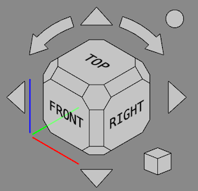

# Release notes 0.21
**FreeCAD 0.21** was released on **2 August 2023**, get it from the [Download](Download.md) page. This page lists all new features and changes.

Older FreeCAD release notes can be found in the [Feature list](Feature_list#Release_notes.md).

## General

-   The default backup file naming scheme is now **FCBak**. The older format (**FCStd#**) is deprecated and will be removed in a future version. Users with the old scheme enabled will be warned on startup. [Pull request #9668](https://github.com/FreeCAD/FreeCAD/pull/9668)

## User interface 

+++
|  | The [Navigation Cube](Navigation_Cube.md) has been updated. The cube is no longer shown in perspective if the [3D view](3D_view.md) is in orthographic view mode. Corner faces have been made hexagonal and larger so that they are easier to click. Borders have been added around the buttons. Default font selection and sizing has been improved. The Mini-cube menu now includes a checkbox to toggle the movability of the cube. Several new parameters have been added, see the [Navigation Cube](Navigation_Cube.md) page for more information.[Pull request #7876](https://github.com/FreeCAD/FreeCAD/pull/7876), [Pull request #8266](https://github.com/FreeCAD/FreeCAD/pull/8266), [Pull request #8646](https://github.com/FreeCAD/FreeCAD/pull/8646) and [Pull request #9356](https://github.com/FreeCAD/FreeCAD/pull/9356). |
+++

+++
| Persistent section cut of intersecting objects.Click on the image to see the animation. | The [Section Cut](Part_SectionCut.md) tool now allows to cut intersecting objects. This is useful for assemblies where intersections of touching objects can sometimes not be avoided due to numerical issues. |
|                                                                                                                                                                                                                            | [Pull request #8252](https://github.com/FreeCAD/FreeCAD/pull/8252).                                                                                                                                                    |
+++

+++
|  | The display style of [measurement](Part_Workbench#Measure.md) results created using the [Part](Part_Workbench.md) or [PartDesign](PartDesign_Workbench.md) workbench can now be changed in the [preferences](PartDesign_Preferences#Measure.md). [Pull request #7148](https://github.com/FreeCAD/FreeCAD/pull/7148) |
+++

+++
|  | The workbench selector can now optionally be put in the menubar instead of the toolbar area. [Pull request #7679](https://github.com/FreeCAD/FreeCAD/pull/7679) |
+++

### Further user interface improvements 

-   The buttons for  [Print](Std_Print.md) and  [Edit Mode](Std_UserEditMode.md) have been removed from the File toolbar. They can be re-added by [customizing](Std_DlgCustomize.md) your toolbar. [Pull request #7570](https://github.com/FreeCAD/FreeCAD/pull/7570) and [commit ea9a04e](https://github.com/FreeCAD/FreeCAD/commit/ea9a04e)
-   The File toolbar has been split. The buttons for  [Undo](Std_Undo.md),  [Redo](Std_Redo.md) and  [Refresh](Std_Refresh.md) have been moved to the new Edit toolbar. The buttons for  [Cut](Std_Cut.md),  [Copy](Std_Copy.md) and  [Paste](Std_Paste.md) have been moved to the new Clipboard toolbar. The button for  [What\'s This?](Std_WhatsThis.md) has been moved to the new Help toolbar. [Pull request #7620](https://github.com/FreeCAD/FreeCAD/pull/7620)
-   Commands to [store](Std_StoreWorkingView.md) and [recall](Std_RecallWorkingView.md) a temporary working view have been added. [Pull request #7525](https://github.com/FreeCAD/FreeCAD/pull/7525)
-   Value changes with the mouse wheel in \'input fields\' (a widget type used to enter values in task panels, for example by [Draft Line](Draft_Line.md)) are disabled if the widget doesn\'t have the focus and the [ComboBoxWheelEventFilter](Fine-tuning#Mouse_related.md) parameter is enabled. This prevents unwanted value changes while scrolling, as was already the case for spin and combo boxes. [Pull request #7561](https://github.com/FreeCAD/FreeCAD/pull/7561)
-   It is now possible to set a default transparency for new [Part](Part_Module.md) or [PartDesign](PartDesign_Workbench.md) objects in the [Preferences](PartDesign_Preferences.md). [Pull request #7103](https://github.com/FreeCAD/FreeCAD/pull/7103)
-   There is the new orbit style **Free Turntable**. It can either be enabled in the [Preferences](Preferences_Editor#Navigation.md) or by pressing the **[** button in the [Status bar](Status_bar.md) and then using the menu **Settings → Orbit**). [Pull Request #8048](https://github.com/FreeCAD/FreeCAD/pull/8048)
-   The [Std SetAppearance](Std_SetAppearance.md) task panel now also has a button to set the Point Color property. [Pull request #7708](https://github.com/FreeCAD/FreeCAD/pull/7708)
-   A button has been added to switch the colors of the [3D view](3D_view.md) background gradient in the [Preferences](Preferences_Editor#Colors.md). [Pull request #7155](https://github.com/FreeCAD/FreeCAD/pull/7155)
-   All transparency settings use now the uniform spin button step of 5%: One click on the button in a dialog or the [property editor](Property_editor.md) changes the transparency by 5%. Keep the button pressed to change several 5% steps at once. [Pull request #7723](https://github.com/FreeCAD/FreeCAD/pull/7723)
-   The Output window has been renamed to Report view for uniformity with the UI. [Pull Request #7739](https://github.com/FreeCAD/FreeCAD/pull/7739)
-   The Image Workbench has been removed. To insert an Image Plane the [Std Import](Std_Import.md) command can now be used. Double-click an Image Plane to change its orientation and scale. The new [Std ViewLoadImage](Std_ViewLoadImage.md) command replaces the Image Open command. [Pull Request #8955](https://github.com/FreeCAD/FreeCAD/pull/8955)
-   The deprecated Raytracing Workbench has been removed. The external [Render Workbench](https://github.com/FreeCAD/FreeCAD-render) should be used instead. [Pull Request #9420](https://github.com/FreeCAD/FreeCAD/pull/9420)

## Core system and API 

### Core

-   The function **cbrt(x)** for cubic roots was added for use in [Expressions](Expressions#Exponential_and_logarithmic_functions.md). [Pull request #8629](https://github.com/FreeCAD/FreeCAD/pull/8629)
-   Many new [Properties](Property#All_property_types.md) are available for scripting. [Pull request #6717](https://github.com/FreeCAD/FreeCAD/pull/6717)
-   Added object creation functions {{Incode|vector}}, {{Incode|matrix}}, {{Incode|rotation}}, {{Incode|placement}} as well as matrix functions {{Incode|mrotate}}, {{Incode|mrotatex}}, {{Incode|mrotatey}}, {{Incode|mrotatez}}, {{Incode|mtranslate}} for use in [Expressions](Expressions.md). [Pull request #8603](https://github.com/FreeCAD/FreeCAD/pull/8603).

### API

#### New Python API 

-   *BSplineSurfacePy::scaleKnotsToBounds*: Scales the U and V knots lists to fit the specified bounds. [Pull request #7258](https://github.com/FreeCAD/FreeCAD/pull/7258) and [Pull request #7385](https://github.com/FreeCAD/FreeCAD/pull/7385)
-   *BSplineCurvePy::scaleKnotsToBounds*: Scales the knots list to fit the specified bounds. [Pull request #7385](https://github.com/FreeCAD/FreeCAD/pull/7385)

-   *ShapeFix_EdgeConnectPy*: Root class for fixing operations. [commit 4d4adb93](https://github.com/FreeCAD/FreeCAD/commit/4d4adb93)
-   *ShapeFix_EdgePy*: Fixing invalid edge. [commit 4089cbfb](https://github.com/FreeCAD/FreeCAD/commit/4089cbfb)
-   *ShapeFix_FaceConnectPy*: Rebuilds connectivity between faces in shell. [commit a0eb2e9d](https://github.com/FreeCAD/FreeCAD/commit/a0eb2e9d)
-   *ShapeFix_FacePy*: Class for fixing operations on faces. [commit b6cd635c](https://github.com/FreeCAD/FreeCAD/commit/b6cd635c)
-   *ShapeFix_FixSmallFacePy*: Class for fixing operations on faces. [commit 4c2946c8](https://github.com/FreeCAD/FreeCAD/commit/4c2946c8)
-   *ShapeFix_FixSmallSolidPy*: Fixing solids with small size. [commit b70d8d37](https://github.com/FreeCAD/FreeCAD/commit/b70d8d37)
-   *ShapeFix_FreeBoundsPy*: Intended to output free bounds of the shape. [commit 1ee1aee1](https://github.com/FreeCAD/FreeCAD/commit/1ee1aee1)
-   *ShapeFix_RootPy*: Root class for fixing operations. [commit f3e941a3](https://github.com/FreeCAD/FreeCAD/commit/f3e941a3)
-   *ShapeFix_ShapePy*: Class for fixing operations on shapes. [commit 87db9dcc](https://github.com/FreeCAD/FreeCAD/commit/87db9dcc)
-   *ShapeFix_ShapeTolerancePy*: Modifies tolerances of sub-shapes (vertices, edges, faces). [commit 125d5b63](https://github.com/FreeCAD/FreeCAD/commit/125d5b63)
-   *ShapeFix_ShellPy*: Root class for fixing operations. [commit f3e941a3](https://github.com/FreeCAD/FreeCAD/commit/f3e941a3)
-   *ShapeFix_SolidPy*: Root class for fixing operations. [commit 8d568793](https://github.com/FreeCAD/FreeCAD/commit/8d568793)
-   *ShapeFix_SplitCommonVertexPy*: Class for fixing operations on shapes. [commit 4b44c54c](https://github.com/FreeCAD/FreeCAD/commit/4b44c54c)
-   *ShapeFix_SplitToolPy*: Tool for splitting and cutting edges. [commit bbecc3f2](https://github.com/FreeCAD/FreeCAD/commit/bbecc3f2)
-   *ShapeFix_WireframePy*: Provides methods for fixing wireframe of shape. [commit 6843a461](https://github.com/FreeCAD/FreeCAD/commit/6843a461)
-   *ShapeFix_WirePy*: Class for fixing operations on wires. [commit 94f6279a](https://github.com/FreeCAD/FreeCAD/commit/94f6279a)
-   *ShapeFix_WireVertexPy*: Fixing disconnected edges in the wire. [commit 8c6ffc99](https://github.com/FreeCAD/FreeCAD/commit/8c6ffc99)

#### Removed Python API 

-   *FreeCAD.EndingAdd*: replaced by *FreeCAD.addImportType*. [Pull request #7167](https://github.com/FreeCAD/FreeCAD/pull/7167)
-   *FreeCAD.EndingGet*: replaced by *FreeCAD.getImportType*. [Pull request #7167](https://github.com/FreeCAD/FreeCAD/pull/7167)

## Addon Manager 

-   Added basic Python package management for updating and removing automatically-installed dependencies.
-   Added a \"developer mode\" to aid in the creation of the metadata file required in each Addon.

## Arch Workbench 

-   Several [Arch Profile](Arch_Profile.md) categories have been added: IS RHS, IS SHS, IS Angle and IS Tee. [Pull request #7181](https://github.com/FreeCAD/FreeCAD/pull/7181) and [Pull request #7217](https://github.com/FreeCAD/FreeCAD/pull/7217)
-   [Arch Profile](Arch_Profile.md) objects now support modification of the profile type after creation. [Pull request #7217](https://github.com/FreeCAD/FreeCAD/pull/7217)
-   Several edit mode issues have been fixed and the [Tree view](Tree_view.md) context menus for Arch objects have been improved. Objects that can be edited now have an **Edit** option in that menu. The **Set colors** option was removed for objects without a face or that can only have a single face. [Pull request #8122](https://github.com/FreeCAD/FreeCAD/pull/8122)
-   [Arch SectionPlane](Arch_SectionPlane.md) objects now handle non-solid objects the same as solid objects. [Pull request #8688](https://github.com/FreeCAD/FreeCAD/pull/8688)

### Further Arch improvements 

-   The **Invert hinge position** tool has been improved. For all rectangular wires the opposite edge is now correctly detected. [Pull request #8199](https://github.com/FreeCAD/FreeCAD/pull/8199)
-   The Terrain of an [Arch Site](Arch_Site.md) can now also be a solid. [Pull request #8409](https://github.com/FreeCAD/FreeCAD/pull/8409)
-   An [Arch Site](Arch_Site.md) no longer shows a phantom representation of the objects in its Group. [Pull request #8409](https://github.com/FreeCAD/FreeCAD/pull/8409)

## Draft Workbench 

-   The inaccuracy of [Draft Snap Near](Draft_Snap_Near.md) when snapping to curves was fixed. In addition, [Draft Snap Perpendicular](Draft_Snap_Perpendicular.md) can now also snap to faces and find multiple points. To snap to a vertex (e.g. a [Draft Point](Draft_Point.md)) [Draft Snap Endpoint](Draft_Snap_Endpoint.md) must now be used instead of [Draft Snap Near](Draft_Snap_Near.md). [Pull request #7132](https://github.com/FreeCAD/FreeCAD/pull/7132)
-   To make working with [layers](Draft_Layer.md) easier their drag and drop behavior was modified. If you drop an object from a [Std Group](Std_Group.md), or a group-like object such as an [Arch BuildingPart](Arch_BuildingPart.md), on a layer, it is no longer removed from the group, and vice versa. This works without holding down the **Ctrl** key. [Pull request #7462](https://github.com/FreeCAD/FreeCAD/pull/7462)
-   The [Draft PointArray](Draft_PointArray.md) command now supports more point object types. Any object with a shape and vertices, as well as a [mesh](Mesh_Workbench.md) and a [point cloud](Points_Workbench.md) can be used. [Pull request #7597](https://github.com/FreeCAD/FreeCAD/pull/7597)
-   The [Tree view](Tree_view.md) context menus for Draft objects have been improved. Objects that can be edited with the [Draft Edit](Draft_Edit.md) command, or that have a dedicated edit solution, now have an **Edit** option in that menu. The **Set colors** option was removed for objects without a face or that can only have a single face. [Pull request #7970](https://github.com/FreeCAD/FreeCAD/pull/7970)
-   The properties of Draft annotation objects have been unified. [Draft Text](Draft_Text.md), [Draft Dimension](Draft_Dimension.md) and [Draft Label](Draft_Label.md) objects now all have a Font Name, a Font Size and a Text Color property. The Display Mode options have been made consistent as well and are now: Screen and World. [Issue #7861](https://github.com/FreeCAD/FreeCAD/issues/7861) and [Pull request #8081](https://github.com/FreeCAD/FreeCAD/pull/8081)
-   In the task panel of the [Draft SetStyle](Draft_SetStyle.md) command the **Texts/dims** button has been replaced by the **Annotations** button. Pressing this button will process all annotations, including [Draft Labels](Draft_Label.md). **Dim overshoot**, **Ext lines** and **Ext overshoot** parameters have been added. Several minor additional issues were also fixed. [Pull request #8190](https://github.com/FreeCAD/FreeCAD/pull/8190), [Pull request #8195](https://github.com/FreeCAD/FreeCAD/pull/8195), [Pull request #8196](https://github.com/FreeCAD/FreeCAD/pull/8196) and [Pull request #9514](https://github.com/FreeCAD/FreeCAD/pull/9514).
-   Undo/Redo did not work properly for the Draft modification commands on Windows. [Pull request #8267](https://github.com/FreeCAD/FreeCAD/pull/8267)
-   The [LayerManager command](Draft_LayerManager.md) has been migrated from the BIM Workbench to the Draft Workbench. [Pull request #8795](https://github.com/FreeCAD/FreeCAD/pull/8795)

### Further Draft improvements 

-   When aligning the working plane with a face it was only rotated to match the global axes if the face was a quad. [Pull request #7249](https://github.com/FreeCAD/FreeCAD/pull/7249)
-   Several [Draft PathArray](Draft_PathArray.md) related issues have been fixed. [Pull request #7506](https://github.com/FreeCAD/FreeCAD/pull/7506) and [Pull request #7662](https://github.com/FreeCAD/FreeCAD/pull/7662)
-   The [Draft Edit](Draft_Edit.md) command has received several improvements. For [wires](Draft_Wire.md), [B-splines](Draft_BSpline.md) and [Bézier curves](Draft_BezCurve.md) a Close/Open option has been added to the edge context menu. For B-splines and Bézier curves a Reverse option has been added to the same menu as well. The task panels have been cleaned up. [Pull request #7527](https://github.com/FreeCAD/FreeCAD/pull/7527) and [Pull request #7541](https://github.com/FreeCAD/FreeCAD/pull/7541)
-   Using Esc to exit a command no longer switches off continue mode. [Pull request #7611](https://github.com/FreeCAD/FreeCAD/pull/7611)
-   The [Draft Snap](Draft_Snap.md) toolbar was changed to a standard toolbar. Keyboard shortcuts can now be assigned to snaps. But using them during a command only works if none of the input boxes in the task panel has the focus as they \'catch\' the so-called in-command shortcuts. [Pull request #7656](https://github.com/FreeCAD/FreeCAD/pull/7656)
-   Several [Draft AnnotationStyleEditor](Draft_AnnotationStyleEditor.md) bugs have been fixed. The **Text color** and **Text spacing** parameters have been added. [Pull request #8207](https://github.com/FreeCAD/FreeCAD/pull/8207) and [Pull request #9702](https://github.com/FreeCAD/FreeCAD/pull/9702)
-   Start and End Offset properties have been added to [Draft PathArray](Draft_PathArray.md) objects. [Pull request #8295](https://github.com/FreeCAD/FreeCAD/pull/8295)
-   A Count property has been added to the arrays that lacked this property: the non-Link versions of [Draft OrthoArray](Draft_OrthoArray.md), [Draft PolarArray](Draft_PolarArray.md) and [Draft CircularArray](Draft_CircularArray.md). [Pull request #8433](https://github.com/FreeCAD/FreeCAD/pull/8433)
-   The on/off behavior of the [grid](Draft_Snap_Grid.md) has been fixed. [Pull request #8818](https://github.com/FreeCAD/FreeCAD/pull/8818)
-   The handling of DWG converters has been improved. [Pull request #9444](https://github.com/FreeCAD/FreeCAD/pull/9444) and [Pull request #9830](https://github.com/FreeCAD/FreeCAD/pull/9830)

## FEM Workbench 

   
  Iso-contours, depicting the y-component of the absolute magneticflux density in and around a copper wire that is flown through byelectric current at a frequency of 100 kHz.For more info about this model, see section 14 of the [Elmer Tutorials](https://www.nic.funet.fi/index/elmer/doc/ElmerTutorials.pdf).   There is the new  [Contours filter](FEM_PostFilterContours.md) filter that allows to draw iso-lines or iso-contours. Iso-contours are connected mesh nodes that have the same result field value. A typical example are electric field lines. [Pull request #8462](https://github.com/FreeCAD/FreeCAD/pull/8462)
   

   
  Simulation result (of flowing water being heated) where 8 mesh regionsare visible (one for every CPU core used).   It is now possible to run the solver [Elmer](FEM_SolverElmer.md) using multiple CPU cores. For more info about the caveats, see [this forum post](https://forum.freecadweb.org/viewtopic.php?p=610617#p610617) [Pull request #7159](https://github.com/FreeCAD/FreeCAD/pull/7159)
   

   
  Simulation result of the imaginary part of the current density ina crucible that was heated electrically by a surrounding coil.This model is available via the [FEM Examples](FEM_Examples.md).For more info about this model, see section 16 of the [Elmer Tutorials](https://www.nic.funet.fi/index/elmer/doc/ElmerTutorials.pdf).   The  [Magnetodynamic 2D equation](FEM_EquationMagnetodynamic2D.md) was added. With this it is possible to perform electromagnetic simulations in 2D. [Pull request #8355](https://github.com/FreeCAD/FreeCAD/pull/8355)
   

   
  Simulation result of the imaginary part of the magnetic flux density inand around a copper wire that is flown through by electric current ata frequency of 100 kHz.This model is available via the [FEM Examples](FEM_Examples.md).For more info about this model, see section 14 of the [Elmer Tutorials](https://www.nic.funet.fi/index/elmer/doc/ElmerTutorials.pdf).   The  [Magnetodynamic equation](FEM_EquationMagnetodynamic.md) was added. With this it is possible to perform electromagnetic simulations. [Pull request #8380](https://github.com/FreeCAD/FreeCAD/pull/8380)
   

   
  Simulation result of an iron U-wire that is deformedby pressing the ends of the U together.For more info about this model, see section 8 of the [Elmer Tutorials](https://www.nic.funet.fi/index/elmer/doc/ElmerTutorials.pdf).   The  [Deformation equation](FEM_EquationDeformation.md) was added. With this it is possible to perform nonlinear elasticity analyses (deformation). [Pull request #8981](https://github.com/FreeCAD/FreeCAD/pull/8981)
   

### Further FEM improvements 

-   When performing analyses using the  [CalculiX solver](FEM_SolverCalculixCxxtools.md), there is now also a [results pipeline](FEM_PostPipelineFromResult.md) created to visualize the results. [Pull request #8525](https://github.com/FreeCAD/FreeCAD/pull/8525) and [Pull request #8903](https://github.com/FreeCAD/FreeCAD/pull/8903)
-   It is now possible to perform [transient analyses](FEM_SolverElmer_SolverSettings#Timestepping_(transient_analyses).md) when using the  [Elmer solver](FEM_SolverElmer.md). [Pull request #9056](https://github.com/FreeCAD/FreeCAD/pull/9056)
-   The  [initial pressure constraint](FEM_ConstraintInitialPressure.md) was added to set the initial internal pressure of fluids. [Pull request #7364](https://github.com/FreeCAD/FreeCAD/pull/7364)
-   The  [current density constraint](FEM_ConstraintCurrentDensity.md) was added to set current densities for bodies and faces. [Pull request #8348](https://github.com/FreeCAD/FreeCAD/pull/8348)
-   The  [magnetization constraint](FEM_ConstraintMagnetization.md) was added to set magnetizations for bodies and faces. [Pull request #8393](https://github.com/FreeCAD/FreeCAD/pull/8393)
-   The  [flow velocity constraint](FEM_ConstraintFlowVelocity.md) and  [initial flow velocity constraint](FEM_ConstraintInitialFlowVelocity.md) were completely rewritten. It is now also possible to specify a velocity via a math formula (to define a velocity profile). [Pull request #8963](https://github.com/FreeCAD/FreeCAD/pull/8963) and [Pull request #8964](https://github.com/FreeCAD/FreeCAD/pull/8964)**Note:** This is a breaking change. Analyses with existing flow velocity and initial flow velocity constraints will not work anymore. You have to create new flow velocity constraints in the analysis to make existing analyses work.**Also note:** until FreeCAD 0.21 the results of the flow solver were wrong (fluid density and viscosity were a factor 1000 too high). Therefore the necessary recreation of the velocity constraint also assures the results will be correct.
-   It is now possible to define in the  [displacement constraint](FEM_ConstraintDisplacement.md) displacements as equations (displacement according to the current solver time).
-   The  [body heat source constraint](FEM_ConstraintBodyHeatSource.md) has now a task panel and it is possible to set the heat for several bodies or to use several constraints for different bodies in one analysis. [Pull request #7367](https://github.com/FreeCAD/FreeCAD/pull/7367)
-   The  [spring constraint](FEM_ConstraintSpring.md) was not used by any solver. Now it can be used by the [Elmer](FEM_SolverElmer.md) solver via the equations [Deformation](FEM_EquationDeformation.md) and [Elasticity](FEM_EquationElasticity.md). [Pull request #9005](https://github.com/FreeCAD/FreeCAD/pull/9005)
-   The result mesh cut function  [Filter function cylinder](FEM_PostCreateFunctionCylinder.md) was added. [Pull request #8735](https://github.com/FreeCAD/FreeCAD/pull/8735)
-   The result mesh cut function  [Filter function box](FEM_PostCreateFunctionBox.md) was added. [Pull request #8825](https://github.com/FreeCAD/FreeCAD/pull/8825)
-   It is now possible to open (and this way visualize) \*.pvtu files (partitioned VTK unstructured grid data). A \*.pvtu file is also the result of an [Elmer](FEM_SolverElmer.md) simulation, when more than one CPU core is used for calculations. [Pull request #7159](https://github.com/FreeCAD/FreeCAD/pull/7159)
-   Critical Strain Ratio has been added to the VTK result pipeline. It gives an indication of ductile rupture for materials with a \"MaterialMechanicalNonlinear\" object. [Pull request #7467](https://github.com/FreeCAD/FreeCAD/pull/7467)
-    [FEM mesh to mesh](FEM_FemMesh2Mesh.md) has the new parameter *scale* to define the scale of deformed mesh using Python. [Forum thread](https://forum.freecadweb.org/viewtopic.php?f=18&t=71936) and [Pull request #7715](https://github.com/FreeCAD/FreeCAD/pull/7715)
-   The [preferences](FEM_Preferences.md) have a new option to define which solver should automatically be added when creating a new analysis.
-   Usability improvements:
    -   If you are in the FEM workbench when loading a FreeCAD file containing an analysis, the analysis gets activated automatically (you have immediate access to all FEM toolbar buttons).
    -   The toolbar only has buttons for solvers installed on your system. Unavailable solvers are no longer displayed.
-   New example files for the following equations are available via the [FEM Examples](FEM_Examples.md): [Deformation](FEM_EquationDeformation.md), [Flow](FEM_EquationFlow.md), [Flux](FEM_EquationFlux.md), [Heat](FEM_EquationHeat.md), [Magnetodynamic](FEM_EquationMagnetodynamic.md) and [Magnetodynamic 2D](FEM_EquationMagnetodynamic2D.md). Pull requests [#8550](https://github.com/FreeCAD/FreeCAD/pull/8550), [#8569](https://github.com/FreeCAD/FreeCAD/pull/8569), [#8579](https://github.com/FreeCAD/FreeCAD/pull/8579), [#8597](https://github.com/FreeCAD/FreeCAD/pull/8597), [#8630](https://github.com/FreeCAD/FreeCAD/pull/8630) and [#9004](https://github.com/FreeCAD/FreeCAD/pull/9004).
-   New material card for carbon dioxide and a titanium alloy. [Pull request #8332](https://github.com/FreeCAD/FreeCAD/pull/8332) and [Pull request #8636](https://github.com/FreeCAD/FreeCAD/pull/8636)

## Mesh

-   Support to add transparencies to a mesh. [Forum thread](https://forum.freecadweb.org/viewtopic.php?f=22&t=72531) and [Commit f88305e](https://github.com/FreeCAD/FreeCAD/commit/f88305e)

## Part Workbench 

-   The [Part PointsFromMesh](Part_PointsFromMesh.md) command has been extended to accept any geometric object as input. [Pull request #8730](https://github.com/FreeCAD/FreeCAD/pull/8730)

## PartDesign Workbench 

   
  A counterdrill hole.   The [Hole](PartDesign_Hole.md) dialog supports the screw head type *Counterdrill*. [Pull request #7562](https://github.com/FreeCAD/FreeCAD/pull/7562)
                                                                                                                              
   

+++
|  | The UX on multiple PartDesign task dialogs for selecting geometries has been improved, now no longer requiring the use of separate buttons for adding or removing geometries to the selection. [Pull request #8990](https://github.com/FreeCAD/FreeCAD/pull/8990) |
+++
|                                                                                                       |                                                                                                                                                                                                                                                                   |
+++

### Further PartDesign improvements 

-   In the [Hole](PartDesign_Hole.md) dialog, the deprecated screw head types (cheese head, cap screw etc.) have been removed. They were deprecated since FreeCAD 0.19. Holes using these types are transformed to custom countersinks/counterbore holes with the diameter and depth used by the types. [Pull request #7654](https://github.com/FreeCAD/FreeCAD/pull/7654)
-   In the [Additive Loft](PartDesign_AdditiveLoft.md) and [Subtractive Loft](PartDesign_SubtractiveLoft.md) dialogs, the previously non-functional option **Closed** does now create a closed loft (like a ring). [Pull request #8748](https://github.com/FreeCAD/FreeCAD/pull/8748)
-   The [Validate sketch](Sketcher_ValidateSketch.md) command was added to Helper toolbar. [Pull request #7700](https://github.com/FreeCAD/FreeCAD/pull/7700)
-   The unusable [Leave sketch](Sketcher_LeaveSketch.md) and [View sketch](Sketcher_ViewSketch.md) commands were removed from the menu. The [Edit sketch](Sketcher_EditSketch.md), [Merge sketches](Sketcher_MergeSketches.md) and [Mirror sketch](Sketcher_MirrorSketch.md) commands were added to the menu. [Pull request #7700](https://github.com/FreeCAD/FreeCAD/pull/7700)
-   The [involute gear profile](PartDesign_InvoluteGear.md) has new properties to change the tooth length. This now allows adjustments for certain types of interferences and to use the profile to create [involute splines](https://en.wikipedia.org/wiki/Spline_(mechanical)) too. [Pull request #8184](https://github.com/FreeCAD/FreeCAD/pull/8184)
-   The [involute gear profile](PartDesign_InvoluteGear.md) now offers profile shifting. [Issue #5618](https://github.com/FreeCAD/FreeCAD/issues/5618) and [Pull request #8934](https://github.com/FreeCAD/FreeCAD/pull/8934)
-   When creating a [Clone](PartDesign_Clone.md) it will now inherit the colors of the cloned object. [Pull request #9547](https://github.com/FreeCAD/FreeCAD/pull/9547)

## Path Workbench 

-   Camotics integration. If camotics (version 1.2.2 or later) is installed, a new icon will be added to the Path toolbar. Select a Path Job and press the button to open the Camotics dialog. Then drag the slider to generate a simulated solid at any point in the job. You can also launch the full camotics application to run the animated simulaton. This results in a silent post-processing of the job and creation of a camotics project file. [Pull request #6637](https://github.com/FreeCAD/FreeCAD/pull/6637)

-   Additional substitution strings for automatic output naming. If output is being split into multiple files, the filenames can automatically substitute the toolcontroller label, Work Coordinate Systems (WCS), or operation label. This is in addition to the other existing substitution strings like date, job name, etc.

-   Implemented Chipbreaking option for peck style drill cycles. Chipbreaking emits a G73 cycle which causes the control to make a very small retraction move to break the chip without fully retracting the bit from the hole. G73 is supported natively by LinuxCNC. Some other postprocessors will have to interpret the G73 and emit control appropriate codes or decompose the retraction into G1/G0 moves. Postprocessor support for G73 decomposition has been added to the \"refactored\" postprocessors.[Pull request #7469](https://github.com/FreeCAD/FreeCAD/pull/7469)

## Sketcher Workbench 

   
  Dragging of B-spline knots.Click on the image to see the animation.   B-spline knots can now be dragged around and constrained like any other sketch point. [Pull request #7484](https://github.com/FreeCAD/FreeCAD/pull/7484)
                                                                                                                                                                                                             
   

   
  Dragging of a B-spline.Click on the image if the animation does not start.   Dragging a B-spline now only moves the part between knots. [Pull request #7110](https://github.com/FreeCAD/FreeCAD/pull/7110)
                                                                                                                                                                                                          
   

   
  Click on the image to see the animation.   The [Join curves](Sketcher_JoinCurves.md) tool has been added. It can combine two curves into a single B-spline. [Pull request #6507](https://github.com/FreeCAD/FreeCAD/pull/6507)
                                                                                                                                                            
   

   
  Click on the image to see the animation.   Sketches can now be seamlessly edited from the front or back. When working from the back, vertices (and all geometries and constraints) are equally selectable and the section view is switched automatically. [Pull request #7417](https://github.com/FreeCAD/FreeCAD/pull/7417)
                                                                                                                                                      
   

+++
|  | The Sketcher grid has been reworked. The [Grid](Sketcher_Grid.md) tool has been added. Automatic rescalling of grid option has been added. [Pull request #8473](https://github.com/FreeCAD/FreeCAD/pull/8473) |
+++
|                                                                                                   |                                                                                                                                                                                                                       |
+++

+++
|  | The Sketcher Constraint widget has been reworked to simplify the UI. [Pull request #7566](https://github.com/FreeCAD/FreeCAD/pull/7566) |
+++
|                                                                                                               |                                                                                                                                         |
+++

   
  Click on the image to see the animation.   The Element widget has been reworked to simplify the UI and enable simpler selection of the different parts of each geometry: Edge, start point, end point and mid point. [Pull request #7567](https://github.com/FreeCAD/FreeCAD/pull/7567)
                                                                                                                                                                  
   

+++
|  | A feature to automatically resize the grid according to the zoom level and other improvements were introduced. [Pull request #8473](https://github.com/FreeCAD/FreeCAD/pull/8473) |
+++
|                                                                                     |                                                                                                                                                                                   |
+++

+++
|  | Basic visual layers functionality was introduced, for now only 3 hardcoded layers are supported. Expect further improvements down the road. This PR also removes the \"Edit controls\" widget from the task panel as all it\'s contents have been moved to other places or removed. The rendering order options have been moved to the Sketcher edit tools toolbar. [Pull request #8716](https://github.com/FreeCAD/FreeCAD/pull/8716) and [Pull request #9590](https://github.com/FreeCAD/FreeCAD/pull/9590) |
+++
|                                                                                         |                                                                                                                                                                                                                                                                                                                                                                                                                                                                                                               |
+++

+++
|  | Circle to circle [distance constraint](Sketcher_ConstrainDistance.md) was introduced. [Pull request #8896](https://github.com/FreeCAD/FreeCAD/pull/8896) |
+++
|                                                                                                                           |                                                                                                                                                                  |
+++

+++
|  | Circle to line [distance constraint](Sketcher_ConstrainDistance.md) was introduced. [Pull request #9044](https://github.com/FreeCAD/FreeCAD/pull/9044) |
+++
|                                                                                                                       |                                                                                                                                                                |
+++

   
  Click on the image to see the animation.   Snap Manager, snapping at angle and midpoint snap were added. [Pull request #8387](https://github.com/FreeCAD/FreeCAD/pull/8387)
                                                                                                                                                
   

+++
|  | [Coincident constraint](Sketcher_ConstrainCoincident.md) can now act as a concentric constraint when selecting 2 or more circles, arcs, ellipses or arcs of ellipses. [Pull request #7703](https://github.com/FreeCAD/FreeCAD/pull/7703) |
+++
|                                                                                                 |                                                                                                                                                                                                                                                  |
+++

+++
|  | [B-spline by knots](Sketcher_CreateBSplineByInterpolation.md) tool was added. [Pull request #8530](https://github.com/FreeCAD/FreeCAD/pull/8530) |
+++
|                                                                                                                     |                                                                                                                                                          |
+++

+++
|  | [Periodic B-spline by knots](Sketcher_CreatePeriodicBSplineByInterpolation.md) tool was added. [Pull request #8530](https://github.com/FreeCAD/FreeCAD/pull/8530) |
+++
|                                                                                                                                       |                                                                                                                                                                           |
+++

### Further Sketcher improvements 

-   The toolbar button for [Constrain refraction (Snell\'s law)](Sketcher_ConstrainSnellsLaw.md) has been removed. [Commit ef62fc3](https://github.com/FreeCAD/FreeCAD/commit/ef62fc3)
-   [Split](Sketcher_Split.md) now supports more curves (ellipses, parabolas, hyperbolas and B-splines). [Pull request #6971](https://github.com/FreeCAD/FreeCAD/pull/6971)
-   The [Dimensional Constraints](Sketcher_Workbench#Dimensional_constraints.md) and Quantity Spin Boxes now support the same math as [Expressions](Expressions.md) (Evaluated in place). [Pull Request #7124](https://github.com/FreeCAD/FreeCAD/pull/7124)
-   The toolbar buttons for [Select redundant constraints](Sketcher_SelectRedundantConstraints.md) and [Select conflicting constraints](Sketcher_SelectConflictingConstraints.md) have been removed. [Pull request #7568](https://github.com/FreeCAD/FreeCAD/pull/7568)
-   The toolbar button for [Stop operation](Sketcher_StopOperation.md) has been removed. [Pull request #7569](https://github.com/FreeCAD/FreeCAD/pull/7569)
-   The toolbar button for [Select unconstrained DoF](Sketcher_SelectElementsWithDoFs.md) has been removed. [Pull request #7603](https://github.com/FreeCAD/FreeCAD/pull/7603)
-   The Sketcher toolbar has been split in two: \'Sketcher-edit-mode\' and \'Sketcher\' (i.e. \'not edit mode\'). The Sketcher toolbars that are only for edit-mode are hidden in non-edit-mode, and those only for non-edit-mode are hidden in edit-mode. The Structure toolbar is also hidden in Sketcher. [Pull request #7655](https://github.com/FreeCAD/FreeCAD/pull/7655)
-   [Carbon copy](Sketcher_CarbonCopy.md) if possible now uses constraint names in the expressions it creates instead of an index based reference, making it more reliable. [Pull request #7688](https://github.com/FreeCAD/FreeCAD/pull/7688)
-   The Constrain internal alignment tool has been removed. It was obsolete since the introduction of the [Show/hide internal geometry tool](Sketcher_RestoreInternalAlignmentGeometry.md). [Pull request #8863](https://github.com/FreeCAD/FreeCAD/pull/8863)
-   The Sketcher \'Solver Message\' taskbox has been simplified. The auto-remove-redundant checkbox has been moved to the Constraint taskbox setting button menu. The auto-update checkbox has been moved to the menu of the update button. [Pull request #8864](https://github.com/FreeCAD/FreeCAD/pull/8864)

## Surface Workbench 

+++
|  | The [Blend Curve](Surface_BlendCurve.md) tool was added. [Pull request #7339](https://github.com/FreeCAD/FreeCAD/pull/7339) |
+++
|                                                                                               |                                                                                                                                     |
+++

## TechDraw Workbench 

+++
|            | The [SurfaceFinishSymbol](TechDraw_SurfaceFinishSymbol.md) tool was added to allow for the creation of surface finish symbols describing roughness, lay and waviness, but also denoting the type of surface treatment. It supports both ISO and ASME styles. As shown in the image, the existing [LeaderLine](TechDraw_LeaderLine.md) tool can be used to properly refer oriented symbols to the edges of an object. [Pull request #7227](https://github.com/FreeCAD/FreeCAD/pull/7227) |
+++
|                        | The [ComplexSection](TechDraw_ComplexSection.md) tool was added to allow for the creation of half, offset and aligned sections. [Pull request #7658](https://github.com/FreeCAD/FreeCAD/pull/7658)                                                                                                                                                                                                                                                                                              |
+++
|              | The [HoleShaftFit](TechDraw_HoleShaftFit.md) tool was added. [Pull request #8455](https://github.com/FreeCAD/FreeCAD/pull/8455)                                                                                                                                                                                                                                                                                                                                                                 |
+++
|  | The [AxoLengthDimension](TechDraw_AxoLengthDimension.md) tool was added. [Pull request #8359](https://github.com/FreeCAD/FreeCAD/pull/8359)                                                                                                                                                                                                                                                                                                                                                     |
+++
|                                                                                                                               |                                                                                                                                                                                                                                                                                                                                                                                                                                                                                                         |
+++

### Further TechDraw improvements 

-   Navigation modes have been updated to match those used in the 3D view. [Pull request #7081](https://github.com/FreeCAD/FreeCAD/pull/7081) and [Pull request #7107](https://github.com/FreeCAD/FreeCAD/pull/7107)
-   Bitmap hatching was fixed. [Issue #6582](https://github.com/FreeCAD/FreeCAD/issues/6582) and [Pull request #7121](https://github.com/FreeCAD/FreeCAD/pull/7121)
-   Support for adjustable gaps for extension lines of [dimensions](TechDraw_Preferences#Dimensions.md) was added. [Pull request #7133](https://github.com/FreeCAD/FreeCAD/pull/7133)
-   Multithreading was introduced for hidden line removal and face finding. [Pull request #7377](https://github.com/FreeCAD/FreeCAD/pull/7377)
-   The face detection algorithm was improved. [Pull request #7448](https://github.com/FreeCAD/FreeCAD/pull/7448)
-   The [PrintAll](TechDraw_PrintAll.md) tool was added. [Pull request #7460](https://github.com/FreeCAD/FreeCAD/pull/7460)
-   [Four tools](TechDraw_StackGroup.md) to control the stacking order of views were added. [Issue #6012](https://github.com/FreeCAD/FreeCAD/issues/6012) and [Pull request #7460](https://github.com/FreeCAD/FreeCAD/pull/7460)
-   [ActiveView](TechDraw_ActiveView.md) now creates a screen capture instead of an SVG image. [Pull request #7471](https://github.com/FreeCAD/FreeCAD/pull/7471)
-   All Latin script templates have been converted to \"plain svg\". [Pull request #7472](https://github.com/FreeCAD/FreeCAD/pull/7472)
-   A preview was added to the task panel of the [SectionView](TechDraw_SectionView.md) tool. [Pull request #7658](https://github.com/FreeCAD/FreeCAD/pull/7658)
-   Deprecated DrawViewPart functions were removed: replaceCenterLine, replaceCosmeticEdge, replaceCosmeticVertex and replaceGeomFormat.
-   3D dimensions can now be created in the same way as 2D dimensions (apart from the fact that the geometry has to be selected in a 3D view). This eliminates the need to link them manually to 3D geometry. [Pull request #8141](https://github.com/FreeCAD/FreeCAD/pull/8141)
-   The [DimensionRepair](TechDraw_DimensionRepair.md) tool was added. [Pull request #8141](https://github.com/FreeCAD/FreeCAD/pull/8141)
-   A function to remove overlapping edges returned by the hidden line removal algorithm was added, including a new setting (in advanced preferences) for the number of passes of this function. [Pull request #9280](https://github.com/FreeCAD/FreeCAD/pull/9280)

## Compilation

Since this release FreeCAD can only be compiled using Qt 5.x and Python 3.x. The lowest supported Qt version is 5.12, the lowest supported Python version is 3.8.

To compile FreeCAD see the instructions for [Windows](Compile_on_Windows.md), [Linux](Compile_on_Linux.md) and [macOS](Compile_on_MacOS.md).

The supported operating systems are:

-   Windows 7, 8, 10 and 11
-   Linux Ubuntu Focal Fossa (20.04) and newer
-   macOS: 10.12 Sierra or newer

## Known Limitations 

### 32bit Windows 

Since FreeCAD 0.19 we no longer officially support 32bit Windows. FreeCAD might work on these systems, but no support is given.

### Remote Desktop under Windows 

Depending on the OpenGL graphics capabilities of a computer, it might be that one encounters a crash when running FreeCAD via remote desktop. To fix this upgrade your OpenGL driver. Only if this doesn\'t help:

-   Download [this](https://downloads.fdossena.com/geth.php?r=mesa64-latest) OpenGL library for 64bit Windows and extract it.
-   Rename the DLL file to *opengl32sw.dll* and copy it to the *bin* subfolder of FreeCAD\'s installation folder (overwrite the existing DLL there).

### macOS: Start Workbench shows blank page 

If the [Start Workbench](Start_Workbench.md) shows only a blank page, you must enable the option **Use software OpenGL** in the menu **FreeCAD-0.21 → Preferences → Display**.

## Other Resources 

-   [Mango Jelly Video about 0.21 Features](https://www.youtube.com/watch?v=rPxr0yvNgxo)

---
⏵ [documentation index](../README.md) > [News](Category_News.md) > [Documentation](Category_Documentation.md) > [Releases](Category_Releases.md) > Release notes 0.21
