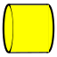

---
 GuiCommand:
   Name: Rocket BodyTube
   MenuLocation: Rocket , Body Tube
   Workbenches: Rocket_Workbench
   Version: 0.19
---

# Rocket BodyTube

## Description

Body tubes are the basic building block of all rockets. It typically contain the motor and payload, and server as an attachment point for the fins and nose cone.

The body tube tool can be used to create many components other than body tubes, for example: motor mounts, engine blocks, and launch lugs. Centering rings can be thought of as short body tubes with very thick walls, although the workbench has a tool specifically for them.

## Usage

1.  There are several ways to invoke the command:
    -   Press the ** [Body Tube](Rocket_BodyTube.md)** button.
    -   Select the **Rocket →  Body Tube** option from the menu.
    -   Double click on a Body Tube object in the [Tree view](Tree_view.md).
2.  Set options and press **OK**.

## Properties

{{TitleProperty|Body Tube}}

-    **Inner Diameter**: The diameter of the inside of the body tube

-    **Length**: The length of the body tube

-    **Outer Diameter**: The diameter of the outside of the body tube

{{TitleProperty|Rocket Component}}

These parameters are provided for information and have no effect on the design of the component.

-    **Description**: Description of the component

-    **Manufacturer**: Manufacturer when known

-    **Material**: Material when known

-    **Part Number**: Manufacturer part number

## Scripting

See also: [:Category:API](:Category_API.md) and [FreeCAD Scripting Basics](FreeCAD_Scripting_Basics.md).

TBD

## Tutorials and Learning 

[Rocket Workbench Body Tubes, Bulkheads, and Centering Rings](https://youtu.be/xi7acpw3eDA) Tutorial on YouTube

---
⏵ [documentation index](../README.md) > [API]] and ](Category_API]] and .md) > [Addons](Category_Addons.md) > [External Workbenches](Category_External Workbenches.md) > Rocket BodyTube
