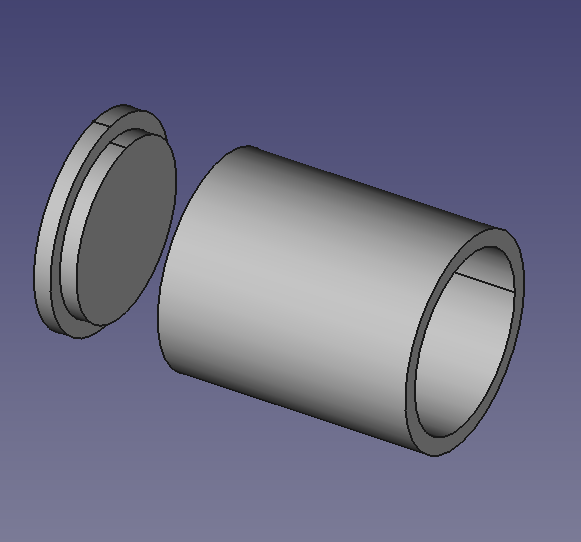
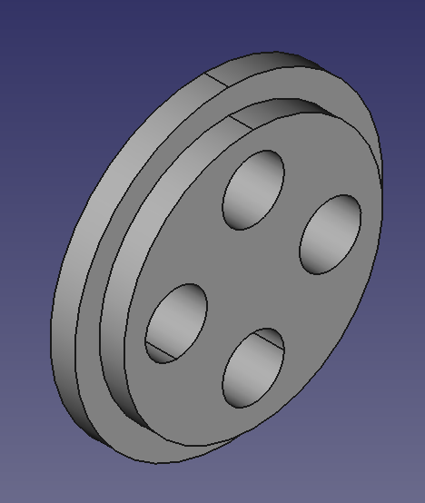

---
- GuiCommand:
   Name:Rocket Bulkhead
   MenuLocation:Rocket - Bulkhead
   Workbenches:[Rocket Workbench](Rocket_Workbench.md)
   Version:0.19
---

# Rocket Bulkhead

## Description

A bulkhead is a solid section of material used to close off a section of body tube, or to provide a base for a nose cone.

## Usage

1.  There are several ways to invoke the command:
    -   Press the ** [Bulkhead](Rocket_Bulkhead.md)** button.
    -   Select the **Rocket →  Bulkhead** option from the menu.
    -   Double click on a Bulkhead object in the [Tree view](Tree_view.md).
2.  Set options and press **OK**.

## Options

### Step

Bulkheads may include a step.

A step may be thought of as an additional bulkhead of smaller diameter stacked on top of the original bulkhead. The most common use is to cap the end of a body tube, such as for an electronics bay. In this case the outer diameter of the bulkhead would match the outer diameter of the body tube, and the outer diameter of the step would match the inner diameter of the body tube.

   
*A stepped bulkhead used to cap a body tube*

### Holes

A bulkhead may require holes for a variety of reasons, such as for attaching an eye hook. This tool allows you to specify one or more identical holes applied in a radial pattern.

   
*A stepped bulkhead with 4 holes*

## Properties

{{TitleProperty|Bulkhead}}

-    **Diameter**: The outer diameter of the bulkhead

-    **Hole Center**: The distance from the center of the hole to the center of the bulkhead

-    **Hole Count**: The number of holes applied in a radial pattern around the center of the bulkhead

-    **Hole Diameter**: The diameter of the hole

-    **Hole Offset**: Offset from 0 degrees of the first hole

-    **Holes**: True when the the bulkhead has one or more holes, see [Options](#Options.md)

-    **Step**: True when the bulkhead includes a step, see [Options](#Options.md)

-    **Step Diameter**: The outer diameter of the step

-    **Step Thickness**: The thickness, not including the bulkhead thickness, of the step

-    **Thickness**: The thickness, not including any step, of the bulkhead

{{TitleProperty|Rocket Component}}

These parameters are provided for information and have no effect on the design of the component.

-    **Description**: Description of the component

-    **Manufacturer**: Manufacturer when known

-    **Material**: Material when known

-    **Part Number**: Manufacturer part number

## Scripting

See also: [:Category:API](:Category_API.md) and [FreeCAD Scripting Basics](FreeCAD_Scripting_Basics.md).

TBD

## Tutorials and Learning 

[Rocket Workbench Body Tubes, Bulkheads, and Centering Rings](https://youtu.be/xi7acpw3eDA) Tutorial on YouTube

---
 [documentation index](../README.md) > [API]] and ](Category_API]] and .md) > [Addons](Category_Addons.md) > [External Workbenches](Category_External Workbenches.md) > Rocket Bulkhead
