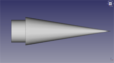
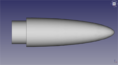
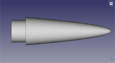
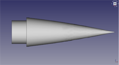
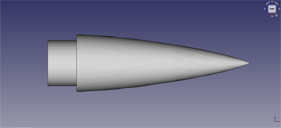
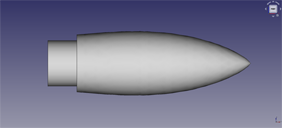
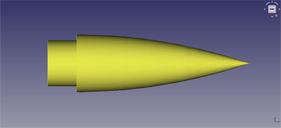
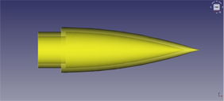
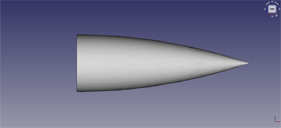

---
- GuiCommand:
   Name:Rocket NoseCone
   MenuLocation:Rocket → Nose Cone
   Workbenches:[Rocket Workbench](Rocket_Workbench.md)
   Version:0.19
---

## Description

Nose cones come in a variety of shapes and sizes, most of which are difficult to model without programming. For many rocket builders, this makes the process unworkable. This command allows for nose cone creation using simple properties combined with a specialized task dialog.

## Usage

1.  There are several ways to invoke the command:
    -   Press the ** [Nose Cone](Rocket_NoseCone.md)** button.
    -   Select the **Rocket →  Nose Cone** option from the menu.
    -   Double click on a Nose Cone object in the model view.
2.  Set options and press **OK**.

## Options

### Nose Cone Types 

The theory behind the various nose cone shapes is explained here: [Nose cone design](https://en.wikipedia.org/wiki/Nose_cone_design)

Supported nose cone types include:

-   Cone.

   *Conical*

-   Ogive.

   *Ogive*

-   Elliptical.

   *Elliptical*

-   Parabola. The shape commonly thought of as a parabola is not generated using a parabolic series, but a power series with a coefficient of 1/2. This is explained in the Wikipedia article.

   *Parabola (Power series with coefficient 1/2)*

-   Parabolic series. This shape is constrained using a coefficient, as explained in the Wikipedia article.

      *Parabolic series with coefficient 1*

-   Von Karman. A Haack series with a coefficient of 0

   *Von Karman (Haack series with coefficient 0)*

-   Haack Series. This shape is constrained using a coefficient, as explained in the Wikipedia article.

      *Haack series with coefficient 2*

### Nose Cone Styles 

Nose cones can be drawn in one of 3 styles

-   Solid: The cone is constructed as a solid piece, such as out of balsa wood.

  

-   Hollow: The cone is hollow on the inside having a specified thickness. The end is not sealed.

  

-   Capped: Similar to hollow, except the end is sealed.

  

### Shoulders

Nose cones can be created with or without shoulders
      *Ogive without shoulder*

## Properties

{{TitleProperty|Rocket Component}}

These parameters are provided for information and have no effect on the design of the component.

-    **Manufacturer**: Manufacturer when known

-    **Part Number**: Manufacturer part number

-    **Description**: Description of the component

-    **Material**: Material when known

{{TitleProperty|Nose Cone}}

-    **Nose Type**: Defines the shape of the nose cone using the coefficient when required, see [Options](#Options.md)

-    **Nose Style**: Defines the style of the nose cone, see [Options](#Options.md)

-    **Length**: The length of the nose cone without the shoulder

-    **Radius**: The radius of the base of the nose cone

-    **Thickness**: When the Nose Style is hollow or capped, this will determine the wall thickness of the nose cone

-    **Coefficent**: Combined with the Nose Type, this defines the shape of the nose cone, see [Options](#Options.md)

-    **Shoulder**: True when the Nose Cone includes a shoulder

-    **Shoulder Length**: The length of the shoulder

-    **Shoulder Radius**: The radius of the shoulder. This must be less than the radius of the Nose Cone

-    **Shoulder Thickness**: When the Nose Style is hollow or capped, this will determine the wall thickness of the shoulder

-    **Resolution**: Used internally, this parameter defines the number of data points to use when drawing the outline of the nose cone

## Scripting

See also: [:Category:API](:Category:API.md) and [FreeCAD Scripting Basics](FreeCAD_Scripting_Basics.md).

TBD

## Tutorials and Learning 

[Rocket Workbench Nose Cones](https://youtu.be/zwLgie2E4Ts) Tutorial on YouTube

 

[Category:Addons](Category:Addons.md) [Category:External Workbenches](Category:External_Workbenches.md)
