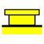
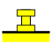

---
- GuiCommand:
   Name:Rocket RailButton
   MenuLocation:Rocket → Launch Guides → Rail Button
   Workbenches:[Rocket Workbench](Rocket_Workbench.md)
   Version:0.19
---

# Rocket RailButton

## Description

A rail button is a small button attached to the side of the rocket that allows the rocket to be guided using a rail until it is fast enough to be aerodynamically stable.

## Usage

1.  There are several ways to invoke the command:
    -   Press the ** [Rail Button](Rocket_RailButton.md)** button.
    -   Select the **Rocket → Launch Guides→  Rail Button** option from the menu.
    -   Double click on a Rail Button object in the model view.
2.  Set options and press **OK**.

## Properties

{{TitleProperty|Rocket Component}}

These parameters are provided for information and have no effect on the design of the component.

-    **Manufacturer**: Manufacturer when known

-    **Part Number**: Manufacturer part number

-    **Description**: Description of the component

-    **Material**: Material when known

{{TitleProperty|Rail Button}}

-    **Rail Button Shape**:

-    **Outer Diameter**:

-    **Inner Diameter**:

-    **Top Thickness**:

-    **Base Thickness**:

-    **Total Thickness**:

-    **Fastener**:

:\* **Countersink Angle**:

:\* **Head Diameter**:

:\* **Shank Diameter**:

:\* **Presets**:

-    **Top Fillet**:

:\* **Radius**:

---
 [documentation index](../README.md) > [Addons](Category_Addons.md) > [External Workbenches](Category_External Workbenches.md) > Rocket RailButton
