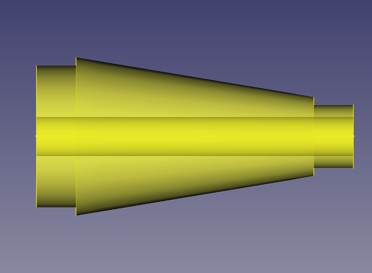

---
- GuiCommand:
   Name:Rocket Transition
   MenuLocation:Rocket → Transition
   Workbenches:[Rocket Workbench](Rocket_Workbench.md)
   Version:0.19
---

# Rocket Transition

## Description

Transitions are like [nose cones](Rocket_NoseCone.md) in many ways. While typically conical, they can have the same shapes as nose cones, but are far more versatile.

The most common application is to change from one body diameter to another, such as between stages, or at the base of a payload fairing. It can also be used for a boat tail, where the diameter of the rocket decreases towards the exhaust nozzle.

## Usage

1.  There are several ways to invoke the command:
    -   Press the ** [Transition](Rocket_Transition.md)** button.
    -   Select the **Rocket →  Transition** option from the menu.
    -   Double click on a Transition object in the [Tree view](Tree_view.md).
2.  Set options and press **OK**.

## Options

### Transition Types 

Transitions support all the shapes supported by Nose Cones, see [Nose Cone Options](Rocket_NoseCone#Options.md) for more details

### Transition Styles 

Transitions support all the styles supported by Nose Cones, see [Nose Cone Options](Rocket_NoseCone#Options.md) for more details.

In addition, transitions have one more style option, *Solid Core*. For this style, the transition is solid but with a hole from one end to another. One example where this might be used is a balsa transition designed to hold a body tube in the manner of a centering ring.

   
*Transition with aft shoulder holding a body tube*

   
*Transition with fore and aft shoulders showing the internal core*

### Clipped

Shapes such as an ogive or a parabola can be applied in one of two ways. The standard, non-clipped, treats the axis parallel to the central axis offset by the smaller of the fore and aft radius as the axis for drawing the shape. The clipped method applies a larger version of the curve centered around the transition axis, and clips the portion forward of the smaller radius. In this example, the non-clipped curve is drawn from *x=0* to *x=60* around the *y=10* axis. The clipped version extends the shape along the x axis until *y=0* and takes only the portion from *x=0* to *x=60*.
   
*Clipped and non-clipped curves for a parabolic transition*
For some shapes, this makes no difference in the shape of the transition, such as for conical or ogive shapes. In these cases, clipping is ignored.
   
*Clipped and non-clipped curves for an ogive transition*

## Notes

There are some known issues with the drawing of transitions that are currently being worked on.

-   Clipped versions of elliptical transitions are producing invalid shapes
-   Clipped versions where the forward radius is larger than the aft radius may produce invalid shapes. If this is the case you may design the transition backwards and use the Position to rotate it.

## Properties

{{TitleProperty|Rocket Component}}

These parameters are provided for information and have no effect on the design of the component.

-    **Description**: Description of the component

-    **Manufacturer**: Manufacturer when known

-    **Material**: Material when known

-    **Part Number**: Manufacturer part number

{{TitleProperty|Transition}}

-    **Aft Diameter**: The diameter of the base of the transition

-    **Aft Shoulder**: True when the transition includes a shoulder at the base

-    **Aft Shoulder Diameter**: The diameter of the shoulder. This must be less than the **Aft Diameter** of the transition

-    **Aft Shoulder Length**: The length of the shoulder

-    **Aft Shoulder Thickness**: When the **Transition Style** is *Hollow* or *Capped*, this will determine the wall thickness of the shoulder

-    **Clipped**: Defines the shape of the transition in combination with the **Transition Type**, see [Options](#Options.md)

-    **Coefficient**: Combined with the **Transition Type**, this defines the shape of the transition, see [Options](#Options.md)

-    **Core Diameter**: When the **Transition Style** is *Solid Core*, this will determine the size of the hole through the transition, see [Options](#Options.md)

-    **Fore Diameter**: The diameter of the front of the transition

-    **Fore Shoulder**: True when the transition includes a shoulder at the forward end

-    **Fore Shoulder Diameter**: The diameter of the shoulder. This must be less than the **Fore Radius** of the transition

-    **Fore Shoulder Length**: The length of the shoulder

-    **Fore Shoulder Thickness**: When the **Transition Style** is *Hollow* or *Capped*, this will determine the wall thickness of the shoulder

-    **Length**: The length of the transition without the shoulders

-    **Resolution**: Used internally, this parameter defines the number of data points to use when drawing the outline of the nose cone

-    **Thickness**: When the **Transition Style** is *Hollow* or *Capped*, this will determine the wall thickness of the transition

-    **Transition Style**: Defines the style of the transition, see [Options](#Options.md)

-    **Transition Type**: Defines the shape of the transition using the coefficient when required, see [Options](#Options.md)

## Scripting

See also: [:Category:API](:Category_API.md) and [FreeCAD Scripting Basics](FreeCAD_Scripting_Basics.md).

TBD

## Tutorials and Learning 

[Rocket Workbench Transitions](https://youtu.be/O5Ze4MYAHNA) Tutorial on YouTube

---
 [documentation index](../README.md) > [API]] and ](Category_API]] and .md) > [Addons](Category_Addons.md) > [External Workbenches](Category_External Workbenches.md) > Rocket Transition
