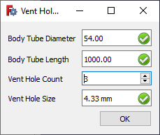

---
- GuiCommand:
   Name:Rocket Vent Hole Size Calculator
   Icon:Rocket_Calculator.svg
   MenuLocation:Rocket → Calculators → Vent Hole Size Calculator
   Workbenches:[Rocket Workbench](Rocket_Workbench.md)
   Version:0.19
---

# Rocket Vent Hole Size Calculator

## Description

This calculator determines the minimum size of vent holes for barometric altimeters based on the volume of the space and the number of vent holes.

Calculation comes from the rule of thumb of 1/4\" vent hole for every 100 cubic inches of volume. A single vent hole of the appropriate size is susceptible to noise caused by breezes and wind gusts. These effects are minimized by using multiple vent holes distributed around the volume, with 3 holes being considered a practical minimum. The combined area of all vent holes will be equivalent to that of a single larger hole.

## Usage

  

1.  There are several ways to invoke the command:
    -   Press the ** [Vent Hole Size Calculator](Rocket_Vent_Hole_Size_Calculator.md)** button.
    -   Select the **Rocket → Calculators →  Vent Hole Size Calculator** option from the menu.
2.  Enter the parameters of your electronics bay.

## Calculation

Vent hole size is calculated using the following formula:

$$D_{vent} = 0.004396 D \sqrt{\cfrac{L}{N}}$$

where

$$D_{vent} =$$ vent hole size

$$D =$$ body tube diameter

$$L =$$ body tube length

$$N =$$ number of vent holes

### Units

Calculations are done using metric units, but will display in your preferred units. Values can also be entered using any supported units by including the units with the value (*eg* 5 oz, or 23.2 g)

## References

1.  <http://vernk.com/AltimeterPortSizing.htm>

---
 [documentation index](../README.md) > [Addons](Category_Addons.md) > [External Workbenches](Category_External Workbenches.md) > Rocket Vent Hole Size Calculator
