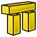

---
- GuiCommand:
   Name:Arch Structure
   MenuLocation:Arch → Structure
   Workbenches:[Arch](Arch_Workbench.md)
   Shortcut:**S** **T**
   SeeAlso:[Arch Wall](Arch_Wall.md), [Arch Rebar](Arch_Rebar.md)
---

## Description

The [Arch Structure](Arch_Structure.md) tool allows you to build structural elements such as columns or beams, by specifying their width, length and height, or by basing them on a 2D profile (face, wire or sketch).

If no profile is given, a set of presets are available to quickly build a structural element from a predefined standard profile.

   *Column based on a 2D base profile; a column and a beam defined by their height, length and width, without a base profile; a metallic structure based on a 2D face*

## Usage

1.  Select a 2D shape (draft object, face or sketch) (optional).
2.  Press the ** [[Arch Structure]]** button, or press **S** then **T** keys.
3.  Adjust the desired properties.

## Options

-   When no base 2D object is selected, the structure tool has 2 drawing modes: Column and beam:
    -   In column mode, you are asked to pick one point on screen or by entering coordinates. The new structural object will be placed at that point.
    -   In beam mode, you are asked to pick two points on screen or by entering coordinates. The new structural object will span between these two points.
-   Structural elements share the common properties and behaviours of all [Arch Components](Arch_Component.md)
-   The height, width and length of a structure can be adjusted after creation
-   Press **Esc** or the **Cancel** button to abort the current command.
-   Double-clicking on the structure in the tree view after it is created allows you to enter edit mode and access and modify its additions and subtractions
-   In edit mode, it is also possible to add [axes systems](Arch_Axis.md) to the structural element. When adding one axes system, the structural element will be copied once on each axis of the system. When adding two axes systems, the structural element will be copied once on each intersection of the two systems.

## Properties

### View

-    **Proxy|PythonObject**:


{{TitleProperty|Component}}

-    **UseMaterialColor|Bool**: Use the material color as this object\'s shape color, if available


{{TitleProperty|Display Options}}

-    **BoundingBox|Bool**: Display object bounding box

-    **DisplayMode|Enumeration**: Set the display mode

-    **ShowInTree|Bool**: Show the object in the tree view

-    **Visibility|Bool**: Show the object in the 3d view


{{TitleProperty|Nodes}}

-    **NodeColor|Color**: The color of the nodes line

-    **NodeLine|Float**: The width of the nodes line

-    **NodeSize|Float**: The size of the node points

-    **NodeType|Enumeration**: The type of structural node

-    **ShowNodes|Bool**: If the nodes are visible or not


{{TitleProperty|Object Style}}

-    **AngularDeflection|Angle**: Specify how finely to generate the mesh for rendering on screen or when exporting.

The default value is 28.5 degrees, or 0.5 radians. The smaller the value the smoother the appearance in the 3D view, and the finer the mesh that will be exported.

-    **Deviation|FloatConstraint**: Sets the accuracy of the polygonal representation of the model

in the 3D view (tessellation). Lower values indicate better quality. The value is in percent of object\'s size.

-    **DiffuseColor|ColorList**: Object diffuse color.

-    **DrawStyle|Enumeration**: Defines the style of the edges in the 3D view.

-    **Lighting|Enumeration**: Set object lighting.

-    **LineColor|Color**: Set object line color.

-    **LineColorArray|ColorList**: Object line color array.

-    **LineMaterial|Material**: Object line material.

-    **LineWidth|FloatConstraint**: Set object line width.

-    **PointColor|Color**: Set object point color

-    **PointColorArray|ColorList**: Object point color array.

-    **PointMaterial|Material**: Object point material.

-    **PointSize|FloatConstraint**: Set object point size.

-    **ShapeColor|Color**: Set shape color

-    **ShapeMaterial|Material**: Shape material

-    **Transparency|Percent**: Set object transparency


{{TitleProperty|Selection}}

-    **OnTopWhenSelected|Enumeration**: Enabled: Display the object on top of any other object when selected

Object: On top only if the whole object is selected Element: On top only if some sub-element of the object is selected

-    **Selectable|Bool**: Set if the object is selectable in the 3d view

-    **SelectionStyle|Enumeration**: Set the object selection style

### Data

-    {{PropertyData_Test|Placement|Placement|Recalc}}:

-    **Proxy|PythonObject**:

-    **Shape|Part::PropertyPartShape**:

-    **Visibility|Bool**:


{{TitleProperty|Base}}

-    **ExpressionEngine|ExpressionEngine|Hidden**: Property expressions

-    **Label|String**: User name of the object (UTF8)

-    **Label2|String|Hidden**: User description of the object (UTF8)


{{TitleProperty|Component}}

-    **Additions|LinkList**: Other shapes that are appended to this object

-    **Axis|Link**: An optional axis or axis system on which this object should be duplicated

-    **Base|Link**: The base object this component is built upon

-    **CloneOf|Link**: The object this component is cloning

-    **HiRes|Link**: An optional higher-resolution mesh or shape for this object

-    **HorizontalArea|Area**: The area of the projection of this object onto the XY plane

-    **Material|Link**: A material for this object

-    **MoveBase|Bool**: Specifies if moving this object moves its base instead

-    **MoveWithHost|Bool**: Specifies if this object must move together when its host is moved

-    **PerimeterLength|Length**: The perimeter length of the horizontal area

-    **StandardCode|String**: An optional standard (OmniClass, etc\...) code for this component

-    **Subtractions|LinkList**: Other shapes that are subtracted from this object

-    **VerticalArea|Area**: The area of all vertical faces of this object


{{TitleProperty|IFC}}

-    **IfcData|Map**: IFC data

-    **IfcProperties|Map**: IFC properties of this object

-    **IfcType|Enumeration**: The type of this object


{{TitleProperty|IFC Attributes}}

-    **Description|String**: Description of IFC attributes are not yet implemented

-    **GlobalId|String**: Description of IFC attributes are not yet implemented

-    **ObjectType|String**: Description of IFC attributes are not yet implemented

-    **PredefinedType|Enumeration**: Description of IFC attributes are not yet implemented

-    **Tag|String**: Description of IFC attributes are not yet implemented


{{TitleProperty|Structure}}

-    **FaceMaker|Enumeration**: Specifies the type of face generation algorithm to use to build the profile. Choices are None, Simple, Cheese and Bullseye.

-    **Height|Length**: Specifies the height of the structure, or the extrusion length when based on a profile. If no height is given, and the structure is inside an [Arch Floor](Arch_Floor.md) object with its height defined, the structure will automatically take the value of the floor height.

-    **Length|Length**: Specifies the length of the structure. This is only used if the structure is not based on a profile.

-    **Nodes|VectorList**: The structural nodes of this element

-    **NodesOffset|Distance**: Specifies an optional offset between the centerline and the nodes line.

-    **Normal|Vector**: Specifies the direction in which the base face of this structure will be extruded. If this property is kept to (0,0,0), the direction will be automatically set to the normal direction of the base face.

-    **Profile|String**: A description of the standard profile this element is based upon

-    **Tool|Link**: An optional extrusion path, which can be any type of wire. If this property is empty, the extrusion will be straight, and happen in the direction given by the Normal property

-    **Width|Length**: The width of this element, if not based on a profile

## Presets

The Structure tool also features a series of presets that allow to quickly build standard metallic profiles or precast concrete elements.

   *Some presets for steel structures*

The presets are obtained by choosing a **Category** from the structure options panel. Available categories are **Precast concrete** or any of the industry-standard metallic profiles such as **HEA**, **HEB** or **INP**. For each of these categories, a number of presets are available. Once a preset is chosen, its individual parameters such as **Length**, **Width** or **Height** can be adjusted. However, for metallic profiles, the profile size is set by the preset and cannot be changed.

The **Switch L/H** button can be used to switch Length and Height values, and therefore building a horizontal beam rather than a vertical column.

   
*Some presets for precast concrete structures*

## Structural nodes 

Structural objects also have the ability to display structural nodes. Structural nodes are a sequence of 3D points stored in a \"Nodes\" property. By switching the \"Show Nodes\" view property on/off, one can see the structural nodes of a structural element:

   
*Structural nodes made visible for a set of structures*

-   Nodes are calculated and updated automatically, as long as you don\'t modify them manually. If you did, they won\'t be updated if the shape of the structural object changes, unless you use the \"Reset nodes\" tool below.
-   Arch structures can have not only linear nodes, but also planar nodes. For this, 1- There must be at least 3 vectors in the \"Nodes\" property of the object, 2- the \"NodesType\" property of their ViewObject must be set to \"Area\".
-   When the nodes calculation is automatic (that is, if you never touched them manually), when setting the Role property of a structure to \"Slab\", it will automatically become a planar node (there will be more than 3 vectors and the NodesType will be set to \"Area\").
-   When editing a structure object (double-click), a couple of node tools are available in the task view:
    -   Reset the nodes to automatic calculation, in case you modified them manually
    -   Edit the nodes graphically, works the same way as [Draft Edit](Draft_Edit.md)
    -   Extend the nodes of the edited object until it touches the node of another object
    -   Make the node of this object and another one coincident
    -   Toggle the display of all nodes of all structural objects of the document on/off

## Scripting


**See also:**

[Arch API](Arch_API.md) and [FreeCAD Scripting Basics](FreeCAD_Scripting_Basics.md).

The Structure tool can be used in [macros](macros.md) and from the [Python](Python.md) console by using the following function:  
```python
Structure = makeStructure(baseobj=None, height=None)
Structure = makeStructure(baseobj=None, length=None, width=None, height=None, name="Structure")
```

-   Creates a `Structure` object from the given `baseobj`, which is a closed profile, and the given extrusion `height`.
    -   If no `baseobj` is given, you can provide the numerical values for the `length`, `width`, and `height` to create a block structure.
    -   The `baseobj` can also be any existing solid object.

Example:  
```python
import FreeCAD, Draft, Arch

Rect = Draft.makeRectangle(200, 300)
Structure1 = Arch.makeStructure(Rect, height=2000)
FreeCAD.ActiveDocument.recompute()

Structure2 = Arch.makeStructure(None, length=500, width=1000, height=3000)
Draft.move(Structure2, FreeCAD.Vector(2000, 0, 0))
FreeCAD.ActiveDocument.recompute()
``` 

 


