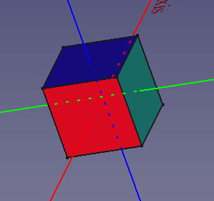
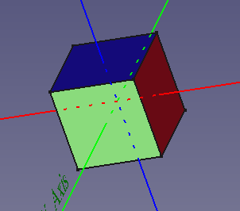
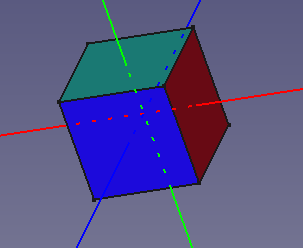
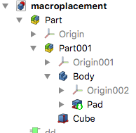

# Sandbox:Edwilliams16
## Manipulating Vectors in FreeCAD 

Vectors are ubiquitous in FreeCAD, describing point locations and displacements.


```python 
from FreeCAD import Vector 
v1 = Vector(1, 2, 3) 
v2 = Vector(4, 5, 6)```

creates a vector v1 whose x-, y-, and z-components are 1, 2, 3 , respectively.

The result of adding the two vectors, tip to tail is given by

v1.add(v2)

but much more conveniently by:

v1 + v2

because the + operator has been overloaded, resulting in the vector Vector(5, 7, 9)

We can also subtract vectors, and multiply or divide them by scalars, so we can write:

2*v2 - v1/2

obtaining Vector(7.5, 9, 10.5)

The length of the vector v1 is given by Pythagoras\' theorem (in 3D):


```python 
import math 
math.sqrt(v1.x * v1.x + v1.y * v1.y + v1.z * v1.z)
```

or much more conveniently by the builtin method

v1.Length

We can use a vector to represent a direction in space. For this purpose, since the (non-zero!) length of the vector is then immaterial, it is customary to use unit vectors, whose length is 1. (In FreeCAD dialogs for axes, you can use un-normalized directions. The code normalizes them for you.) We can create a unit vector by normalizing any vector in the desired direction:

v1.normalize() # unit vector in the direction of v1

This gives us alternative way of creating vectors. If we\'d like, for instance, to create a vector in the direction of v1 with the length of v2, we could use:

v2.Length * v1.normalize()

### Dot and cross products of vectors 

Other than addition and subtraction, there are other geometrically meaningful ways of combining two vectors.

One is the [dot product](https://en.wikipedia.org/wiki/Dot_product)

v1.dot(v2) # or v2.dot(v1)

In terms of components, if v1 = Vector(v1x, v1y, v1z) and v2 = Vector(v2x, v2y, v2z), then v1.dot(v2) = v1x*v2x + v1y*v2y + v1z*v2z Alternatively, this can be shown to be equal to the product of their two lengths with the cosine of the angle between them. It is thus, in some sense, the projection of one vector on the other. It can be used to calculate the angle between the two (non-zero) vectors:

angle = math.acos(v1.dot(v2)/(v1.Length * v2.Length))

giving the angle in radians.

this method is built in to FreeCAD as

angle = v1.getAngle(v2)

The [cross product](https://en.wikipedia.org/wiki/Cross_product) of two vectors v1 and v2 creates a third vector, perpendicular to both of them, that is, normal to the plane containing v1 and v2 In component form, v1.cross(v2) = Vector(v1y*v2z - v1z*v2y, v1z*v2x - v1x*v2z, v1x*v2y - v1y*v2x) Its length is given by the product of the lengths of v1 and v2 with the sine of the angle between them. It thus vanishes if v1 and v2 are parallel.

Another way of visualizing this is that the length of v1.cross(v2) is the area of the parallelogram defined by v1 and v2. Note that v1.cross(v2)and v2.cross(v1) have opposite signs, but v1.dot(v2) and v2.dot(v1)are equal.

A test to check if, within numerical error, two (non-zero) vectors are parallel could be written:


```python 
def isParallel(v1, v2):     
    return (v1.cross(v2)).Length &lt;= 1e-7 * v1.Length *  v2.Length
```

Similarly, 
```python 
def isPerpendicular(v1, v2):
    return v1.dot(v2) &lt;= 1e-7 * v1.Length * v2.Length
``` tests for orthogonality.

These tests both return True if either vector has zero length. If you require False, replace <= with <.

### Rotations

Another operation we might want to perform on a vector is to rotate it. There are many ways to specify a rotation.

\-- Rotation object\-- four floats (a quaternion)

FreeCAD\'s internal representation of rotations (a, b, c, d) = a **i** + b **j** + c **k** + d

where d = cos(theta/2), (a,b,c) = sin(theta/2)\*unit\_vector

represents a rotation of theta about the unit\_vector axis. It is unlikely you will need to work with these directly.

\-- three floats (yaw, pitch, roll)

Uses Euler Angles. (see below)

​ <https://wiki.freecadweb.org/Placement>

\-- Vector (rotation axis) and float (rotation angle)

see below

\-- two Vectors (two axes)

Rotation(v1, v2)rotates v1 into v2 **in the v1 - v2 plane**. (There are an infinity of other possible rotation axes)

\-- Matrix object \-- 16 floats (4x4 matrix)

The 3x3 submatrix in the top-left is the rotation part. The rest represents (unused) translation.

\-- 9 floats (3x3 matrix)

See <https://en.wikipedia.org/wiki/Rotation_matrix#In_three_dimensions>

\-- 3 vectors + optional string

rot = FreeCAD.Rotation(Vector(0,1,0),Vector(-1,0,0),Vector(0,0,1),'ZXY')

For example, rotates x-\>y, y-\>-x and z-\>z . Because of potential numerical error, the target triad may not be exactly orthogonal, the optional string \'ZXY\' gives the priority order of the calculation. (Here the Z-axis is taken as is, the X-axis is orthogonalized and the Y axis is ignored.)

Of these, axis and angle is the most commonly used rotation constructor. To rotate v1 around the axis given by v2 by 30 degrees, we would use:


```python
from FreeCAD import Rotation 
rot = Rotation(v2, 30) 
rotVec = rot.multVec(v1)
```

Note that we input the angle in degrees, but if we query it with rot.Angle we get the internal value in radians.

### Successive rotations and Euler Angles 

See <https://wiki.freecadweb.org/Placement#Position_and_Yaw.2C_Pitch_and_Roll>

One of the properties of quaternions that makes them so useful is that the product of two quaternions represents the result of succesive rotations to which they correspond. The order matters! The result of two rotations is generally not the same if the rotations are made in the reverse order.

Yaw, pitch and roll through three *Euler* angles is a decomposition of a general rotation into three successive rotations about coordinate axes. This is commonly used in aerodynamics and rigid body mechanics.

\-- First we rotate by the yaw angle about the z-axis.

\-- Then pitch up by pitch angle about the *new* y-axis.

\-- Finally, we roll about the *new* x axis by the roll angle. In FreeCAD


```python
rot = Rotation(10, 20 ,30) # create rotation with yaw =10, pitch = 20 and roll = 30 degrees 
ryaw = Rotation(Vector(0, 0, 1), 10) rpitch = Rotation(Vector(0, 1, 0), 20) 
rroll = Rotation(Vector(0, 0, 1), 30) 
rypr = ryaw.multiply(rpitch.multiply(rroll)) #creating rotation by multiplying quaternions 
rot.isSame(rypr, 1e-15) # True
```

What is easily confused here is that in above case the successive rotations are about the *new* rotated axes. If instead, we make successive rotations about the fixed coordinate axes, *not* following the body, the multiplications are made in the opposite order!


```python
rz = Rotation(Vector(0, 0, 1), 90) 
rx = Rotation(Vector(1, 0 ,0), 90) 
rzx = Rotation(Vector(1, 1, 1), 120) #this is you what you should get if you do rz then rx 
rzx1 = rz.multiply(rx)  # note the opposite order 
rzx.isSame(rzx1, 1e-15) # True  1e-15 is a tolerance that allows for finite precision error
```



 Axis cube prior to rotation.



After rz - 90 degrees around global z axis



After rzx - 90 degrees around global z axis, followed by 90 degrees around global x-axis.

Note that since rotation axes are stored normalized, rxy.Axis returns Vector(0.57735026919, 0.57735026919, 0.57735026919)) This is likewise the case for thePlacement.Rotation.Axisproperty of a Placement. When you enter an axis into a placement rotation dialog, it need not be normalized. The code replaces your entry with the normalized version.

Note that the rot1.isSame(rot2, tolerance) method tests True if rot1 and rot2 create the same result. For instance, Rotation(Vector(0, 0, 1), 90), Rotation(Vector(0, 0, 1), -270)and Rotation(Vector(0, 0, -1), 270) test True with isSameeven though their Axis and Angleproperties differ, and are stored as created.

#### slerp (Spherical Linear Interpolation.) 

This is a function widely used in animation. Suppose you wanted to smoothly rotate an object from one orientation, rot1 to another, rot2. You would need to create a series of intermediate orientations. rot1.slerp(rot2, 0.3) creates a rotation 30% of the way between the two. As a simple example:


```python 
rot1 = Rotation(Vector(0, 0, 1), 30) 
rot2 = Rotation(Vector(0, 0, 1), 80) 
rotbetween = rot1.slerp(rot2, 0.3)  
rotbetween.Angle # pi/4 = 45 degrees = 30 + 0.3*(80 - 30)
```

This example is simple because rot1 and rot2 happen to have the same axis. Slerp works in the general case. [](https://en.wikipedia.org/wiki/Slerp)

#### Offset rotations 

Rotation(axis angle) represents rotations about the direction axis through the origin. What if we wish to rotate a point P about an axis offset from the origin by the Vector C? We break our Vector P into the two parts C and P - C. The first part remains fixed, the second rotates, resulting in 
```python 
rot = Rotation(axis, angle)
newP = C + Rotation.multVec(P -  C)
```

### Some other Vector Methods 

Let v, v0, v1, v2 etc. be Vectors

v.distanceToLine(v1, v2)

This returns the perpendicular distance to the extended line passing though v1 in the direction v2

v.distanceToLineSegment(v1, v2)

The name and tooltip are misleading here. This function returns the *vector* to the closest point on the line segment that extends from v1 and v2. It is along the perpendicular if that meets the line segment, otherwise it is to the nearest endpoint.

v.distanceToPlane(v1, v2)

The plane is defined by v1, any point on it, and v2, the direction of the normal to the plane. The method returns the shortest distance to the plane - positive if v is on the side of the plane pointed to by its normal v2, negative otherwise.

### Placement

A Placement combines rotation and translation into a single operator. Placement.Base is the translation vector. Placement.Rotation is the rotation. The combined operation translates the object, rotated about its origin, by the translation vector. (See [Rigid Transformation Math](Rigid_Transformation_Math.md) for the representation of placements as 4 x 4 matrices.) The placement relates the local coordinate system (LCS) of the object to that of its container coordinate system (CCS). The tooltip for App.Rotation shows the many options for its constructor. An example, rotating by 90 degrees about the x-axis and translating 20 in the z-direction, would be


```python
rot = App.Rotation(App.Vector(1,0,0), 90)
trans = App.Vector(0, 0, 20)
placement = App.Placement(trans, rot)
```

A placement acting on (multiplying) a coordinate vector in the LCS gives the coordinates in the CCS. (see Vertex Coordinates) 
```python
lcscoord = App.Vector(0, 10, 0)
ccscoord = rot * lcscoord #or rot.multiply(lcscoord) => App.Vector(0, 0, 10) 
```

We can test of two placements are equal within numerical tolerance with:


```python
def placements_same(pl1, pl2, tol = 1e-7):
    return pl1.Rotation.isSame(pl2.Rotation, tol) and pl1.Base.isEqual(pl2.Base, tol)   
```

#### Compound placement 

 The document **macroplacement**, whose tree-view is illustrated above, contains two objects, **Body** and **Cube**. The **Part** container\'s location in the document\'s global coordinate system (GCS) is given by its Placement property. Likewise, **Part001**\'s location **Part**\'s LCS is given by its Placement. The global placements of the objects are determined by multiplying the chain of placements, starting from the root. Note that the features inside the Body container (Pad) have the placement of the Body.


```python
doc = App.ActiveDocument
plPart = doc.getObject('Part').Placement
plPart001 = doc.getObject('Part001').Placement
plBody = doc.getObject('Body').Placement
gplBody = plPart * plPart001 * plBody  #from chain of placements
gplBody1 = doc.getObject('Body').getGlobalPlacement() #from built-in method
placements_same(gplBody, gplBody1) #  returns True
```

#### Manipulating global Placement. 

Changing any of the placements in the chain will change the global placements of the children.  Suppose we wish to change the global placement of **Body** by changing the placement of **Part001**. We express the desired change in global placement of **Body** as delta_global


```python
doc = App.ActiveDocument
plPart001 = doc.getObject('Part001').Placement
gplBody = doc.getObject('Body').getGlobalPlacement()  
delta_global = App.Placement (App.Vector(20,0,0), App.Vector(1, 0, 0), 180) # desired change in global placement
gplBodyNew = delta_global * gplBody  #  desired final global placement
container_global_placement = doc.getObject('Part').getGlobalPlacement() #global placement of parent of Part001
delta_part001 = container_global_placement.inverse() * delta_global * container_global_placement
doc.getObject('Part001').Placement = delta_part001 * plPart001  #move Part001 and its contents
doc.recompute()
gplBodyNew1 = doc.getObject('Body').getGlobalPlacement()  # new placement
placements_same(gplBodyNew, gplBodyNew1) #  returns True - it works!
```

### Vertex Coordinates 

Selecting a vertex in the 3D view displays its global coordinates and its name. We can obtain the local coordinates as follows. 
```python
doc = App.ActiveDocument
pad = doc.getObject('Pad')
pad.Shape.Vertexes[4].Point # returns the LCS coordinates of Vertex005
box = doc.getObject('Box')
box.Shape.Vertexes[3].Point # returns the coordinates of Vertex004 including its placement
pli = box.Placement.inverse()
pli * box.Shape.Vertexes[3].Point  # returns the LCS coordinates of Vertex004 by undoing the placement
``` Part workbench objects behave differently from others for historical reasons. **Point** for Part objects includes their placement. See [Forum discussion](https://forum.freecadweb.org/viewtopic.php?f=10&t=27821&sid=ed6ead0ccdffb9836043e548919759a5#p225497)

Using the Gui, on selecting a vertex: 
```python
sel = Gui.Selection.getSelectionEx()
sel[0].SubObjects[0].Point #returns the LCS coordinates of picked Vertex (including placement if a Part, as above)
sel[0].PickedPoints[0]  #returns global coordinates of picked vertex
sel[0].Object.Placement # object placement
```

Possible code correcting for placement of part objects {{Code|code =
def getLCSVertex(sel):
    '''return coordinates of selected vertex in local coordinate system'''
    pt = sel[0].SubObjects[0].Point
    if sel[0].Object.TypeId[0:6] == 'Part::':
        return sel[0].Object.Placement.inverse() * pt
    else:
        return pt
}}

### References

<https://wiki.freecadweb.org/Placement>

<https://github.com/FreeCAD/FreeCAD/blob/5d49bf78de785a536f941f1a6d06d432582a95d3/src/Base/Rotation.cpp>


---
 [documentation index](../README.md) > Sandbox:Edwilliams16
