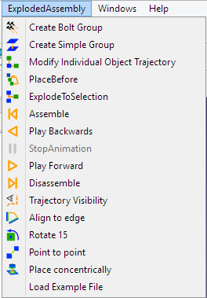

# Sandbox:Exploded Assembly
## Introduction

FreeCAD workbench to create exploded views and animations of assemblies.

Features

-   Create nice explosions of assemblies graphically (no code at all!)
-   Create sub-exploded groups
-   Give rotation to screws and nuts for realistic disassembles
-   Use the provided auxiliary assembly tools to place your parts together
-   TODO feature: create trajectory from wires and sketches

## References

-   Author: JMG1
-   Home page: [ExplodedAssembly](https://github.com/JMG1/ExplodedAssembly)
-   Source code on github: [ExplodedAssembly](https://github.com/JMG1/ExplodedAssembly)

## Tools

Toolbar

Drop down menu

-    Create Bolt Group
-    Create Simple Group
-    Modify Individual Object Trajectory
-    Place Before
-    Explode To Selection
-    Assemble
-    Play Backwards
-    Stop Animation
-    Play Forward
-    Disassemble
-    Trajectory Visibility
-    Align To Edge
-    Rotate 90
-    Poin To Point
-    Place Concentrically

Other

-    Animation Camera
-    Animation Camera Edge
-    Animation Camera Follow
-    Animation Camera Manual
-    Trajectory Edit
-    Wire Trajectory
-    ExplodedAssembly icon

## Installation

### Automatic installation 

This workbench can be installed from the [Addon Manager](Std_AddonMgr.md).

### From GitHub 

Using git on Ubuntu & Mint:

-   Open the command propmpt (terminal) with the keys ctrl+alt+t
-   Install git: sudo apt-get install git
-   Clone repository: git clone <https://github.com/JMG1/ExplodedAssembly> \~/.FreeCAD/Mod/ExplodedAssembly

That\'s all, the next time you launch FreeCAD the workbench should be incorporated automagically.

To install manually download this repository as ZIP and:

-   For Ubuntu, Mint and similar OS\'s, extract it inside /home/username/.FreeCAD/Mod
-   For Windows, extract it inside drive: \\Users\\your\_user\_name\\AppData\\Roaming\\FreeCAD\\Mod

## Links to ExplodedAssembly WB 

-   Workbench Wiki:
-   FreeCAD Wiki:
-   FreeCAD Forum: <http://forum.freecadweb.org/viewtopic.php?f=24&t=9028>
-   Tutorials:
-   Videos: [1](https://www.youtube.com/watch?v=lzYR7I2h7KQ) [2](https://www.youtube.com/watch?v=t72qdG772Q8&feature=youtu.be)
-   Files: inside the workbench
-   Report bugs: Please report bugs at <https://github.com/JMG1/ExplodedAssembly/issues>

## Other useful links 

-   [ExplodedAnimation](http://www.freecadweb.org/wiki/index.php?title=Sandbox:ExplodedAnimation)
-   [External workbenches](External_workbenches.md)
-   [Macros recipes](Macros_recipes.md)

[ Sandbox](Category_Sandbox.md)

---
[documentation index](../README.md) > Sandbox:Exploded Assembly
