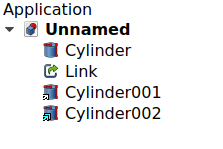

---
- GuiCommand:
   Name: Std LinkMake
   MenuLocation: None
   Workbenches: All
   Version: 0.19
   SeeAlso: Std_Part, Std_Group, PartDesign_Body
---

# Sandbox:Roy 043

## Description

The **Std LinkMake** command creates [App Links](App_Link.md) (`App::Link` class). An App Link, or Link for short, is an object that references, links, to another object in the same document, or in another document. It is especially designed to efficiently duplicate a single object multiple times and forms the basis of the [Assembly3 Workbench](Assembly3_Workbench.md) and the [Assembly4 Workbench](Assembly4_Workbench.md).

A [Link](App_Link.md) object can optionally behave like an array by duplicating its base object several times. This [Link Array](#Link_Array.md) object can also be created with the different array tools of the [Draft Workbench](Draft_Workbench.md).

The **Std LinkMake** command is not defined by a particular workbench, but by the base system, thus it is found in the **structure toolbar** that is available in all [workbenches](Workbenches.md).

## Usage

### Same document 

1.  Select one or more objects.
2.  There are several ways to invoke the command:
    -   Press the ** [Make link](Std_LinkMake.md)** button.
    -   Select the **Link actions →  Make link** option from the [Tree view](Tree_view.md) context menu or [3D view](3D_view.md) context menu.
3.  For each selected object a Link is created.

### External document 

1.  If required change the [Tree view](Tree_view.md) DocumentMode to MultiDocument with the  [Std TreeMultiDocument](Std_TreeMultiDocument.md) command.
2.  Open a source document and a target document.
3.  Select one or more objects in the source document.
4.  Switch to the target document by clicking its tab in the [Main view area](Main_view_area.md).
5.  Press the ** [Make link](Std_LinkMake.md)** button.
6.  For each selected object a Link is created.

### Start with empty Link 

1.  Make sure no object is selected.
2.  There are several ways to invoke the command:
    -   Press the ** [Make link](Std_LinkMake.md)** button.
    -   Select the **Link actions →  Make link** option from the [Tree view](Tree_view.md) context menu or [3D view](3D_view.md) context menu.
3.  An empty Link is created.
4.  In the [Property editor](Property_editor.md) click in the **Linked Object** field of the Link.
5.  Press the **...** button.
6.  The **Link** dialog opens.
7.  Do one of the following:
    -   Select an object from the same document.
    -   Switch to an external document by clicking its tab in the [Main view area](Main_view_area.md), and select an object there.
8.  In both cases you can also select a subelement from an object in the [3D view](3D_view.md). This will create a Sub-Link. See [Std LinkMakeRelative](Std_LinkMakeRelative.md).
9.  Press the **OK** button.

 


*(1) An object, (2) an empty Link, (3) a full Link to the first object (with overridden material), and (4) a Link to only some subelements of the object. The empty Link is not tied to a real object so it is not displayed in the [3D view](3D_view.md).*

 


*(1, 2) Two objects from a source document linked into a target document, (3) a Link to the second Link (its tab in the [Main view area](Main_view_area.md)), and (4) a Link to the subelements of the second Link.*

### Drag and drop 

You can also create Links by performing a drag and drop operation in the [Tree view](Tree_view.md).

1.  Select one or more objects in the [Tree view](Tree_view.md).
2.  Hold down the **Alt** key.
3.  Drag the selection to the document label of the current document or an external document.
4.  The cursor icon will change.
5.  Drop the selection.

### Notes

-   When linking to an object in an external document both the source document and the target document have to be saved at least once. This is required to determine the relative path for the Link.

## Link Array 

A Link can be turned into an array where each element has its own placement and appearance.

1.  Make sure the **Show Element** property of the Link is set to `True` (this is the default).
2.  Change the **Element Count** of the Link to {{Value|1}} or more. Using {{Value|1}} results in an array with a single element, so you will typically use a value of {{Value|2}} or more.
3.  Each Link element in the array can be positioned individually by changing its own **Placement** property.
4.  In a similar way, each element in the array can have its own appearance. See [Override appearance](#Override_appearance.md) below.
5.  Once you are satisfied with the placement and properties of the Link elements in the array, you can change **Show Element** to `False` in order to hide them in the [Tree view](Tree_view.md).


*(1) Original object, and (2, 3, 4) a Link array with three elements, each in a different position. The first Link has an overridden material and transparent faces, the other two have custom face colors.*

### Notes 

-   When creating this type of Link Array, you must place each of the elements manually. If you need a patterned array you should use the array tools of the [Draft Workbench](Draft_Workbench.md), like [Draft OrthoArray](Draft_OrthoArray.md), [Draft PolarArray](Draft_PolarArray.md), and [Draft CircularArray](Draft_CircularArray.md). These commands can create normal copies or Link copies depending on the options at creation time.

## Link to Std Part 

 [Std LinkMake](Std_LinkMake.md) can be used on  [Std Parts](Std_Part.md) in order to quickly duplicate groups of objects, [assemblies](assembly.md), positioned in space. A Link to a Part will keep the visibility of its child objects synchronized with that Part. If you hide a child object in the Link, it will be hidden in the original Part, as well as in all other Links to that Part.

## Link to Std Group 

A regular  [Std Group](Std_Group.md) does not have a **Placement** property, so it cannot control the position of its child objects. However when  [Std LinkMake](Std_LinkMake.md) is used on a  [Std Group](Std_Group.md) the resulting Link does have a **Placement** and, like a  [Std Part](Std_Part.md), can control the position of its child objects. A Link to a Group allows independent control of the visibility of its child objects.

## Link to PartDesign Body 

A Link can be created from a [PartDesign Body](PartDesign_Body.md), but not from its individual features. To avoid selecting them instead of the Body, it is recommended to set the **Display Mode Body** property to {{Value|Tip}}.

## Link to Link 

## Override appearance 

By default a Link has the same appearance as the original **Linked Object**. There are two options, which can be combined, to override that.

### Override material 

If the **Override Material** property of a Link is set to `True`, its **Shape Material** property will control its appearance. Note that if the **Override Material** property of a Link Array is set to `True`, the individual **Override Material** properties of its elements are ignored.

### Override colors 

It is possible to change the appearance of individual subelements (vertices, edges and faces) of a Link. Sublements can also be child objects inside Links to Parts and Groups, and elements in a Link Array. Apart from changing their appearance, subelements can also be hidden.

1.  Select a Link in the [Tree view](Tree_view.md).
2.  Right-click and select the **Override colors...** option from the context menu.
3.  The **Set element color** task panel opens.
4.  Pick one or more subelements in the [3D view](3D_view.md).
5.  Do one of the following:
    -   To change the appearance of the subelements:
        1.  Press the **Edit** button.
        2.  Specify the color and transparency in the **Select Color** dialog.
        3.  The subelements receive the selected color and transparency, and are added to the list with a color swatch.
    -   To hide the subelements:
        1.  Press the **Hide** button.
        2.  The subelements are hidden in the 3D view and are added to the list with an eye icon .
        3.  When the cursor is over a hidden subelement in the list, it is temporarily made visible in the [3D view](3D_view.md).
6.  To remove custom attributes:
    1.  Select one or more elements in the list.
    2.  Press the **Remove** button.
7.  Optionally press the **Remove all** button to remove all custom attributes from the Link.
8.  Press the **OK** button to close task panel.

 


*A [Std Part](Std_Part.md) containing three objects, and a Link to that Part. In the Link, (1) the first object is made invisible, (2) the second object has some subelements with different colors, (3) the entire third object has a different color and a level of transparency.*

### Notes 

-   The coloring of subelements is subject to the [topological naming problem](Topological_naming_problem.md) so it should be done as the last modelling step, when the model is no longer subject to change.
-   The individual elements in a Link Array are listed in the [Tree view](Tree_view.md) if **Show Element** is `True` and can then be shown or hidden by pressing the **Space** bar. This generally makes more sense than using the **Override colors...** option to control their visibility.
-   If the **Alpha channel** option is missing in the **Select Color** dialog then add this Boolean preference: **Tools → Edit parameters... → BaseApp → Preferences → Dialog → DontUseNativeColorDialog**, and set it to `False`. See [Std DlgParameter](Std_DlgParameter.md) and [Fine-tuning](Fine-tuning.md) for more information.

## Properties

The [App Link](App_Link.md) (`App::Link` class) is derived from the basic [App DocumentObject](App_DocumentObject.md) (`App::DocumentObject` class) and inherits all its properties.

The following are the specific properties available in the [Property editor](Property_editor.md). The [App Link](App_Link.md) will additionally show the properties of the original **Linked Object**. The names of these linked properties appear in green in the [Property editor](Property_editor.md). Hidden properties can be shown by using the **Show all** command in the context menu of the [Property editor](Property_editor.md).

### Data


{{TitleProperty| Link}}

-    **Linked Object|XLink**: it indicates the source object of the [App Link](App_Link.md); this can be an entire object, or a subelement of it (vertex, edge, or face).

-    **Link Transform|Bool**: it defaults to `False`, in which case the Link will override the **Linked Object**\'s own placement. If it is set to `True`, the Link will be placed in the same position as the **Linked Object**, and its placement will be relative to the **Linked Object**\'s placement. This can also be achieved with **[ [Std LinkMakeRelative](Std_LinkMakeRelative.md)**.

-    **Link Placement|Placement|Hidden**: it is an offset applied on top of the **Placement** of the **Linked Object**. This property is normally hidden but appears if **Link Transform** is set to `True`; in this case, **Placement** now becomes hidden.

-    **Placement|Placement**: the placement of the Link in absolute coordinates.

-    **Show Element|Bool**: it defaults to `True`, in which case the [Tree view](Tree_view.md) will show the individual Link copies, as long as **Element Count** is {{Value|1}} or larger.

-    **Element Count|IntegerConstraint**: it defaults to {{Value|0}}. If it is {{Value|1}} or larger, the [App Link](App_Link.md) will behave like an array, and will duplicate the same **Linked Object** many times. If **Show Elements** is `True`, each element in the array will be displayed in the [Tree view](Tree_view.md), and each can have its own **Placement** modified. Each Link copy will have a name based on the Link\'s [Name](Object_name.md), augmented by `_iN`, where `N` is a number starting from `0`. For example, with a single `Link`, the copies will be named `Link_i0`, `Link_i1`, `Link_i2`, etc.

-    **Link Execute|String**: name of the execute function that will run for this particular Link object. It defaults to {{Value|'appLinkExecute'}}. Set it to {{Value|'None'}} to disable it.

-    **Colored Elements|LinkSubHidden|Hidden**: list of Link elements that have had their color overriden.

-    **Link Copy On Change|Enumeration**: {{Value|Disabled}} or {{Value|Enabled}}.

-    **Scale|Float**: it defaults to {{Value|1.0}}. It is a factor for uniform scaling in each direction `X`, `Y`, and `Z`. For example, a cube of {{Value|2 mm}} x {{Value|2 mm}} x {{Value|2 mm}}, that is scaled by {{Value|2.0}}, will result in a shape with dimensions {{Value|4 mm}} x {{Value|4 mm}} x {{Value|4 mm}}.

-    **Scale Vector|Vector|Hidden**: the scale factor for each component `(X, Y, Z)` for all Link elements when **Element Count** is {{Value|1}} or larger. If **Scale** is other than {{Value|1.0}}, this same value will be used in the three components.

-    **Scale List|VectorList**: the scale factor for each Link element.

-    **Visibility List|BoolList|Hidden**: {{emphasis|(read-only)}} the visibility state of each Link element, either `True` or `False`.

-    **Placement List|PlacementList|Hidden**: {{emphasis|(read-only)}} the placement for each Link element.

-    **Element List|LinkList|Hidden**: the list of Link elements.

-    **_ Link Touched|Bool|Hidden**:

-    **_ Child Cache|LinkList|Hidden**:

-    **_ Link Owner|Integer|Hidden**:


{{TitleProperty|Base}}

-    **Proxy|PythonObject|Hidden**: a custom class associated with this object. This only exists for the [Python](Python.md) version. See [Scripting](Std_LinkMake#Scripting.md).

### View


{{TitleProperty| Link}}

-    **Draw Style|Enumeration**: it defaults to {{Value|None}}; it can be {{value|Solid}}, {{value|Dashed}}, {{value|Dotted}}; defines the style of the edges in the [3D view](3D_view.md).

-    **Line Width|FloatConstraint**: a float that determines the width in pixels of the edges in the [3D view](3D_view.md). It defaults to {{value|2.0}}.

-    **Override Material|Bool**: it defaults to `False`; if set to `True` it will override the **Linked Object**\'s material, and it will display the colors defined in **Shape Material**.

-    **Point Size|FloatConstraint**: similar to **Line Width**, defines the size of the vertices.

-    **Selectable|Bool**: if it is `True`, the object can be picked with the pointer in the [3D view](3D_view.md). Otherwise, the object cannot be selected until this option is set to `True`.

-    **Shape Material|Material**: this property includes sub-properties that describe the appearance of the object.

    -   
        **Diffuse Color**
        
        , it defaults to  light blue .

    -   
        **Ambient Color**
        
        , it defaults to  dark gray .

    -   
        **Specular Color**
        
        , it defaults to  black .

    -   
        **Emissive Color**
        
        , it defaults to  black .

    -   
        **Shininess**
        
        , it defaults to {{Value|0.2}}

    -   
        **Transparency**
        
        , it defaults to {{Value|0.0}}.


{{TitleProperty|Base}}

-    **Child View Provider|PersistentObject|Hidden**:

-    **Material List|MaterialList|Hidden**: **(read-only)** if individual materials have been added, they will be listed here.

-    **Override Color List|ColorList|Hidden**: **(read-only)** if the individual faces or edges of the link have been overridden they will be listed here.

-    **Override Material List|BoolList|Hidden**: **(read-only)** if the individual materials of the link have been overridden they will be listed here.

-    **Proxy|PythonObject|hidden**: a custom [viewprovider](Viewprovider.md) class associated with this object. This only exists for the [Python](Python.md) version. See [Scripting](#Scripting.md).


{{TitleProperty|Display Options}}

-    **Display Mode|Enumeration|Hidden**: {{Value|Link}} or {{Value|ChildView}}.

-    **Show In Tree|Bool**: see the information in [App FeaturePython](App_FeaturePython.md).

-    **Visibility|Bool**: see the information in [App FeaturePython](App_FeaturePython.md).


{{TitleProperty|Selection}}

-    **On Top When Selected|Enumeration**: see the information in [App FeaturePython](App_FeaturePython.md).

-    **Selection Style|Enumeration**: see the information in [App FeaturePython](App_FeaturePython.md).

## Scripting


**See also:**

[FreeCAD Scripting Basics](FreeCAD_Scripting_Basics.md) and [scripted objects](Scripted_objects.md).

See [Part Feature](Part_Feature.md) for the general information on adding objects to the document.

An App Link is created with the `addObject()` method of the document. its **Linked Object** can be defined by changing its `LinkedObject` property, or by using its `setLink` method.

 
```python
import FreeCAD as App

doc = App.newDocument()
obj1 = App.ActiveDocument.addObject("Part::Box", "Box")
obj2 = App.ActiveDocument.addObject("Part::Cylinder", "Cylinder")
obj1.Placement.Base = App.Vector(10, 0, 0)
obj2.Placement.Base = App.Vector(0, 10, 0)

link1 = App.ActiveDocument.addObject("App::Link", "Link")
link2 = App.ActiveDocument.addObject("App::Link", "Link")

link1.LinkedObject = obj1
link2.setLink(obj2)
link1.Placement.Base = App.Vector(-10, -10, 0)
link2.Placement.Base = App.Vector(10, -10, 0)
link1.ViewObject.OverrideMaterial = True
App.ActiveDocument.recompute()
```

The basic `App::Link` doesn\'t have a Proxy object so it can\'t be fully used for sub-classing.

For [Python](Python.md) subclassing you should create a `App::LinkPython` object.

 
```python
import FreeCAD as App

doc = App.newDocument()
obj = App.ActiveDocument.addObject("App::LinkPython", "Link")
obj.Label = "Custom label"
```


 {{Std Base navi}}


---
⏵ [documentation index](../README.md) > Sandbox:Roy 043
