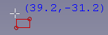
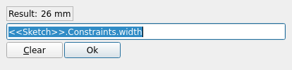
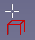

# Sandbox:Roy 043 Tmp PD Tut 2

## Introduction

*This is an updated version of the [Basic Part Design Tutorial](Basic_Part_Design_Tutorial.md).*

This tutorial introduces users to the [PartDesign Workbench](PartDesign_Workbench.md). In this tutorial we will create a 3D solid model of the part shown in the image above. In the [Drawing](TechDraw_Workbench.md) at the end of this paragraph all the necessary dimensions to complete the task are given.

We will start by creating a core solid shape from a base Sketch and then build on that shape, adding what are known as Features. These features will either add material to, or remove material from the solid by use of additional sketches and accompanying feature operations.

We will follow some of the techniques described in [Advice for creating stable models](Feature_editing#Advice_for_creating_stable_models.md):

-   We will use a **master sketch**.
-   **Named constraints** will be used to hold dimensions that can be readily referenced later in the model construction.
    For instance, to change the model width from 53 mm, as in the technical drawing, to 55 mm we need only to modify the **Length** value of the appropriate **named constraint** in the **master sketch** and the whole model will modify accordingly. This is *parametric* design in action.
-   **External Geometries** are potentially subject to the [Topological Naming Problem](Topological_naming_problem.md). We will be using them only when strictly necessary and will attempt to reference to the most **stable** elements available. Referencing edges or vertices of prior sketches is normally more stable than referencing edges or vertices of generated solid geometry.

This Tutorial will not use every feature and tool available in the Part Design Workbench, but will provide a basic foundation upon which users can build their knowledge and skills.

Feel free to signal any errors or problems in this forum thread: [New Part Design Tutorial for FC 019 and 020](https://forum.freecad.org/viewtopic.php?f=36&t=73235).

## Preliminary notes 

-   This tutorial will provide detailed descriptions when it describes an operation for the first time; subsequent operations will have a more concise description. When in doubt, find the operation that contains the more detailed description. For instance, when creating a sketch for the first time the process of choosing the sketch Plane will be explained in detail, for subsequent sketches it will not.
-   All mentioned tools can be accessed from toolbars and from the menu.
-   This tutorial assumes that {{CheckBox|TRUE|Auto constraints}} in the Sketcher\'s **Edit controls** window is checked. This ensures that some constraints are applied automatically. If this is not the case you will need to apply them yourself.
-   If Sketcher\'s Solver detects a redundant constraint it will turn the sketch orange in color. Before further constraints are added, redundant constraints should be removed. Redundant constraints are shown in the task panel, click the blue reference and press **Del**.
-   You exit a Sketcher drawing tool by pressing the **Esc** key or by right-clicking an empty area of the 3D view. The mouse cursor should change to the standard arrow cursor. If you press **Esc** an additional time you will exit the sketch edit mode. To return to the editor, click the Model tab, then either double-click the Sketch element in the tree, or right-click it and select **Edit sketch** from the context menu. To avoid leaving edit mode when pressing **Esc** too often, change the **Esc can leave sketch edit mode** preference, see [Sketcher Preferences](Sketcher_Preferences#General.md).
-   It\'s possible that some elements in a task panel, for instance the **OK** button, are not visible if the panel is not wide enough. You can make it wider by dragging its right border. Place your mouse pointer over the border, when the pointer changes to a two-way arrow, hold down the left mouse button and drag.
-   During the v0.21/v1.0 development cycle a new icon was introduced for the [Sketcher Create polyline](Sketcher_CreatePolyline.md) tool: . The old icon looks like this: . In this tutorial we will use the new icon.
-   See [PartDesign Workbench Concepts](Part_and_PartDesign#PartDesign_Workbench_Concepts.md) for some conceptual background.
-   See the [Sketcher WorkBench](Sketcher_Workbench.md) for a more detailed explanation of some of the terminology used here.

## Startup

First make sure you are in the  [PartDesign Workbench](PartDesign_Workbench.md). If required select it from the [Workbench dropdown list](Std_Workbench.md). Once there, you will want to create a new document if you have not done so already. It is a good habit to save your work often, so first save the new document, giving it any name you choose.

All work in Part Design begins with a [Body](Glossary#Body.md). Then we will build the solid inside the body by starting with a [sketch](Glossary#Sketch.md).

Click  [Create new body](PartDesign_Body.md) to create and activate a new Body Container. Note that it is also possible to skip this step: when creating a sketch using the Part Design  [Create sketch](PartDesign_NewSketch.md) tool, if no existing Body is found, a new one is automatically created and activated.

## Master sketch 

The master sketch contains the model\'s rectangular base shape and two **named constraints** that will supply correct dimensions to other parts of the model: **length** that will contain 53 mm (the result of adding the 39 mm dimension to the two 7 mm sides) and **width** that will contain 26 mm. To be able to take advantage of the model\'s symmetry in later steps, the top edge of the rectangle will be centered around the origin with a symmetrical constraint.

**Sketch**

     

**Step 1: Create the sketch**

1.  Click  [Create sketch](PartDesign_NewSketch.md). This will create the sketch within the just created body. It will be named **Sketch**.
2.  A task panel like **Fig: MS1** will open where you have to choose to which plane the sketch will be attached.
    1.  Select **XY_Plane** from the list.
    2.  Click **OK**.
3.  FreeCAD automatically switches to the [Sketcher Workbench](Sketcher_Workbench.md).
4.  The sketch is opened in edit mode: you will see something like **Fig: MS2**.

**Step 2: Add geometry**

1.  Click  [Create rectangle](Sketcher_CreateRectangle.md).
2.  Pick two points to create a rectangle roughly centered around the **Y axis** similar to **Fig: MS3**. Note:
    -   Don\'t place points on **X axis** as the **Solver** will automatically apply constraints that will create a problem later.
    -   The dimensions of the rectangle are unimportant at this point. They will be assigned using constraints in a later step.
3.  Once done, press **Esc**, or right-click, to exit \"rectangle creation mode\". \"Rectangle creation mode\" is indicated by this cursor appearance:
    

**Step 3: Assign a horizontal constraint**

1.  Select the line defined by **P2** and **P3** in **Fig: MS3**.
2.  Use the button  [Horizontal distance constraint](Sketcher_ConstrainDistanceX.md):
    1.  A dimension will appear between extreme points of the line selected. This dimension is the current distance.
    2.  Additionally, a dialog will appear:
        
    3.  Assign **Length = 53 mm**.
    4.  To be able to easily reference this dimension later a name is required. You are free to use any name, it need only be unique within the sketch. Assign **Name = length**.
    5.  Click **OK**.
3.  The result should resemble **Fig: MS4**

**Step 4: Assign a symmetrical constraint**

1.  Select points **P2** and **P3** of the rectangle.
2.  Select the **origin** of the sketch.
    \'\'Note: the selection order of the points is important.
3.  Click  [Symmetrical constraint](Sketcher_ConstrainSymmetric.md).
4.  You will end up with something that resembles **Fig: MS5**.

**Step 5: Assign a vertical constraint**

:   Assign a vertical distance constraint following the same procedure as used for the previous horizontal distance constraint:

1.  Select the line defined by **P3** and **P4** in **Fig: MS3**.
2.  Click  [Vertical distance constraint](Sketcher_ConstrainDistanceY.md):
    1.  Assign **Length = 26 mm**
    2.  Assign **Name = width**.
    3.  Click **OK**.
3.  Result should resemble **Fig: MS6**.
4.  Note the following:
    -   The lines on the sketch are bright green. (Assuming you have not modified the default color theme).
    -   The **Solver messages** window displays **Fully constrained**.
    -   If you select any line or vertex of the sketch and try to drag it, it won\'t move.

**Step 6: Close the sketch**

:   Click the **Close** button at the top of the [tasks panel](Task_panel.md) to leave sketch edit mode.

## Main profile 

The main profile is created by [padding](PartDesign_Pad.md) a new sketch.

**Sketch001**

 

**Step 1: Create the sketch**

:   Click  [Create sketch](PartDesign_NewSketch.md). Attach it to the **YZ_Plane**. FreeCAD will assign the name **Sketch001**.

**Step 2: Add geometry**

1.  Use the  [Create polyline](Sketcher_CreatePolyline.md) tool to make a shape like that in **Fig: MP1**.
2.  The labels P1, P2 etc. will not appear in the Sketcher. They were added as references.
3.  The three vertical and horizontal constraints you see in the image are added automatically by the auto-constraints provided you drew the lines that way. If you didn\'t you need to add them.
4.  When you close the figure, make sure the first point is selected when you click to create the final line. The selected point will change color and you will see the symbol for a  [Coincident constraint](Sketcher_ConstrainCoincident.md) appear by the vertex. Coincidence constraints have to be explicit - just having two vertices visually coincident is not sufficient.
5.  As done in first sketch you will assign additional constraints later to adjust the dimensions and exact shape (see note about Constraints below).

**Step 3: Assign constraints**

1.  Select the point **P2** and the **Y-axis** and apply a  [Point onto object constraint](Sketcher_ConstrainPointOnObject.md).
2.  Select the **origin** and the point **P1** and apply a  [Horizontal constraint](Sketcher_ConstrainHorizontal.md). Why not a  [Coincident constraint](Sketcher_ConstrainCoincident.md), you might ask. Try it (and undo). The sketch will turn orange and a solver message *redundant constraints* will appear. Because the line P1-P2 has already been constrained to be vertical, the only remaining degree of freedom is P1\'s y-coordinate. The coincidence constraint sets both the x- and y-coordinates to zero, but the x-coordinate is already determined. The horizontal constraint, on the other hand, only sets the y-coordinate to zero, which is sufficient.
3.  Select the line defined by points **P2** and **P3** and apply a  [Horizontal distance constraint](Sketcher_ConstrainDistanceX.md) and assign **Length = 5 mm**.
4.  Select the line defined by points **P1** and **P2** and apply a  [Vertical distance constraint](Sketcher_ConstrainDistanceY.md) and assign **Length = 26 mm**.
5.  Select the line defined by points **P4** and **P1** and apply a  [Horizontal distance constraint](Sketcher_ConstrainDistanceX.md):
    1.  For this value you will use a **Named constraint** using [Expressions](Expressions.md). To do so you have to click the little button on the dimensions , and you will be presented with a new dialog window named **Formula editor** that contains an input field and a **Result:** label, similar to the image below:
        
        When you start typing in the input field, you will be presented with some autocompletions.
    2.  Select the label of the sketch. In our case we want **>.**. Note the period after the label.
    3.  To select the **named constraint** \"width\", you first have to enter **Constraints.** with the period. Here autocomplete works.
    4.  To add \"width\", as yet autocompletion is not available, so complete the cell to read **>.Constraints.width**. If all went well the red error message in the **Result:** field has been replaced by the correct value as in the figure below:
        
    5.  Click **OK** to close **Formula editor** dialog.
    6.  Click **OK** to close **Insert length** dialog.
6.  At this point you should have a fully constrained sketch similar to **Fig: MP2**.
7.  Note the subtly different colors used for distance constraints assigned using expressions and those assigned specifying a length.

**Step 4: Close the sketch**

:   Click the **Close** button at the top of the [tasks panel](Task_panel.md) to leave sketch edit mode.

**Pad**

1.  Make sure **Sketch001** is selected.
2.  Click  [Pad](PartDesign_Pad.md):
    1.  The Pad task panel opens.
    2.  For **Type** select {{ComboBox|Dimension}}.
    3.  For **Length** you will use again an **Expression** but this time you will enter **>.Constraints.length** in the field. This should evaluate to 53 mm.
    4.  Select {{CheckBox|TRUE|Symmetric to plane}}.
    5.  Click **OK** to close the task panel.
3.  Once that is done you will have a solid as shown in **Fig: MP3**.

## Corner cutouts 

For the corner cutouts two features are added to the model. A [pocket](PartDesign_Pocket.md), based on another sketch, is used to create the first cutout, and this feature is then [mirrored](PartDesign_Mirrored.md).

**Sketch002**

   

**Step 1: Hide the solid**

:   Hide the just created solid: Select **Pad** and click the **Spacebar**.

**Step 2: Create the sketch**

:   Click  [Create sketch](PartDesign_NewSketch.md) and create a sketch attached to the **XZ_Plane**. The sketch will be named **Sketch002**.

**Step 3: Add geometry**

:   Select  [Create rectangle](Sketcher_CreateRectangle.md), and create a rectangle. Do not create it too near an axis, to avoid any automatic constraints that would make it difficult to move into the correct position using [External geometry](Sketcher_External.md) later.

**Step 4: Assign dimensional constraints**

1.  Select one of the horizontal lines apply a  [Horizontal distance constraint](Sketcher_ConstrainDistanceX.md) and a value of 11 mm.
2.  Select one of the vertical lines apply a  [Vertical distance constraint](Sketcher_ConstrainDistanceY.md) and a value of 5 mm.
3.  You should obtain something similar to **Fig: CC1**.

**Step 5: Close the sketch**

:   Click **Close** at the top of the task panel. **Sketch002** will not be not fully constrained at this stage.

**Step 6: Make previous sketches visible**

:   To use [External geometry](Sketcher_External.md) the sketches whose elements we want to reference must be visible. Make sure **Sketch** and **Sketch001** are both visible. Use the **Spacebar** to toggle visibility if needed.

**Step 7: Applying External geometries constraints**

1.  Double click **Sketch002** to activate edit mode. Rotate the view so you can clearly see the points as shown in **Fig: CC2**. This will ease subsequent steps. Note that the rectangle\'s initial position could be different in your sketch.
2.  Click  [External geometry](Sketcher_External.md), the cursor will change:
    
3.  Select point **P1** in **Fig: CC3**, selected point will remain highlighted and in the **Elements** tab of task panel you will see that this element is shown .
4.  Select with this cursor point **P2** in **Fig: CC3**.
    In the **Elements** tab of task panel you will see another element like the above.
5.  Right-click or press **Esc** to terminate External Geometry selection. The cursor will return to the **standard arrow pointer**.
6.  Select point **P1** and point **P3** and apply a  [Vertical constraint](Sketcher_ConstrainVertical.md). The rectangle will be aligned with the X position of selected point.
7.  Select point **P2** and point **P3** and apply a  [Horizontal constraint](Sketcher_ConstrainHorizontal.md). The rectangle will be aligned with the Y position of the selected point.
8.  **Sketch002** should now be fully constrained.

**Step 8: Close the sketch**

:   Click **Close** at the top of the task panel.

**Pocket**

 

To create the cutouts we will use the  [Pocket](PartDesign_Pocket.md) tool. This tool is the opposite of the Pad tool. Whereas the Pad tool adds material to the part, the Pocket tool removes material from the part.

1.  Select **Pad** and unhide it.
2.  Select **Sketch002**.
3.  Select  [Pocket](PartDesign_Pocket.md) and configure the operation:
    1.  Select **Type** {{ComboBox|Through all}}.
    2.  Check {{CheckBox|TRUE|Reversed}}
    3.  Click the **OK** button.
4.  You should have something that resembles **Fig: CC5**

**Mirror**

Instead of creating another sketch and pocketing it, we can take advantage of the model\'s symmetry about the YZ plane and use  [Mirrored](PartDesign_Mirrored.md).

1.  Select **Pocket**.
2.  Click  [Mirrored](PartDesign_Mirrored.md):
    1.  A task panel will open.
    2.  Select Plane {{ComboBox|Vertical sketch axis}} from the pulldown menu. The plane will be defined by this axis (the Y axis) and also by the Z axis of the sketch. We could also have selected **Base_YZ_Plane** to obtaining the same result.
    3.  Click **OK**.
3.  If all has gone well, you should now have a part that looks like **Fig: CC6**.

## Sides

The sides are created in a similar manner, but instead of removing material we will add material with a [pad](PartDesign_Pad.md) feature.

**Sketch003**

  

1.  Make sure **Sketch** is visible, and **Mirrored** is hidden.
2.  Click  [Create sketch](PartDesign_NewSketch.md) and create the new sketch attached to the **XY_Plane**. The sketch will be named **Sketch003**.
3.  Select  [Create rectangle](Sketcher_CreateRectangle.md) tool, and create a rectangle, similar to those in **Fig: SD1**. This should not trigger any auto constraint, because we offset our rectangle from the x-axis.
4.  Apply these constraints:
    1.  Select one of the horizontal lines apply a  [Horizontal distance constraint](Sketcher_ConstrainDistanceX.md) and a value of 7 mm.
    2.  Select one of the vertical lines apply a  [Vertical distance constraint](Sketcher_ConstrainDistanceY.md) using an **Expression** and assigning the distance **>.Constraints.width**.
    3.  Add an  [External geometry](Sketcher_External.md) using the point **P1** as shown in **Fig: CC3**. (Vertices are somewhat finicky to select. Selecting any line containing P1 will create external references to both ends.)
    4.  Select both the **top-left** point of created rectangle, (marked **TL** in in **Fig: SD1**) and the newly added External Geometry reference to P1.
    5.  Apply a  [Coincident constraint](Sketcher_ConstrainCoincident.md).
5.  The sketch should be fully constrained now.
6.  Click **Close** at the top of the task panel.

**Pad001**

1.  Select **Sketch003**.
2.  Click  [Pad](PartDesign_Pad.md):
    1.  Assign **Type =** {{ComboBox|Dimension}}.
    2.  Assign **Length = 16.7 mm**
    3.  Click **OK**.
3.  You should have a result as shown in **Fig: SD2**

**Mirrored001**

1.  Select **Pad001**.
2.  Click  [Mirrored](PartDesign_Mirrored.md):
    1.  Make sure Plane {{ComboBox|Vertical sketch axis}} from the pulldown menu, is selected.
    2.  Click **OK**.
3.  If all has gone well, you should now have a part that looks like **Fig: SD3**.

**Note:**

Our two mirror operations have a common symmetry plane, so we could have made our model a little simpler by combining them. We would

1.  Omit the **Mirror** operation above
2.  Select both Pad001 and Pocket in step 1 of the above **Mirrored001** operation.

This emphasizes the important concept that we are mirroring the selected features (the operations we performed on the body, in the order selected), not the body itself.

## Center hole 

Now it is time for the most challenging part of our modeling, a challenge that arises because some of the dimensions of the center hole are defined along the slanted face. If you use this face, created by padding **Sketch001**, as a reference for the next sketch, you expose yourself to the [topological naming problem](Topological_naming_problem.md). A better solution is to reference **Sketch001** itself.

**Sketch004**

 

1.  Make **Sketch** visible, and **Mirrored001** hidden.
2.  Click  [Create sketch](PartDesign_NewSketch.md), and create the new sketch in the **YZ Plane**. This will create a sketch named **Sketch004**.
3.  Using  [Create polyline](Sketcher_CreatePolyline.md) tool, trace a polyline like that indicated by the points **P1, P2, P3, P4** in **Fig: CH1**.
4.  Remember to close the polyline by clicking the last point over the selected first point. This will create the required coincidence constraint.
5.  Check the applied constraints:
    -   Delete the redundant  [Vertical constraint](Sketcher_ConstrainVertical.md) applied to the line defined by **P1** and **P2**.
    -   Make sure there is a  [Horizontal constraint](Sketcher_ConstrainHorizontal.md) on lines defined by **P1** and **P4**, and **P2** and **P3**.
    -   Make sure there is a  [Point onto object constraint](Sketcher_ConstrainPointOnObject.md) on **P1** and **P2** on the **Y axis**.
6.  Using  [External geometry](Sketcher_External.md) tool select line defined by **EGP1** and **EGP2** on **Sketch001** indicated in **Fig: CH2** with purple color.
7.  Apply  [Point onto object constraint](Sketcher_ConstrainPointOnObject.md) to **P3** and **P4**, selecting the point and the external geometry, this will make line **P3** to **P4** coincident with line defined by **EGP1** and **EGP2** in **Sketch001**.
8.  Apply  [Distance constraint](Sketcher_ConstrainDistance.md) to line 
**P3** to **P4** and assign **Length = 17 mm**
9.  Apply  [Distance constraint](Sketcher_ConstrainDistance.md) to **P4** and **EGP2** and assign **Length = 7 mm**.
10. This will result in a fully constrained sketch like in **Fig: CH2**.
11. Click **Close** at the top of the task panel.

**Pocket001**

Now you have to model central pocket, Drawing specify its distance from side pad as 11 mm. An easy calculation shows that with this dimension the pocket is centered, having modeled the solid symmetric around the **Y axis** is more easy to place the pocket.

1.  Select **Sketch004**.
2.  Select  [Pocket](PartDesign_Pocket.md) and configure the operation:
    1.  Select **Type** {{ComboBox|Two Dimensions}}.
    2.  Assign **8.5 mm** to **Length** and **Length2** values
    3.  Click the **OK** button.
3.  Select the newly created **Pocket001**.
4.  Change its **Refine** property to **True**.

**Notes:**

1.  **Refine** will try to delete seams left by previous operations. It is advisable to only **\'\'Refine**\'\' the final solid obtained, as some operations can fail if **Refine** is activated.
    (However, there are also cases where **Refine** can make an operation succeed. So in case of problems check this property and test. Unfortunately there is not yet a general rule to follow.)
2.  Alternatively we could have used **Type** {{ComboBox|Dimension}}, checked **Symmetric to Plane** and entered **17 mm** for the **Length** value\'\'

## Result

The model is complete. It should look like the image below.

Finally, select **Sketch** in the Tree View and on the Data tab of the [Property editor](Property_editor.md) look for **Sketch → Constraints**. Expand that node and changed the length and width constraints. The model should change parametrically.

{{PartDesign Tools navi

}} {{Sketcher Tools navi}}

---
 [documentation index](../README.md) > [PartDesign](Category_PartDesign.md) > [Sketcher](Category_Sketcher.md) > Sandbox:Roy 043 Tmp PD Tut 2
