# Sandbox:TutorialArchBIM
{{TutorialInfo/en
|Topic=Modeling
|Level=Intermediate
|Time=Indefinate
|Author=_
|FCVersion=0.17
|Files=
}}

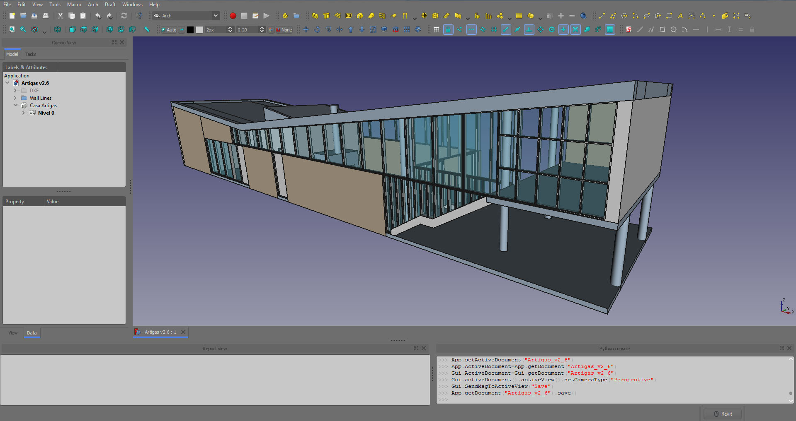

-   [João Batista Vilanova Artigas](http://en.wikipedia.org/wiki/Jo%C3%A3o_Batista_Vilanova_Artigas)
-   [Pictures by Pedro Kok](http://www.pedrokok.com.br/2010/02/residencia-artigas-sao-paulo-sp/img_8258-533px/)
-   [Barão de Jaceguaí, 1151 - Campo Belo, São Paulo-SP (Google)](https://www.google.com/maps/place/Vilanova+Artigas/@-23.62048,-46.6751798,3a,75y,163.84h,67.09t/data=!3m8!1e1!3m6!1sAF1QipOpcWfw3qit1I979azjBmYbIrUqv_cMe593_e69!2e10!3e11!6shttps:%2F%2Flh5.googleusercontent.com%2Fp%2FAF1QipOpcWfw3qit1I979azjBmYbIrUqv_cMe593_e69%3Dw203-h100-k-no-pi-17.99819-ya18.417234-ro1.3375344-fo100!7i5376!8i2688!4m13!1m7!3m6!1s0x94ce509f4a47bb0f:0xd7dfecff13fd4b4!2sRua+Bar%C3%A3o+Jaceguai,+1151+-+Campo+Belo,+S%C3%A3o+Paulo+-+SP,+04606-000,+Brasil!3b1!8m2!3d-23.6205562!4d-46.6751216!3m4!1s0x94ce509f497a12cd:0xe62a63ce23f77686!8m2!3d-23.62048!4d-46.6751798) With 30 images
-   [Completed Freecad model by Wilson, as above image](https://github.com/FreeCAD/Examples/blob/master/at2_Examples/ref/2dReferenceComplete.fcstd)

## Goal of this document 

Update original [Arch Tutorial](Arch_tutorial.md) by [Yorik van Havre](http://yorik.uncreated.net/) .

-   Reflect version updated versions of Freecad (Currently 0.17 / 0.18 )
-   Implement a BIM workflow

Currently this document is **WORK in Progress**

### Contributors

  ------------------------------------------------------------------------------------- ------------------------------------------------------------------------------------------------------------------------------------------------------------------------------------------------------------------------------------------
  [Yorik van Havre](http://yorik.uncreated.net/)                                        Main developer of Arch Workbench, and original author of this document
  [Peter Sande](https://forum.freecadweb.org/memberlist.php?mode=viewprofile&u=10838)   Initiator and co-author of this update. Freecad 0.17 / 0.18 in summer / fall of 2018. The purpose was to seriously try to learn some Freecad Work flows, after playing with it at various points in time over at least the last 5 years.
  [Wilson](https://forum.freecadweb.org/memberlist.php?mode=viewprofile&u=20694)        
  Other                                                                                 In order to make this a working document we need additional users
  ------------------------------------------------------------------------------------- ------------------------------------------------------------------------------------------------------------------------------------------------------------------------------------------------------------------------------------------

### Conventions

#### Example Files 

Reference Files used in this tutorial are named as:

{{Code|
at2_Name
────
│    ─── 
│     │
│     └── SomeMeaningfulName    
│
└── 4 Char prefix
    at2_ -> Arch Tutorial 2 
}}

[Link to example files for this tutorial](https://github.com/FreeCAD/Examples/tree/master/at2_Examples)

#### Images

All Images not already on wiki are named and uploaded to *<File:at2_>\**

#### Markups

-   FIXME Comment
    -   When something needs a closer look, rewrite or other..
-   Tip
-   Delete ?
    -   Something You think should be deleted

This way it is easy to do a quick text search to find topics of concern

## Introduction

This tutorial aims at giving you the basics to work with the _. The [Getting started](Getting_started.md) page is a must read, if you have no previous experience with FreeCAD. Also check our [tutorials](tutorials.md) section, and on [youtube](http://www.youtube.com/results?search_query=freecad) you will also find a lot more of FreeCAD tutorials.

The purpose of the _ greatly benefits from the other disciplines FreeCAD caters to, and offers some features rarely seen in traditional BIM applications.

Here are, for example, a couple of interesting features of FreeCAD\'s [Arch Workbench](Arch_Workbench.md) that you\'ll hardly find in other BIM apps:

-   FIXME ***The next sentence, is that strictly true?*** Architectural objects are always solids. From FreeCAD\'s strong mechanical background, we learned the importance of always working with solid objects. This ensures a much more error-free workflow, and very reliable boolean operations. Since cutting through 3D objects with a 2D plane, in order to extract sections, is also a boolean operation, you can immediately see the importance of this point.

-   Architectural objects can always have any shape. No restrictions. Walls don\'t need to be vertical, slabs don\'t need to look like slabs. Any solid object can always become any architectural object. Very complex things, usually hard to define in other BIM applications, like a floor slab curving up and becoming a wall (yes Zaha Hadid, it\'s you we\'re talking about), present no particular problem at all in FreeCAD.

-   The whole power of FreeCAD is at your fingertips. You can design architectural objects with any other tool of FreeCAD, such as the [PartDesign Workbench](PartDesign_Workbench.md), and when they are ready, convert them to architectural objects. They will still retain their full modeling history, and continue being totally editable. The [Arch Workbench](Arch_Workbench.md) also inherits much of the [Draft Workbench](Draft_Workbench.md) functionality, such as [snapping](Draft_Snap.md) and [working planes](Draft_SelectPlane.md).

-   The [Arch Workbench](Arch_Workbench.md) is very [mesh](Mesh_Workbench.md)-friendly. You can easily design an architectural model in a mesh-based application such as [Blender](http://en.wikipedia.org/wiki/Blender_%28software%29) or [SketchUp](http://en.wikipedia.org/wiki/Sketchup) and import it in FreeCAD. If you took care of the quality of your model and its objects are manifold solid shapes, turning them into architectural objects only requires the press of a button.

At the time of writing, the [Arch Workbench](Arch_Workbench.md), as the rest of FreeCAD, suffers some limitations. Most are being worked on, and will disappear in the future.

-   FreeCAD is no 2D application. It is made for 3D. There is a reasonable set of tools for drawing and editing 2D objects with the [Draft Workbench](Draft_Workbench.md) and [Sketcher Workbench](Sketcher_Workbench.md), but it is not made for handling very large (and sometimes badly drawn) 2D CAD files. You can usually successfully import 2D files, but don\'t expect very high performance if you want to keep working on them in 2D. You have been warned.

-   No materials support. FreeCAD will have a complete [Material](Material.md) system, able to define very complex materials, with all the goodies you can expect (custom properties, material families, rendering and visual aspect properties, etc), and the [Arch Workbench](Arch_Workbench.md) will of course use it when it is ready.

-   Very preliminary _, quite reliably, provided [IfcOpenShell](http://ifcopenshell.org) is installed on your system, but exporting is still not officially supported. This is worked on both by the FreeCAD and IfcOpenShell developers, and in the future we can expect full-powered IFC support.

-   Most Arch tools are still in development. That means that automatic \"wizard\" tools that create complex geometry automatically, such as [Arch Roof](Arch_Roof.md) or [Arch Stairs](Arch_Stairs.md) can only produce certain types of objects, and other tools that have presets, such as [Arch Structure](Arch_Structure.md) or [Arch Window](Arch_Window.md) only have a couple of basic presets. This will of course grow over time.

-   [Relations between objects](Assembly_project.md) in FreeCAD are still not officially available. These, for example the relation between a window and its host wall, are currently implemented in the [Arch Workbench](Arch_Workbench.md) with temporary (and therefore somewhat limited) methods. Many new possibilities will arise when this feature will be fully available.

-   [Units](Units.md) are being implemented in FreeCAD, which will allow you to work with any unit you wish (even imperial units, you guys from the USA can be eternally grateful for this to Jürgen, FreeCAD\'s godfather and dictator). But at the moment the implementation is not complete, and the Arch workbench still doesn\'t support them. You must consider it \"unit-less\". This tutorial uses **millimeters** as units.

## Typical workflows 

In this tutorial we focus on a BIM oriented approach of using FreeCad. We will use mostly three workbenches: [Arch Workbench](Arch_Workbench.md) and BIM, of course, but also Draft, whose tools are all included in Arch, so there is no need to switch workbenches, and Sketcher. Conveniently, You can create a custom toolbar in your Arch workbench, with Tools → Customize, and add the tools from the sketcher that you use often.

## Preparation

Instead of creating a project from scratch, let\'s take an example project to model, it will save us time. We\'ll use this wonderful house by the famous architect [Vilanova Artigas](http://en.wikipedia.org/wiki/Jo%C3%A3o_Batista_Vilanova_Artigas) (see a series of [pictures by Pedro Kok](http://www.pedrokok.com.br/2010/02/residencia-artigas-sao-paulo-sp/img_8258-533px/)), as used in the original FreeCAD Arch Tutorial made by [Yorik](http://yorik.uncreated.net/). It is simple, it\'s a wonderful example of the amazing modernist architecture of São Paulo and the drawings are easily available. You can download drawings in dwg format [here](http://www.bibliocad.com/library/second-house-vilanova-artigas_72926#). To download the file, you\'ll need to make a free registration on the website. In alternative, you can grab directly a DXF version [here](http://yorik.uncreated.net/scripts/artigas.dxf)) as a base to build our model. We recommend you to use DXF files instead of DWG, because FreeCAD handle those a lot better. Either way, is your decision.

After downloading and unzipping the file, you\'ll want to open it with a DWG application such as [DraftSight](http://www.3ds.com/products-services/draftsight/overview/). Alternatively, you can convert it to DXF with a free utility such as the [Teigha File Converter](http://www.opendesign.com/guestfiles/TeighaFileConverter). If you have the Teigha converter installed (and its path set in the Arch Preferences settings), [FreeCAD is also able to import DWG files directly](https://www.freecadweb.org/wiki/Draft_DXF). But since these files can sometimes be of bad quality and very heavy, it\'s usually better to open it first with a 2D CAD application and do some cleaning. You should remove all the unnecessary information (title-blocks, page layouts, unused entities, layers, etc.) and organize the drawings in a logical way (sections and elevations aligned with the plan view, and move everything to the (0,0) point). After, you should organize your drawing it in different layers. This will be handy later on if you need to temporarily hide some of its elements to make it easy to model. This is the result when you import to FreeCAD after organizing the DXF in different layers:

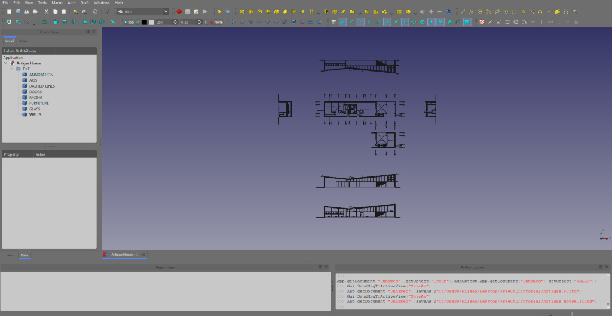

 Before importing your file, you want to make sure that you have the \"Group layers into blocks\" option selected. That way, each layer will be grouped as one object, making it easier to work within FreeCAD. To enable that option, you go to Edit \> Preferences \> Import-Export.

 Sometimes when importing DXF files into FreeCAD, the drawing may be out of scale. If that happens, open the DXF on a program such as Draftsight, create a new file and copy/paste all objects. After, just save it as a new DXF file, give it a new name and import it again into FreeCAD.

You could also organize your layers accordingly to the different elements that make up the project. By that I mean you could make a layer for the plan view, another for the south elevation, north elevation, and so on. Feel free to try out and find the way it suits you best or follow the suggestions above if you prefer.

After that, our file can be opened quite efficiently in FreeCAD. Check the different options available in Edit → Preferences →

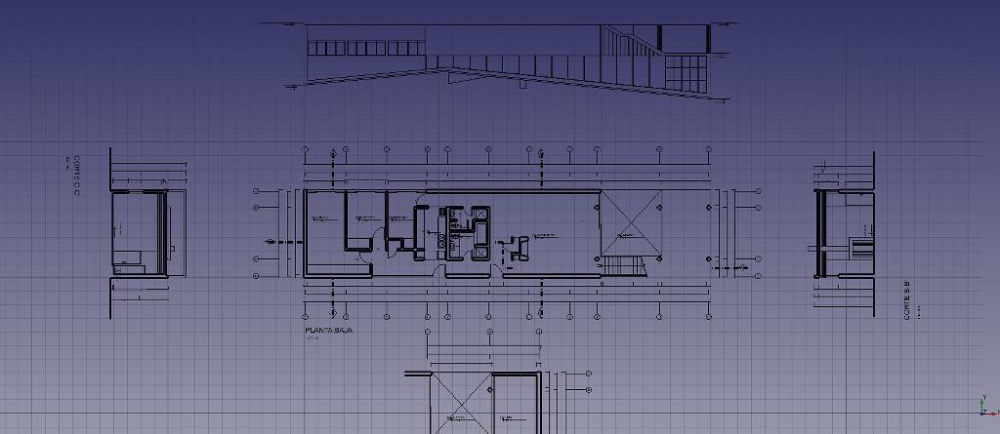

This is how the file looks after being opened in FreeCAD. In this example, thickness of walls were changed, and a couple of doors that were imported with wrong X scale were flipped, with the [Draft Scaletool](Draft_Scale.md).

## Preparing dwg / dxf Alternative text 

For editing and exporting to dxf there are various free tools available. Like said before, one of free tools out there that works fine is _.

Sometimes, the files you\'ll use in your daily work can be in different units, since you\'ll find people with different work methods. If when imported your drawing is e.g. in millimeters and you work in meters, just scale by 1000 (it will scale correctly on all axis), either in FC or other system.

To model your project using plan views, sections and elevations, another method can be used: you can separate your project in several dxf files. This will give you the possibility to rotate the drawings in FreeCAD and position them where you want, independent from one another, as well as to hide part of them while keeping others, if necessary. For that, you\'ll need to create a .dxf file with the ground floor level, another with the level 1 (in the Artigas house, this corresponds to the studio), the north elevation, south elevation, section AA\', BB\', and so on. I would recommend you do this after the cleaning/organization process described before, to save you time and effort. Next, import all .dxf files to FreeCAD.

**NOTE:** Notice that by importing different .dxf drawings to one file, you\'ll be loading them as separate elements. In some computers, you might experience a slightly lower performance than if you would by importing just one .dxf file with all drawings. However, this option allows you to rotate and move these drawings independently from one another, to hide one elevation while keeping another, and so on. Besides, you can always hide all the imported elements and only keep the drawing you need for a particular operation, which will improve significantly your computer performance, if you have a problem with it. Experiment, give it a try and choose the work method that suits you better.

Tip You may also want to try to import or save the various views into separate [FCStd](File_Format_FCStd.md) files. This keeps the files smaller and quicker to work with. Naming of files is Your choice, but it is a good idea to use a naming convention.

Example files produced at various levels of this tutorial will be placed on [GitHub FreeCad Examples at2\_Examples](https://github.com/FreeCAD/Examples/tree/master/at2_Examples)

*For dxf files, they are placed in a directory named ./ref/dxf below the project directory. If You want to skip this step, the imported dxf files can be found here.*

### Plan View 

Start with importing and placing the Plan View.

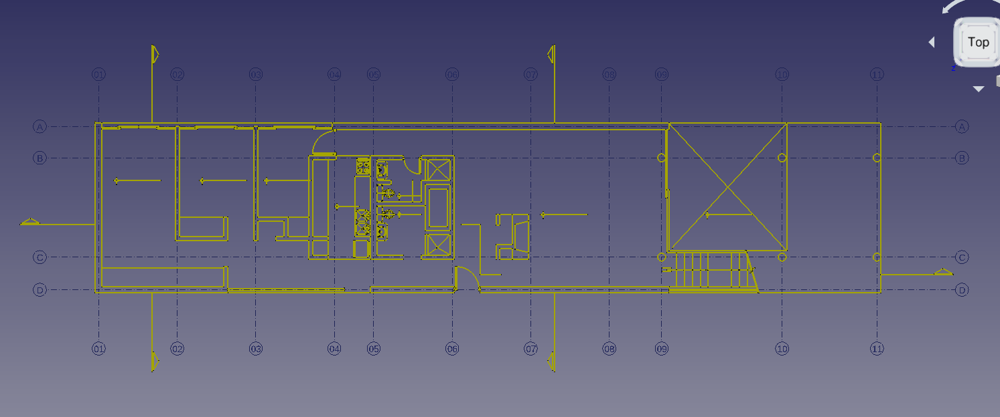

If you don\'t have the option \"Group layers into blocks\" selected, as suggested before, when importing your DXF file your geometry will show up as several edges. This can make FreeCAD run slower. However, depending on what you want to do, you may want to have your object divided in edges instead of grouped into blocks. Either way, make a good habit of organizing your file by compiling these edges into a [group](Std_Group.md). The Group can be created before or after importing. Once you have imported your .dxf file into FreeCAD, just select all the imported edges and 'drag/drop' them into the [group](Std_Group.md).

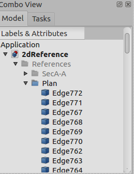

Now, do the same for all the other views. Next in this document, we will place the various views at their location, elevation and rotation, according to our ArchAxisSystem. Before Rotating and placing the various views, we need to do some planning.

Tip

FIXME needs Checking

FreeCad dxf import treats everything as Edges or Shapes, This is generally ok for lines. Bad for circles. No easy way to find Center.

## Planning

FIXME Needs more work

There are no set rules for how to organize Your work. Having said that, planning always pays off. The following list contains some points to get You started.

-   [Define a project origin](#As_a_minimum.md)
-   [Define an Arch Axis System](#Defining_the_Arch_Axis_System.md)
-   Make appropriate as needed workplanes
    -   Name everything something logical
-   Work with partial files
    -   FC does not at current time support referenced attachments (often referred to as xrefs)
    -   However, any selection, even [group(s)](Std_Group.md) in the [ComboView](Document_structure.md) can be copy / pasted between files
        -   for this to work efficiently project origin is essential.
    -   This is a great and not well documented feature of FreeCAD
-   Name Your various files logically
    -   Define a naming convention for files, or You may soon get lost

Most of the guidelines or rules proposed here, are common to any CAD system.

### As a minimum 

**A defined project zero / origin -- with local x,y,z coordinates 0,0,0 shall be defined and used throughout the project.**

Tip

For further planning of File structure jump to the IFC section of this document

In this project we will follow Axis system of downloaded original Drawings.

Defining the project origin at intersection of Axis 01 & D. By our convention this equals SouthWest corner of model. Observe that the axis pass through the center of walls.

When modeling any Architectural model, You will most certainly want to split into separate files. By the way, partial IFC files seem to be the trend at the moment. Mainly split by discipline. The split can be by discipline or other. It is good practice to have a common origin and orientation across these models (files). This makes it easy to copy paste groups between files as needed. It also provides a good basis for several people to work on the project as needed.

Tip

For reference we have made the assumption that global Y-axis equals North.

### Defining the Arch Axis System 

We now want to make an [ArchAxisSystem](Arch_Axis/en.md) for reference when modeling our building. The result will look something like this:

To find the data for making the [ArchAxisSystem](Arch_Axis/en.md) study the Plan View of the imported dwg. This will show You Axis and Dimensions.

Alternatively measure between the various axis in Freecad. This can be done in several ways, using the part workbench Measure linear, [Tape Measure works fine for this](Part_Measure_Linear.md).

By Studying original dxf files.

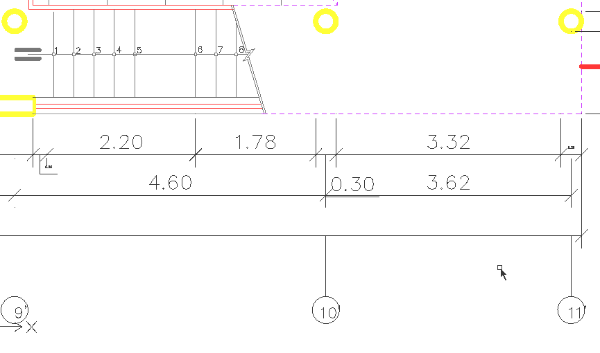

When measuring distance between axis 10 and 11, we find Delta X = 3.6246 Index 11 above, has been adjusted since if possible, we like to work with 'round' figures.

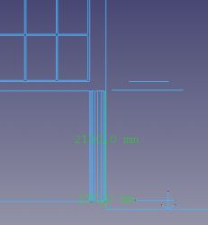

We also observe that the Eastern Columns are tangent to East wall of Studio. This is not good practice.

FIXME Comment

Will reduce the distance between axis 10 and 11. Will try with 3550mm.

#### Arch axis X  

Now, let's make the Axis along global X: The Freecad Command is [Arch Axis ](Arch_Axis.md)

Image shows Data and labels Used.

#### Arch Y-Axis 

Image shows Data and labels Used.

Tip

Observe the 270deg rotation and offset of placement to get labels to get desired layout.

#### Combining to Axis System 

Arch [AxisSystem](Arch_AxisSystem.md) is used to combine the x and y Arch Axis into an Arch Axis system.

Tip

If You save Your AxisSystem to a file, without any other geometry, it does not seem to open as the first file. FreeCad simply Crashes. However, not such a big deal, because if You open another file containing geometry first, then You are able to open the file containing only the AxisSystem without any problem. Strange??

#### Axis System Forum posts 

-   [Arch Axis question](https://forum.freecadweb.org/viewtopic.php?f=23&t=30938)

## Placing and rotating 2d Views 

In order to place 2d views in 3d, we need to prepare some helper objects. In FreeCad we have several ways we can set-up, store and name [Working Planes](Draft_SelectPlane.md) . We can name these and store them by using a [WorkingPlaneProxy object](Draft_WorkingPlaneProxy.md).

You should end up with something looking like this

Tip

By placing and rotating the imported 2d view, You will have a good way of checking their consistency.

## Adding reference planes 

FIXME needs documenting

After starting to look at [\#WokFeature\_Approach](#WokFeature_Approach.md). Think this is a great way of implementing working planes.

## Modeling

### Walls

Walls can be:

-   Inner / Outer, Structural / Non Structural
-   Walls should contain openings for doors, windows, or other

Like most _, [wires](Draft_Wire.md) (polylines), [sketches](Sketcher_Workbench.md), faces or solid (or even on nothing at all, in which case they are defined by height, width and length). The resulting geometry of the wall depends on that base geometry, and the properties you fill in, such as width and height. As you might guess, a wall based on a line will use that line as its alignment line, while a wall based on a face will use that face as its base footprint, and a wall based on a solid will simply adopt the shape of that solid. This allows about any shape imaginable to become a wall.

There are different possible strategies to build walls in FreeCAD. One might want to build a complete \"floor plan\" with the [sketcher](Sketcher_Workbench.md), and build one, big, wall object from it. This technique works, but you can only give one thickness for all the walls of the project. Or, you can build each piece of wall from separate line segments.

!_ on top of the imported plan, one for each type of wall:* Have found that editing a wire is currently more cumbersome than editing a line

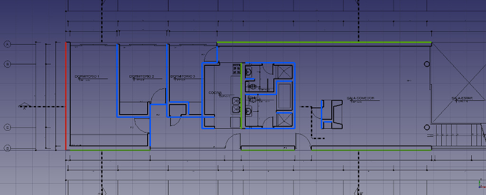

The RED lines that will become concrete walls (a [pictures search](http://www.google.com/search?tbm=isch&q=casa+artigas+brooklin) of the house can help you to see the different wall types), the GREEN ones are the exterior brick walls, and the BLUE ones will become the inner walls. Lines are passed through the doors, because doors will be inserted in the walls later, and will create their openings automatically. Walls can also be aligned left, right or centrally on their baseline, so it doesn\'t matter which side you draw the baseline. Take care on **avoiding intersections** as much as You can. Our model will be cleaner that way. This will save us some headache later, for example if we export our work to other applications, that might not like it.

When this is done, place all those lines in a new [group](Std_Group.md) if you want, select each line one by one, and press the [Arch Wall](Arch_Wall.md) tool to build a wall from each of them. You can also select several lines at once. After doing that, and correcting widths (exterior walls are 25cm wide, inner walls are 15cm wide) and some alignments, we have our walls ready:

You should now have a model resembling something like this.

**Grouping**

Grouping of Your various objects can come in handy at a later stage. How to Group Your model is Your choice.

Here is an example:

Note, Baselines for creating walls have also been grouped

Walls have been grouped like:

-   Walls
    -   WallsExternal
    -   WallsInternal

Tip

Have found the KISS principle (Keep It Simple & Stupid) is a good approach.

-   Using lines as a base for walls works fine.
-   They are easy to move and change.
    -   When editing the line defining a wall, the wall will update
-   At a later stage You can always join them as needed.

Tip

Saving Your walls to a new file at this stage can be a good idea.

One way of doing this is creating a new file.

-   Activate Your file containing Walls You have just modelles
-   Mark the groups You want in Your \'wallModelFile\'
-   Choose Edit-\>Copy
-   Activate Your new file
-   Choose Edit-\>Paste, or Ctrl+v
-   Save Your new file to something meaningful for Your workflow.
    -   Suggestion At2\_Walls\_Initial

With this work flow:

-   Pros
    -   You will be able to go back to Your starting point if anything goes wrong
    -   You will be building a model consisting of several partial models
        -   This is a good way of keeping file size down. You can work on one particual \'sub model\' without caring about the overhead of the total model.
-   Cons
    -   You will generate a lot of files
    -   Be particular how You name Your various files, or get lost.

FIXME

So, how to organize? Believe the main differing factor is Structural / Non Structural Next Level Inner / Outer

[Curtain Walls](https://en.wikipedia.org/wiki/Curtain_wall_(architecture)) are always Non Structural

#### Joining Wall segments 

All Arch objects have a great feature: you can add one to another. Doing that will unite their geometries, but they are still editable independently after. To add one of our crossing walls to the other, just select one, CTRL + select the other, and press the Arch Add tool:

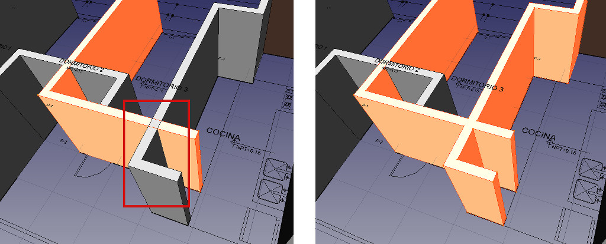

On the left are the two intersecting walls, on the right the result after adding one to the other.

{{Note|An important note about parametric objects|Something is important to consider already. As you can see, in FreeCAD, everything is parametric: Our new "united" wall is made from two walls, each based on a baseline. When you expand them in the [tree view](Document_structure.md), you can see all that chain of dependencies. As you can imagine, this little game can quickly become very complex. Furthermore, if you already know how to work with the [sketcher](Sketcher_Workbench.md), you might have wanted to draw the baselines with constrained sketches. This whole complexity has a cost: it raises exponentially the number of calculations that FreeCAD has to perform to keep your model geometry up to date. So, think about it, don't add unnecessary complexity when you don't need it. Keep a good balance between simple and complex objects, and keep these for the cases where you really need them.}}

For example, I could have drawn all my baselines above without caring about what crosses what, and fix things with the [Arch Add](Arch_Add.md) tool later. But I would have raised much the complexity of my model, for no gain at all. Better make them correct right from the start, and keeping them as very simple pieces of geometry.

Now that our walls are okay, we need to raise their height, until they intersect the roof. Then, since the wall object still cannot be cut automatically by roofs (this will happen some day, though), we will build a \"dummy\" object, that follows the shape of the roof, to be subtracted from our walls.

First, by looking at our 2D drawings, we can see that the highest point of the roof is 5.6m above the ground. So let\'s give all our walls a height of 6m, so we make sure they will be cut by our dummy roof volume. Why 6m and not 5.6m? You may ask. Well, if you already worked with boolean operations (additions, subtractions, intersections), you must already know that these operations usually don\'t like much \"face-on-face\" situations. They prefer clearly, frankly intersecting objects. So by doing this, we keep on the safe side.

To raise the height of our walls, simply select all of them (don\'t forget the one we added to the other) in the tree view, and change the value of their \"height\" property.

#### Studio Elevation 

Before making our roof and cutting the walls, let\'s make the remaining objects that will need to be cut: The walls of the above studio, and the columns.

We will now make a [Workplane](Draft_SelectPlane/en.md) and a [workplaneProxy](Draft_WorkingPlaneProxy.md) object at the studio elevation.

Before establishing the elevation, take a look at the base 2d drawings. Something is wrong in paradise.

We will set top of Studio floor (Slab) to 2425,0 mm

This can be done in many ways. Probably the easiest is to draw the baseline for studio wall on top of the Plan View, and moving it up 2425mm.

Delete ?

The walls of the studio are made the same way as we did, on the superior floor plan, but they will be raised up to level 2.6m. So we will give them the needed height so their top is at 6m too, that is, 3.4m. Once this is done, let\'s move our walls up by 2.6m: Select them both, put yourself in frontal view (View → Standard Views → Front), press the [Draft Move](Draft_Move.md) button, select a first point, then enter 0, 2.6, 0 as coordinates, and press enter. Your objects now have jumped 2.6m high:

{{Note|About coordinates|The [Draft](Draft_Workbench.md) objects, and most [Arch](Arch_Workbench.md) objects too, obey to a Draft system called [working planes](Draft_SelectPlane.md). This system defines a 2D plane where next operations will take place. If you don't specify any, that working plane adapts itself to the current view. This is why we switched to frontal view, and you see that we indicated a movement in X of 0 and in Y of 2.6. We could also have forced the working plane to stay on the ground, by using the [[Draft SelectPlane]] tool. Then, we would have entered a movement of X of 0, Y of 0 and Z of 2.6. }}

**Alternative Approach**

Now let\'s move our walls horizontally, to their correct location. Since we have points to snap to, this is easier: Select both walls, press the [Draft Move](Draft_Move.md) tool, and move them from one point to the other:

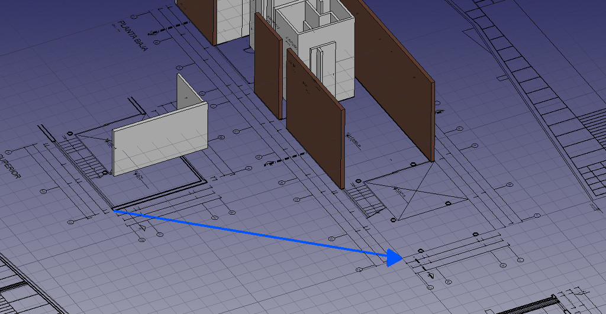

Finally, I changed the color of some walls to a brick-like color (so it\'s easier to differentiate), and made a small correction: Some walls don\'t go up to the roof, but stop at a height of 2.60m. I corrected the height of those walls.

### Subtractions

We will show two different approaches to creating the Subtraction Volume, one drawing on 3d SouthEleveation, second drawing on plan View, rotating and moving.

#### Approach one 

In this Approach we will draw and extrude with correct 3d location

-   Set Your WorkingPlane to Front
-   Draw lines following the lower edge of roof
-   Use DraftTrimex to extend and join lines so they form a closed loop
    -   Make sure the cutting volume we want to produce extends the bounds of what we want to cut
-   Convert lines to closed dwire
-   Extrude to a dimension larger than total width of elements we want to cut
-   If needed, set workplane to top view, move to top view and move extrusion so it covers the with of the building

 

#### Approach Two 

Now it is time to build our subtraction volume. The easiest way will be to draw its profile on top of the section view. Then, we will rotate it and place it at its correct position. See why I placed the sections and elevations like that before beginning? It will be very handy for drawing stuff there, then moving it to its correct position on the model.

Let\'s draw a volume, bigger than the roof, that will be subtracted from our walls. To do that, I drew two lines on top of the base of the roof, then extended them a bit further with the [Draft Trimex](Draft_Trimex.md) tool. Then, I drew a [wire](Draft_Wire.md), snapping on these lines, and going well above our 6 meters. I also drew a blue line on the ground level (0.00), that will be our rotation axis.

Now is the tricky part: We will use the _ button (it is in the \"tasks\" tab of the tree view), and set it to YZ (which is the \"side\" plane). Once you set the working plane manually, like that, it won\'t change depending on your view. You can now rotate your view until you have a good view of all the things you must select. To switch the working plane back to \"automatic\" mode later, press the [Draft SelectPlane](Draft_SelectPlane.md) button again and set it to \"None\".

Now the rotation will be easy to do: Select the profile, press the [Draft Rotate](Draft_Rotate.md) button, click on a point of the blue line, enter 0 as start angle, and 90 as rotation:

Now all we need to do it to move the profile a bit closer to the model (set the working plane to XY if needed), and extrude it. This can be done either with the [Part Extrude](Part_Extrude.md) tool, or [Draft Trimex](Draft_Trimex.md), which also has the special hidden power to extrude faces. Make sure your extrusion is larger than all the walls it will be subtracted from, to avoid face-on-face situations:

#### Common to both approaches 

Now, here comes into action the contrary of the _. As you might have guessed, it also makes an object a child of another, but its shape is subtracted from the host object, instead of being united. So now things are simple: Select the volume to subtract (I renamed it as \"Roof volume to subtract\" in the tree view so it is easy to spot), CTRL + select a wall, and press the [Arch Remove](Arch_Remove.md) button. You\'ll see that, after the subtraction happened, the volume to subtract disappeared from both the 3D view and the tree view. That is because it has been marked as child of the wall, and \"swallowed\" by that wall. Select the wall, expand it in the tree view, there is our volume.

Now, select the volume in the tree vieew, CTRL + select the next wall, press [Arch Remove](Arch_Remove.md). Repeat for the next walls until you have everything properly cut:

Remember that for both [Arch Add](Arch_Add.md) and [Arch Remove](Arch_Remove.md), the order you select the objects is important. The host is always the last one, like in \"Remove X from Y\" or \"Add X to Y\"

{{Note|A note about additions and subtractions|Arch objects that support such additions and subtractions (all of them except the "visual" helper objects such as the axes) keep track of such objects by having two properties, respectively "Additions" and "Subtractions", that contain a list of links to other objects to be subtracted or added. A same object can be in the lists of several other objects, as it is the case of our subtraction volume here. Each of the fathers will want to swallow it in the tree view, though, so it will usually "live" in the last one. But you can always edit those lists for any object, by double-clicking it in the tree view, which in FreeCAD enters edit mode. Pressing the escape key exits edit mode.}}

Tip

Work flow note:

It is probably a good Idea to store Your RoofCutVolume in a separate file for later

### Bathroom Geometry 

FIXME

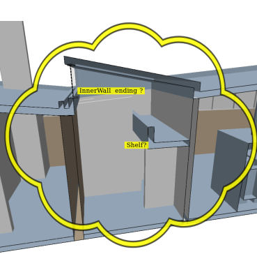

Looking at bathroom geometry, something is not clear.

### Floors

Generally defined as Slabs

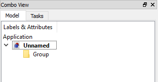

To start with, Create a [group](Std_Group.md) for Floors

Tip

-   Groups are created by **Right + Click** -\> **Create Group**
-   Groups are created at the position of Your Cursor, meaning You may also create a [group](Std_Group.md) as a subgroup.
-   You may also move a goup to another group by Drag & Drop
-   Groups are Renamed by hitting **F2**, or right click a group and select **Rename**, or **Double Click**

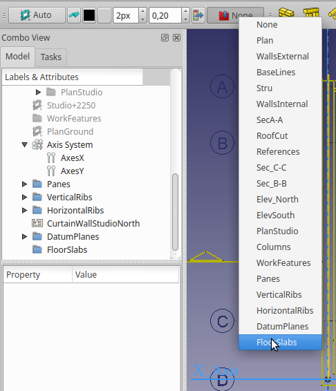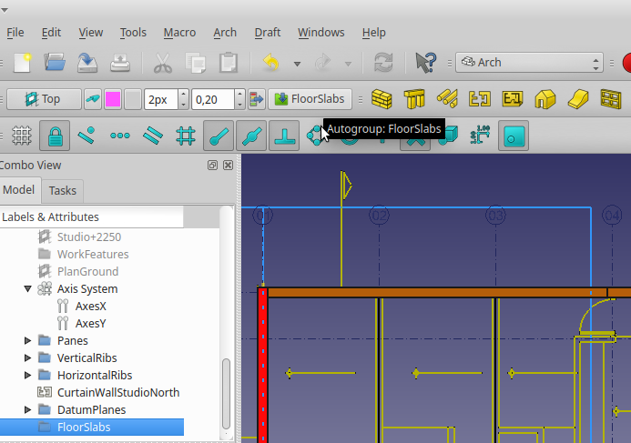

By setting our Group to FloorSlabs, we insure that what we create from now on will be located in this group. (if You forget this step, You can always Drag&Drop entities to this group later)

### Modeling FloorSlabs 

In practice the inner walls (non structural) will probably be placed above the FloorSlabs. For tutorial purposes, we will assume that all walls and columns penetrate the FloorSlabs

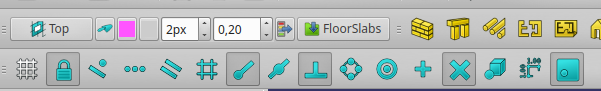

Next set the desired [snap settings](Draft_Snap.md). Especially for new users, conflicting snap settings are a cause of frustration.

In image above, we have the following snap settings active:

-   Lock
-   EndPoint
-   Perpendicular
-   Intersection
-   WorkingPlane

Also make sure WorkingPlane is set to Top.

Now, draw a closed loop to make FloorSlab. This can be done either with lines, or with Draft Dwire. This is Your choice.

Remember that single lines are easier to edit than a dWire, so in many cases it is more efficient to draw single lines, edit, join and add to them, before Joining them to create a dwire.

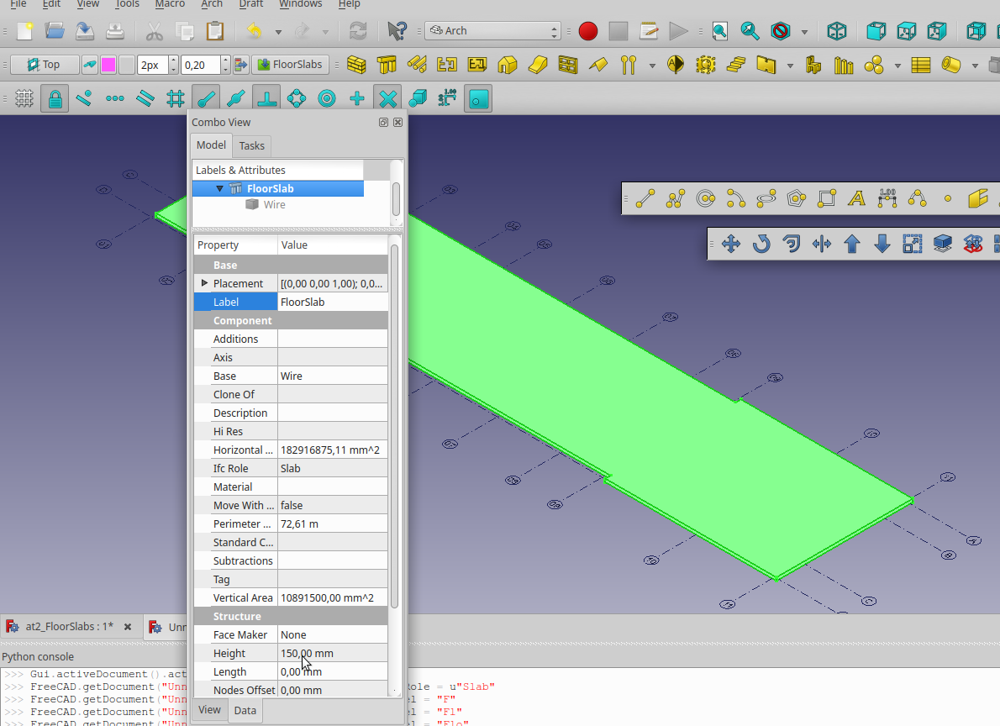

You Should now have something Like image above. **Observe** we have changed the Label to FloorSlab, and ifcRole to Slab (We don\'t want our floor to be exported as a Column)

#### Cutting FloorSlabs 

FIXME Yorik, can You please confirm best practice. Cloning walls to be used for cutting objects does not work. Need to copy cutting objects before ** '''Remove'''**?

In order to Cut FloorSlab with Our walls, without walls disappearing, we need to first make a Copy of them.

Select the walls You want to cut the FloorSlab with , and Copy/Paste them.

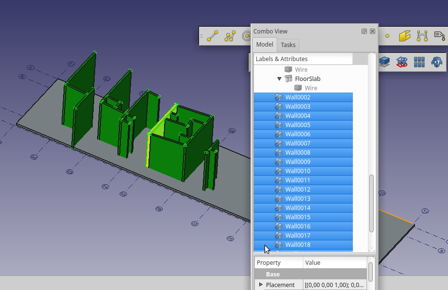

We can see that Copied walls have been created in the FloorSlab Group

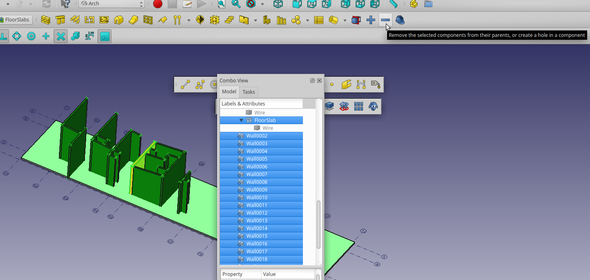

Now select the cutting objects, and the object to be cut (Parent) as the last one, and Press the ** '''Remove'''** button

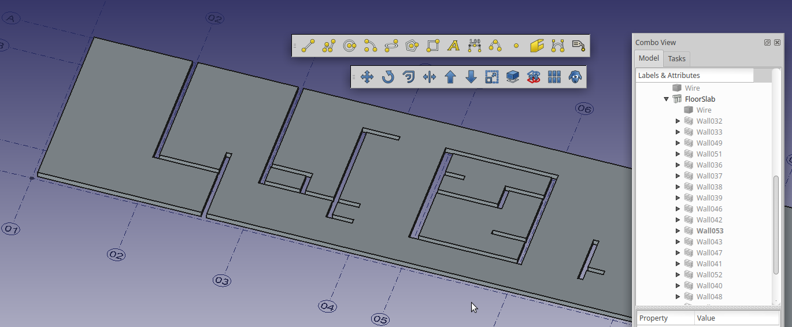 Your result should now look something like this. Observe the cutting objects have been \'swallowed\' by the FloorSlab object.

Next we need to do the same with the Columns. But first we have to model them.

### Columns

If you have started with making the Arch Grid, tis is a piece of cake. All columns are at intersections of grid lines.

When measuring the columns, we find they are ø300mm. Probably they could be thinner, but we will stick with original design here.

Probably the easiest is to use a circle with R=150 as base for columns. then extrude to 6000mm.

Adjust the height of Columns under Studio Slab.

We have Labeled the Columns according to the grid-lines the are placed on.

Next Cut the columns going up to the roof, using the same procedure and cutting object as You used whe cutting the walls previously.

### Making the roofs 

Starting With outer Beams

Looking at the section of the Outer Beams, we can see it is aligned with outer wall. At least in some countries with rougher weather conditions this would be bad practice. Will increase width to 200mm, and have the beam extend 50mm outside the wall.

Would also like to have what we sometimes call a drip nose. Feel it is a bit complicated to add at the moment.

Showing Section of Beam with DripNose

Created as separate extrudes, added to BuildingPart

FIXME

Struggling with determining best way to model..

Tried using Part Boolean Cut For the roof canopy\...

The cut results in error when exporting

#### Roof Center Slab 

Open at2\_ReferenceComplete ([can be downloaded from here](https://github.com/FreeCAD/Examples/blob/master/at2_Examples/ref/2dReferenceComplete.fcstd))

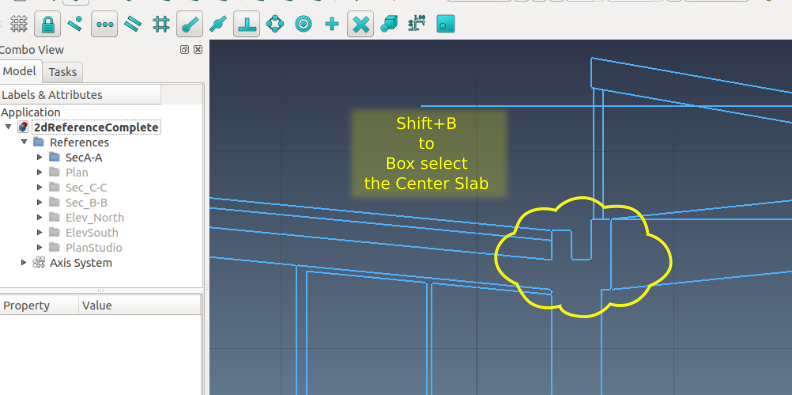

Choose Edit-\>Copy (Ctrl+C)

Make a new file

Choose Edit-\>Paste (Ctrl+V)

Make Your workplane perpendicular to the shapes. This can be done in many ways.

FIXME Comment Add list and ill. of various ways.

Tip If You made the slab by extrude from Front Plane, it will need to be moved by the global Y-axis. If You move the extrusion, by means of Draft-\>Move, this will lead to wrongly placed geometry when exporting to IFC. For IFC export to work correct, You need to also move the underlying or defining geometry.

FIXME Comment Add Illustration + Arch Move

Look at [Arch Component](Arch_Component.md)

Some posts relating to issue and resolution

-   [Tracker 2014-11-08 14:51 Issue identified](https://freecadweb.org/tracker/view.php?id=1820)
-   [Remove component from draft or sketch](https://forum.freecadweb.org/viewtopic.php?f=23&t=8349)

#### Mods to roof 

**Correct supporting wall**

If You cut the wall (RED in image above), we now discover that this is supporting The Roof Center Slab.

This gives us a great opportunity test editing this wall with \[<https://www.freecadweb.org/wiki/Arch_Remove>\| Arch remove command\] ***FIXME Think the doc needs some updating***

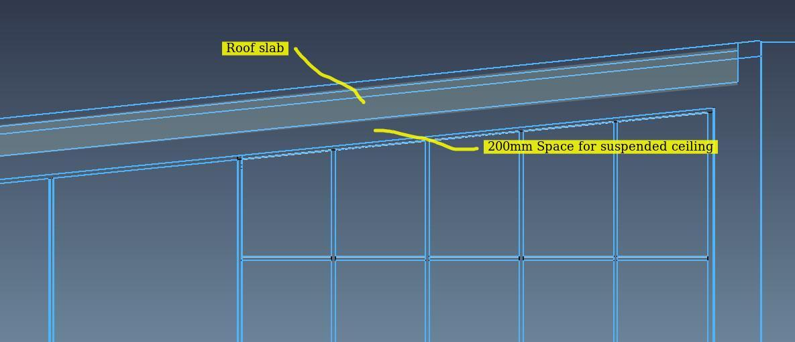

In order to add some flexibility beneath Roof slabs, we have made them as image above.

This means modifying cuts to inner walls and adding a suspended ceiling.

We will also need to add some covering to the Roof Slabs

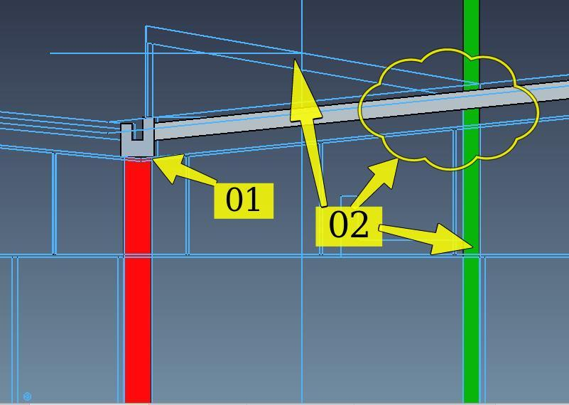

01

-   Shorten supporting wall (Red in above image)
    -   First remove \'cut\'
    -   Adjust height of wall
    -   Center The slab on supporting wall

02

-   Adjust and construct link between Inner wall and roof of Dormer
    -   The inner wall (Green) needs to be combined with the Roof of the Dormer

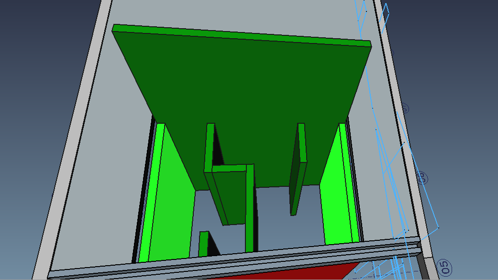

The two highlighted inner walls should probably extend to form the side walls of Dormer

Tip Add Remove

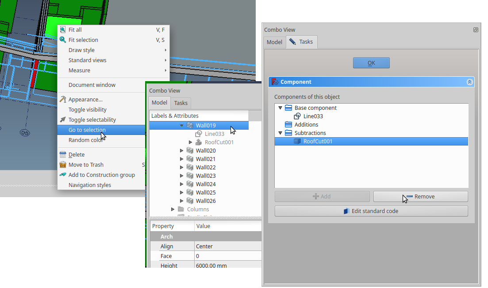

**Right + Click**

, Go to Selection \--\> **DblClick** Gets You to Component Structure / Edit

-   FIXME Yorik, is this Correct naming ?

#### Adding Roof slabs 

It is tempting to the roof slabs by grabbing geometry from section A-A. Set working plane to front. FIXME needs image Draw geometry from section A-A.

-   If You use lines, join them to make a wire.
-   If You draw them as a dwire for extrusion.
    -   You will need to add a plane to be able to extrude in correct normal direction.
    -   Or, You can drop the dwire to a wire, the downside of this is it is not as easy to edit as a dwire.

I am wondering why we have the two different entity types, wire and dwire.

-   dwire entity is easily editable at vertex level, wire entity is not
-   It would be tempting to extrude symmetric elements like these slabs, with a symmetrical extrusion. This works fine in Freecad, but sadly this does not seem to export correctly if exporting to IFC

#### Adding Dormer 

### WokFeature Approach 

Make a plane for the two half of the Roof using

Try to use [Work features](Macro_WorkFeatures.md), installed as WorkBench

Also try [Macro\_Align\_View\_to\_Face](Macro_Align_View_to_Face.md)

[For Myself\....](https://forum.freecadweb.org/memberlist.php?mode=viewprofile&u=10838)

Started Playing with this.. First interesting feature.. If You select An Arch Axis -\> place point at extreme, it will place points at all ends of all the selected axis

View image, by selecting the X-Axis System and hitting WorkFeature-\>Create Points at Line Extreme. Thew workFreature macro will create workpoints at end of all defined lines in ArchAxis. In this case AxesX

Also:

-   Planes created with WorkFeature are able to set workplane in draft. (Only tested 0.18)
-   Planes created this way can be named as all other FC features
-   Macro also contains Align View to Workplane feature

#### IFC note 

When Building part is exported to IFC, it creates 4xIFCproxyElements, and a parent Beam object

FIXME needs updating Check if Fixed

### Stairs

Modeling the Stairs may be done in several ways.

Here we will model them the traditional way, but feel free to experiment with the Automated functionality presented in [Arch Stairs](https://forum.freecadweb.org/viewtopic.php?t=29358)

### Doors

Inner or outer

### Windows

Inner or Outer

## IFC and BIM 

[Building Information Modelling (BIM)](https://en.wikipedia.org/wiki/Building_information_modeling) is a very broad term that describes the process of creating a digital model of a building.

### Planning 

BEP ( BIM Execution Plan)

All BIM projects should have a BEP ( BIM Execution Plan)

As a minimum

#### Common Origin 

**Origin point, northing, and elevation**

One of the simplest yet most critical aspects of good project coordination is the establishment of a common or shared base point for all BIM data to follow. It is also essential to have a common site base point as the data is used through the life-cycle of the building.

### IFC Links 

-   [IFC - Where it all started - The End of Babel - Part 1/2](https://www.youtube.com/watch?v=g_jmGQvr6dQ)
-   [Planning and Standards by U.S. General Services Administration](https://www.gsa.gov/real-estate/design-construction/3d4d-building-information-modeling/bim-guidelines-for-revit/guidelines/technical-standards/bim-technical-standards-file-structure-and-organization)
-   [IFC4 - is it ready yet?](https://blog.areo.io/ifc4-is-it-ready-yet/)
-   [BimServer Center](https://bimserver.center/)
-   [BIMsie](https://www.nibs.org/page/bsa_bimsie#software)
-   [Sustainability of Digital Formats: Planning for Library of Congress Collections](https://www.loc.gov/preservation/digital/formats/fdd/fdd000447.shtml)
-   [The Top 8 Free and Open Source BIM Software Tools](https://blog.capterra.com/the-top-6-free-bim-software-tools/)
-   [Designing Buildings Wiki](https://www.designingbuildings.co.uk/wiki/Industry_Foundation_Classes_IFC)
-   [BuildingSmart schema after 2x3 TC1](https://technical.buildingsmart.org/standards/ifc/ifc-schema-specifications/)

### IFC Collaboration 

-   [Bimsync by Catenda (Norwegian company, dedicated to open standards)](https://home.bimsync.com/)
-   [Open BIMserver](http://bimserver.org/)
-   [Allplan BimPlus (a Nemetschek company)](https://www.allplan.com/products/allplan-bimplus/)

#### Freecad BIM 

-   _

### IFC round tripping 

Aim is to also test round tripping, exporting IFC from FreeCAD and importing same file for comparison.

### BIM requirements by stakeholders 

In the [UK](https://www.designingbuildings.co.uk/wiki/UK), the [Government Construction Strategy published in May 2011](https://www.designingbuildings.co.uk/wiki/Government_construction_strategy), stated that the [\'\...government](https://www.designingbuildings.co.uk/wiki/Government) will [require fully collaborative 3D BIM](https://www.designingbuildings.co.uk/wiki/Bim) (with all project and [asset](https://www.designingbuildings.co.uk/wiki/Asset) information, documentation and data being electronic) as a minimum by 2016\'. This represents a minimum requirement for [Level 2 BIM](https://www.designingbuildings.co.uk/wiki/Level_2_bim) on centrally-procured public projects.

## Relevant Forum Posts 

Have started gathering some forum post that might be relevant for the TutorialArchBim

-   [FreeCAD posts from Yorik\'s blog](https://forum.freecadweb.org/viewtopic.php?t=17498)
-   [reorder objects](https://forum.freecadweb.org/viewtopic.php?f=3&t=5385&start=20)
-   [Why Switch from FreeCAD to Blender](https://forum.freecadweb.org/viewtopic.php?f=8&t=30371)
-   [Noob. Architecture best practices, workflow and other questions](https://forum.freecadweb.org/viewtopic.php?f=3&t=30132)
-   [BIM Workbench](https://forum.freecadweb.org/viewtopic.php?f=9&t=27237&start=100)
-   [xrefs](https://forum.freecadweb.org/viewtopic.php?f=23&t=20933&start=30)
-   [IFC++](https://forum.freecadweb.org/viewtopic.php?f=23&t=30444&start=10)
-   [controls the color of objects in a IFC?](https://forum.freecadweb.org/viewtopic.php?f=23&t=30670&p=254044#p254044%7CWhat)
-   [An arch project Postby sergiobini Thu Jul 26, 2018 12:18 pm](https://forum.freecadweb.org/viewtopic.php?f=24&t=29959&start=10)
-   [Flameshot: Fantastic Screenshot software for Linux users](https://forum.freecadweb.org/viewtopic.php?f=8&t=30780)
-   [Design for a staircase](https://forum.freecadweb.org/viewtopic.php?t=24168)
-   [BIM / Arch tutorials](https://forum.freecadweb.org/viewtopic.php?f=36&t=30806)
-   [Presenting FreeCad](https://forum.freecadweb.org/viewtopic.php?f=36&t=27169)
-   [Document tree display](https://forum.freecadweb.org/viewtopic.php?f=9&t=30856)
-   [Windows macro, various](https://forum.freecadweb.org/viewtopic.php?style=4&t=25407#p199982)
-   [Reinforcement WB](https://forum.freecadweb.org/viewtopic.php?f=24&t=30617)
-   [Yorik lecture hackable FC](https://archive.fosdem.org/2015/schedule/event/freecad/attachments/slides/667/export/events/attachments/freecad/slides/667/freecad_fosdem15.pdf)
-   [Very interesting presentation of FC and general views on OpenSource in Engineering by Joel Graff](https://forum.freecadweb.org/viewtopic.php?f=36&t=27169&p=263517#p263517)

## General building terminology 

-   [Roof terminology](https://eurolayasphaltandroofing.co.uk/roofing-terminology/)

## ToDo

This paragraph or chapter will contain Ideas for improvements, expansion and view, based on communication from participants

## Stubs

This is where we have temporarily stored snippets of text, that maybe should be placed somewhere in the document

These texts are all in a FIXME Comment State

### Snapping Tools 

FIXME needs updating

[Noob. Architecture best practices, workflow and other questions](https://forum.freecadweb.org/viewtopic.php?f=3&t=30132) Quoting forum post: {{Code|
At first, I didn't understand correctly the snapping tools. The snaps seemed random, but thanks to Regis tutorials on Youtube (cheers mate!!) I started over, using the snaps correctly (almost). This second time, by distraction, I added walls to each other and now I got stuck. I need to subtract a volume because some walls intersect a small slab, and when I do it, nothing happens. At first, they were all disappearing; now, not even that. Now, I know the tutorial recommends that we shouldn't add to much stuff to each other in order to avoid unnecessary complexity, but since it is also a BIM app, shouldn't complexity be part of it? I mean, shouldn't walls, if not adding to one another, at least merge directly to each other, like in Revit for example?
}}

Remember this was an issue for me to, and probably is for most people trying to learn FreeCAD.

Needs to be put somewhere in tutorial. Among others, have a look at Regis Snapping

The [Snap Tools](Draft_Snap.md) are one of Your best friends. However, remember that having all set will in most cases result in an illogical condition. Only leave on the snaps You want.

If You have struggled with this when learning FreeCAD, take some comfort in that You are not the only one

### Customizing Arch WorkBench 

This is an example \"customized\" Arch workbench:

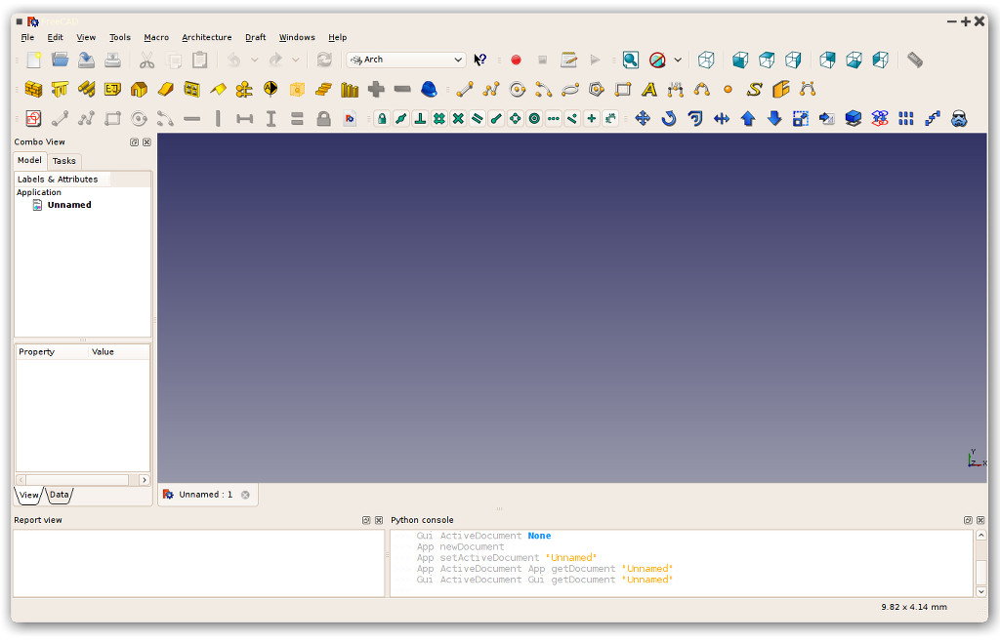

In this tutorial, we will model the house in 3D, based on the 2D drawings we will download from the net, and extract from it 2D documents, such as plans, elevations and sections.

### Abbreviations

FIXME Comment

make list of common abbreviations

[One compilation of Acronyms can be found here](https://www.dummies.com/programming/big-data/your-bim-acronym-guide-what-all-those-letters-mean/)

BEP \| BIM Execution Plan

### References & Links 

Reference any input from users or outside sources

### FCStd file 

\[File\_Format\_FCStd\| File FormatFCStd\]

### Command line 

command line interface

You can create a log file with the additional commandline parameter

Code: Select all

\--log-file arg

### Document Draft Snippets 

### Customizing Arch WorkBench 

[wiki styling](WikiPages.md)

### VDC

FIXME Want to fit VDC in somewhere

Virtual Design and Construction seems to be the next Buzz word after BIM.

[virtual Design and Construction in Skanska Norway](https://www.bi.no/globalassets/forskning/senter-for-byggenaringen/lc-arrangement/lcno-seminar-samlet-170614-pdf.pdf)

## Annex B 

### FreeCAD ifcOpenShell 

-   [Voids](https://forum.freecadweb.org/viewtopic.php?t=25491)
-   [IFC installation](https://forum.freecadweb.org/viewtopic.php?f=4&t=12368)
-   [Add extra python lib path to FreeCAD system path](https://forum.freecadweb.org/viewtopic.php?t=16332)

-   [Download IfcOpenShell](http://ifcopenshell.org/python.html)

{{Code|
import sys
 for p in sys.path:
 print(p)
}}

#### ifcOpenShell from ppa 

{{Code|
sudo add-apt-repository ppa:freecad-community/ppa
sudo apt-get update
}}

#### ifcOpenShell python unicode 

{{Code|
ls -l /usr/lib/python2.7/sitecustomize.py
lrwxrwxrwx 1 root root 31 sep.   4 07:46 /usr/lib/python2.7/sitecustomize.py -> /etc/python2.7/sitecustomize.py
}}

#### Build OCE 

No success so far

[GitHub ifcopenshell](https://github.com/IfcOpenShell/IfcOpenShell)

{{Code|
sudo apt-get install git cmake gcc g++ libboost-all-dev libicu-dev
}}

compile OCE yourself (note that the build takes a long time):

{{Code|
$ sudo apt-get install libftgl-dev libtbb2 libtbb-dev libgl1-mesa-dev libfreetype6-dev
$ git clone https://github.com/tpaviot/oce.git
$ cd oce
$ mkdir build && cd build
$ cmake ..
$ make -j
$ sudo make install
}}

### IFC openshell Linux 

#### Freecad syspath 

{{Code|
import sys
>>> for p in sys.path:
...     print(p)
... 
/usr/lib/freecad-daily/Mod/Drawing
/usr/lib/freecad-daily/Mod/Inspection
/usr/lib/freecad-daily/Mod/Idf
/usr/lib/freecad-daily/Mod/AddonManager
/usr/lib/freecad-daily/Mod/Robot
/usr/lib/freecad-daily/Mod/Arch
/usr/lib/freecad-daily/Mod/Part
/usr/lib/freecad-daily/Mod/Path
/usr/lib/freecad-daily/Mod/Mesh
/usr/lib/freecad-daily/Mod/Raytracing
/usr/lib/freecad-daily/Mod/Material
/usr/lib/freecad-daily/Mod/Plot
/usr/lib/freecad-daily/Mod/Complete
/usr/lib/freecad-daily/Mod/Tux
/usr/lib/freecad-daily/Mod/TechDraw
/usr/lib/freecad-daily/Mod/Import
/usr/lib/freecad-daily/Mod/Test
/usr/lib/freecad-daily/Mod/Draft
/usr/lib/freecad-daily/Mod/Points
/usr/lib/freecad-daily/Mod/Start
/usr/lib/freecad-daily/Mod/Spreadsheet
/usr/lib/freecad-daily/Mod/Fem
/usr/lib/freecad-daily/Mod/OpenSCAD
/usr/lib/freecad-daily/Mod/MeshPart
/usr/lib/freecad-daily/Mod/Web
/usr/lib/freecad-daily/Mod/Ship
/usr/lib/freecad-daily/Mod/Measure
/usr/lib/freecad-daily/Mod/PartDesign
/usr/lib/freecad-daily/Mod/Surface
/usr/lib/freecad-daily/Mod/Image
/usr/lib/freecad-daily/Mod/Show
/usr/lib/freecad-daily/Mod/ReverseEngineering
/usr/lib/freecad-daily/Mod/Sketcher
/usr/lib/freecad-daily/Mod
/usr/lib/freecad-daily/lib64
/usr/lib/freecad-daily/lib
/usr/lib/freecad-daily/Ext

/home/peter
/usr/lib/python2.7
/usr/lib/python2.7/plat-x86_64-linux-gnu
/usr/lib/python2.7/lib-tk
/usr/lib/python2.7/lib-old
/usr/lib/python2.7/lib-dynload
/usr/local/lib/python2.7/dist-packages
/usr/lib/python2.7/dist-packages

/usr/lib/freecad-daily/Macro
/usr/lib/freecad/lib
/home/peter/.FreeCAD/Macro
/home/peter/.FreeCAD/Macro/WorkFeature/WF_2015.py
/home/peter/.FreeCAD/Macro/WorkFeature/ParCurve/WF_ObjParCurve_2016.py
/home/peter/.FreeCAD/Macro/WorkFeature/ParCurve/WF_ObjParCurveEdit_2016.py
>>> 
}}

add /usr/lib/python2.7/site-packages

{{Code|
import sys
sys.path.append("/usr/lib/python2.7/site-packages")
}}

FIXME This does not seem to work?

{{Code|
peter@peter-HP-Z400-Workstation:~/.FreeCAD/Macro$ sudo rsync -azv /home/peter/Downloads/ifcopenshell /usr/local/lib/python2.7/site-packages/
[sudo] password for peter: 
sending incremental file list
ifcopenshell/
ifcopenshell/__init__.py
ifcopenshell/_ifcopenshell_wrapper.so
ifcopenshell/entity_instance.py
ifcopenshell/file.py
ifcopenshell/guid.py
ifcopenshell/ifcopenshell_wrapper.py
ifcopenshell/geom/
ifcopenshell/geom/__init__.py
ifcopenshell/geom/app.py
ifcopenshell/geom/main.py
ifcopenshell/geom/occ_utils.py

sent 19,305,512 bytes  received 218 bytes  7,722,292.00 bytes/sec
total size is 49,071,231  speedup is 2.54

}}

Ended up placing ifcopenshell in \... dist-packages

## Annex B IFC and FreeCAD 

This chapter looks at how FreeCAD entities come across as IFC entities based on using _ and [BIM](BIM_Workbench.md) workbenches

We start looking at basic objects like Wall and Structure.

### Wall

## Annex D IFC PlusPlus 

### Installation

New try with Ubuntu 18.04 LTS

-   [Bernd Hahnebach\'s](https://forum.freecadweb.org/memberlist.php?mode=viewprofile&u=2069) [Script](https://gist.github.com/berndhahnebach/e4d57634fe7eebbae537bf3da1b1b95a)

Download **Stretch\--ifcplusplus.sh** save to Your Home dir.

-   Make executeble
-   Open Terminal
-   chmod u+x Stretch\--ifcplusplus.sh
-   Run the file

Error:

SimpleViewerExampled: error while loading shared libraries: libcarved.so: cannot open shared object file: No such file or directory {{Code|
yorik wrote:
    Thu Aug 30, 2018 6:27 pm
    do you have a libcarved.so together with the SimpleViewerExample executable in Release subfolder? 
}}

Tried this script with Ubuntu 16.04 LTS, got all kinds of errors. Mostly Cmake wrong version. See [ifcPlusPlus](https://forum.freecadweb.org/viewtopic.php?f=23&t=30444)

## Annex X 

Freecad install directories on [Ubuntu](https://en.wikipedia.org/wiki/Ubuntu_(operating_system)) [Linux](https://en.wikipedia.org/wiki/Linux)

Binary executables

{{Code|
/usr/bin$ ls -l freec*
lrwxrwxrwx 1 root root  26 aug.  19 21:25 freecad -> ../lib/freecad/bin/FreeCAD
lrwxrwxrwx 1 root root  29 aug.  19 21:25 freecadcmd -> ../lib/freecad/bin/FreeCADCmd
lrwxrwxrwx 1 root root  35 aug.  23 04:16 freecadcmd-daily -> ../lib/freecad-daily/bin/FreeCADCmd
lrwxrwxrwx 1 root root  32 aug.  23 04:16 freecad-daily -> ../lib/freecad-daily/bin/FreeCAD
-rwxr-xr-x 1 root root 717 aug.  23 01:03 freecad-daily-thumbnailer
-rwxr-xr-x 1 root root 699 aug.  19 20:29 freecad-thumbnailer
}}

### Data directories FreeCad 

{{Code|
/usr/share$ tree -d ./freecad
./freecad
├── examples
├── Gui
│   └── Stylesheets
│       └── images
└── Mod -> ../../lib/freecad/Mod
}}

User Data in {{Code|/Home/User/.FreeCAD}}

seems to be shared with FreeCad-Daily {{Code|
.FreeCAD
├── Macro
├── Macros
└── Mod
    ├── assembly2
    │   ├── docs
    │   ├── Gui
    │   │   └── Resources
    │   │       ├── icons
    │   │       └── ui
    │   └── tests
    ├── BIM
    │   ├── icons
    │   └── utils
    ├── flamingo
    │   ├── dialogs
    │   ├── examples
    │   ├── icons
    │   ├── shapes
    │   │   ├── ballValves
    │   │   └── butterflyValves
    │   ├── tables
    │   └── tutorials
    ├── FreeCAD_assembly2
    │   ├── docs
    │   ├── Gui
    │   │   └── Resources
    │   │       ├── icons
    │   │       └── ui
    │   └── tests
    └── timber
        └── icons

}}

link to Mod {{Code|
/usr/lib$ tree -d ./freecad
./freecad
├── bin
├── Ext
│   └── freecad
├── lib
└── Mod
    ├── AddonManager
    ├── Arch
    │   ├── Dice3DS
    │   ├── Presets
    │   └── Resources
    │       └── icons
    ├── Complete
    │   └── Resources
    │       └── icons
    ├── Draft
    │   └── Resources
    │       └── icons
    ├── Drawing
    │   ├── Resources
    │   │   └── icons
    │   └── Templates
    ├── Fem
    │   ├── femcommands
    │   ├── femguiobjects
    │   ├── feminout
    │   ├── femmesh
    │   ├── femobjects
    │   ├── femresult
    │   ├── femsolver
    │   │   ├── calculix
    │   │   ├── elmer
    │   │   │   └── equations
    │   │   ├── fenics
    │   │   └── z88
    │   ├── femtest
    │   │   └── testfiles
    │   │       ├── ccx
    │   │       ├── elmer
    │   │       └── mesh
    │   ├── femtools
    │   └── Resources
    │       ├── icons
    │       └── ui
    ├── Idf
    │   └── Idflibs
    ├── Image
    │   └── Resources
    │       └── icons
    ├── Import
    ├── Inspection
    │   └── Resources
    │       └── icons
    ├── Material
    │   ├── FluidMaterial
    │   └── StandardMaterial
    │       └── Tools
    ├── Measure
    ├── Mesh
    │   └── Resources
    │       └── icons
    ├── MeshPart
    ├── OpenSCAD
    │   ├── ply
    │   └── Resources
    │       └── icons
    ├── Part
    │   ├── AttachmentEditor
    │   ├── BOPTools
    │   ├── CompoundTools
    │   └── Resources
    │       └── icons
    ├── PartDesign
    │   ├── fcgear
    │   ├── PartDesignTests
    │   ├── Resources
    │   │   └── icons
    │   ├── Scripts
    │   └── WizardShaft
    ├── Path
    │   ├── PathScripts
    │   │   └── post
    │   ├── PathTests
    │   └── Resources
    │       └── icons
    ├── Plot
    │   ├── plotAxes
    │   ├── plotLabels
    │   ├── plotPositions
    │   ├── plotSave
    │   ├── plotSeries
    │   ├── plotUtils
    │   └── resources
    │       └── icons
    ├── Points
    │   └── Resources
    │       └── icons
    ├── Raytracing
    │   ├── Resources
    │   │   └── icons
    │   └── Templates
    ├── ReverseEngineering
    │   └── Resources
    │       └── icons
    ├── Robot
    │   ├── Lib
    │   │   └── Kuka
    │   └── Resources
    │       └── icons
    ├── Ship
    │   ├── resources
    │   │   ├── examples
    │   │   └── icons
    │   ├── shipAreasCurve
    │   ├── shipCapacityCurve
    │   ├── shipCreateLoadCondition
    │   ├── shipCreateShip
    │   ├── shipCreateTank
    │   ├── shipCreateWeight
    │   ├── shipGZ
    │   ├── shipHydrostatics
    │   ├── shipLoadExample
    │   ├── shipOutlineDraw
    │   └── shipUtils
    ├── Show
    ├── Sketcher
    │   ├── ProfileLib
    │   └── Resources
    │       └── icons
    ├── Spreadsheet
    │   └── Resources
    │       └── icons
    ├── Start
    │   ├── Resources
    │   │   └── icons
    │   └── StartPage
    │       └── images
    ├── Surface
    ├── TechDraw
    │   ├── LineGroup
    │   ├── PAT
    │   ├── Patterns
    │   ├── Resources
    │   │   ├── fonts
    │   │   └── icons
    │   ├── TDTest
    │   └── Templates
    ├── Test
    │   └── Resources
    │       └── icons
    ├── Tux
    └── Web
        └── Resources
            └── icons

}}

### Data directories FreeCad-Daily 

{{Code|
/usr/share$ tree -d ./freecad-daily
./freecad-daily
├── examples
├── Gui
│   └── Stylesheets
│       └── images_dark-light
└── Mod
    ├── Arch
    │   ├── Presets
    │   └── Resources
    │       └── icons
    ├── Complete
    │   └── Resources
    │       └── icons
    ├── Draft
    │   └── Resources
    │       └── icons
    ├── Drawing
    │   ├── Resources
    │   │   └── icons
    │   └── Templates
    ├── Fem
    │   └── Resources
    │       └── icons
    ├── Image
    │   └── Resources
    │       └── icons
    ├── Import
    │   └── DxfPlate
    ├── Inspection
    │   └── Resources
    │       └── icons
    ├── Material
    │   ├── FluidMaterial
    │   └── StandardMaterial
    │       └── Tools
    ├── Mesh
    │   └── Resources
    │       └── icons
    ├── OpenSCAD
    │   └── Resources
    │       └── icons
    ├── Part
    │   └── Resources
    │       └── icons
    ├── PartDesign
    │   └── Resources
    │       └── icons
    ├── Path
    │   └── Resources
    │       └── icons
    ├── Plot
    │   └── resources
    │       └── icons
    ├── Points
    │   └── Resources
    │       └── icons
    ├── Raytracing
    │   └── Resources
    │       └── icons
    ├── ReverseEngineering
    │   └── Resources
    │       └── icons
    ├── Robot
    │   ├── Lib
    │   │   └── Kuka
    │   └── Resources
    │       └── icons
    ├── Ship
    │   └── resources
    │       └── icons
    ├── Sketcher
    │   └── Resources
    │       └── icons
    ├── Spreadsheet
    │   └── Resources
    │       └── icons
    ├── Start
    │   ├── Resources
    │   │   └── icons
    │   └── StartPage
    ├── TechDraw
    │   ├── LineGroup
    │   ├── PAT
    │   ├── Patterns
    │   ├── Resources
    │   │   ├── fonts
    │   │   └── icons
    │   └── Templates
    ├── Test
    │   └── Resources
    │       └── icons
    └── Web
        └── Resources
            └── icons

}}

Also in {{Code|
/usr/lib$ tree -d ./freecad-daily
./freecad-daily
├── bin
├── Ext
│   └── freecad
├── lib
└── Mod
    ├── AddonManager
    ├── Arch
    │   └── Dice3DS
    ├── Complete
    ├── Draft
    ├── Drawing
    ├── Fem
    │   ├── femcommands
    │   ├── femguiobjects
    │   ├── feminout
    │   ├── femmesh
    │   ├── femobjects
    │   ├── femresult
    │   ├── femsolver
    │   │   ├── calculix
    │   │   ├── elmer
    │   │   │   └── equations
    │   │   ├── fenics
    │   │   └── z88
    │   ├── femtest
    │   │   └── testfiles
    │   │       ├── ccx
    │   │       ├── elmer
    │   │       └── mesh
    │   ├── femtools
    │   └── Resources
    │       └── ui
    ├── Idf
    │   └── Idflibs
    ├── Image
    │   └── ImageTools
    ├── Import
    ├── Inspection
    ├── Material
    ├── Measure
    ├── Mesh
    ├── MeshPart
    ├── OpenSCAD
    │   └── ply
    ├── Part
    │   ├── AttachmentEditor
    │   ├── BOPTools
    │   └── CompoundTools
    ├── PartDesign
    │   ├── fcgear
    │   ├── PartDesignTests
    │   ├── Scripts
    │   └── WizardShaft
    ├── Path
    │   ├── Images
    │   │   ├── Ops
    │   │   └── Tools
    │   ├── PathScripts
    │   │   └── post
    │   └── PathTests
    ├── Plot
    │   ├── plotAxes
    │   ├── plotLabels
    │   ├── plotPositions
    │   ├── plotSave
    │   ├── plotSeries
    │   └── plotUtils
    ├── Points
    ├── Raytracing
    ├── ReverseEngineering
    ├── Robot
    ├── Ship
    │   ├── resources
    │   │   └── examples
    │   ├── shipAreasCurve
    │   ├── shipCapacityCurve
    │   ├── shipCreateLoadCondition
    │   ├── shipCreateShip
    │   ├── shipCreateTank
    │   ├── shipCreateWeight
    │   ├── shipGZ
    │   ├── shipHydrostatics
    │   ├── shipLoadExample
    │   ├── shipOutlineDraw
    │   └── shipUtils
    ├── Show
    ├── Sketcher
    │   └── ProfileLib
    ├── Spreadsheet
    ├── Start
    │   └── StartPage
    ├── Surface
    ├── TechDraw
    │   └── TDTest
    ├── Test
    ├── Tux
    └── Web

}}

_

---
[documentation index](../README.md) > Sandbox:TutorialArchBIM
