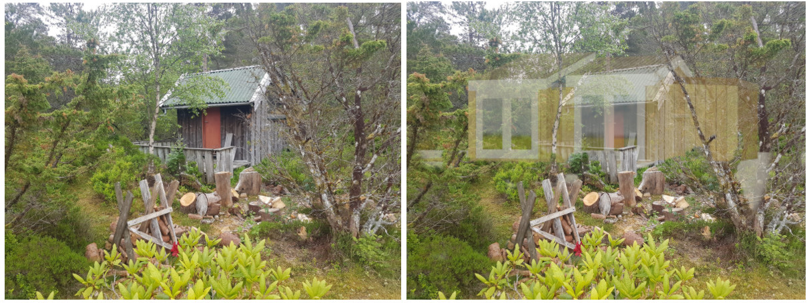
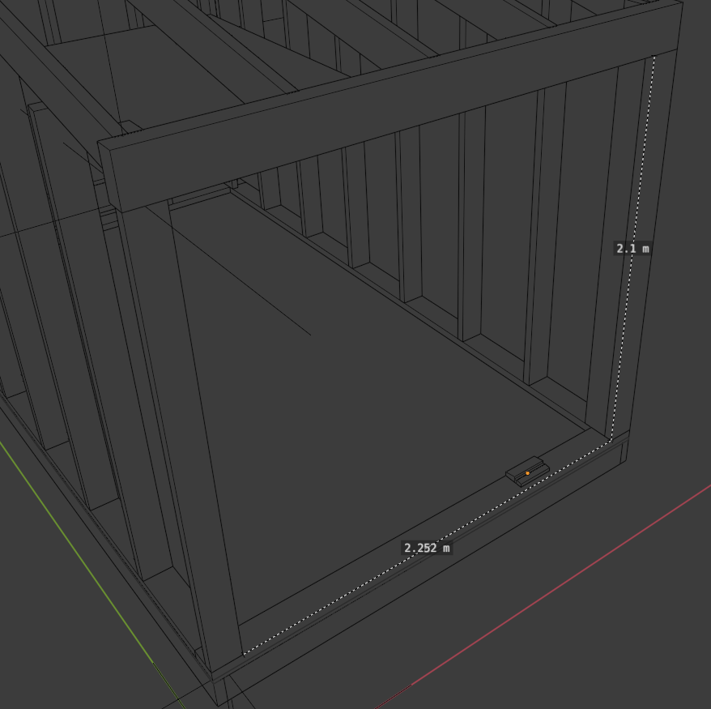

---
- TutorialInfo:/en
   Topic:Modeling
   Level:Intermediate
   Time:Indefinate
   Author:[cadgiru](User_cadgiru.md)
   FCVersion:0.19
   Files:
---

# Sandbox:TutorialBIMannex

# Goal of this document 

Try to investigate:

-   a parallel workflow in [FreeCAD](https://www.freecadweb.org/) and [BlenderBIM](https://blenderbim.org/)
-   make a detailed ifc4 model both Freecad and BlenderBim
-   produce documentation from both

Currently this document is **WORK in Progress** . Participation is always welcome.

## Project description 

Creating a simple freestanding annex to a country summerhouse.

Existing and proposed

### Functional requirements 

Designed as three (possibly Four) adjoining \'buildings\', from left to right in below images and sketches.

-   One (Leftmost)
    -   Kids playhouse with elevated \'bedroom\'
-   Second
    -   Sanitary
-   Third
    -   bedroom
-   Fourth
    -   Eavaluating
    -   Maybe Storing of firewood and Garden Utensils

### Initial Sketches 

 

# Modeling approach 

This is a minor project, but large enough to investigate and document different approaches.

Some main initial thoughts

#### Project should 

-   Use OpenBIM, IFC4
-   Validated
-   Geo-located
-   Models
-   Documentation
-   Produce qty Takeoff

#### Divide project files by discipline 

-   Landscape
    -   Terrain
-   Structural
-   Architectural
-   MEP
    -   Mechanical
    -   Electrical
    -   Plumbing
-   Interior

## BIM Project 

Must Contain, [ref BuildingSmart](https://standards.buildingsmart.org/IFC/RELEASE/IFC2x3/FINAL/HTML/ifckernel/lexical/ifcproject.htm)

-   Project
    -   Name, DH

-   Site
    -   Name, SV
-   Building(s)
    -   Name, B01
    -   Name, B02
    -   Name, B03
-   Floor(s)
    -   Name, 0 Foundation
    -   Name, 1 Etasje
    -   Name, 2 Etasje
    -   Name, Roof

# FreeCAD

Modeling the project in FreeCAD

# BlenderBim

Modeling the project with BlenderBIM

-   Versions used
    -   201207 (December 07th 2020)
    -   200829 (August 29th 2020)
    -   200813 (August 2020)

-   [BlenderBIM documentation](https://blenderbim.org/docs/index.html)
-   [Builds](https://blenderbim.org/builds/)

## BlenderBIM Modeling 

### Modeling Tips 

#### Show number of objects selected in Python Console 

In ViewPort Overlays pulldown, check Statistics. This will place Statistics in the viewport.

##### Alternative

import bpy context = bpy.context print(len(context.selected_objects))

### DoubleDoor

DoubleDoor Opening

If we assume 20mm Clearance each side, this gives L = 2210 H = 2060

## BlenderBIM Project Setup 

We need to beware that project setup refers to to separate setups. The Blender Project setup, and the BlenderBim project setup. These are basically totally separated, and serve different functions.

-   [Blender Project setup](#Project_Setup.md)
    -   deals with organization of blender files and assets.
-   BlendeBIM project setup
    -   organizes IFC structure, internal to file.

## Useful links 

-   [blender-collection-instances-ifc-export](https://community.osarch.org/discussion/162/blender-collection-instances-ifc-export#latest)

# Blender Tips 

### Project Setup 

Organizing files soon comes vital, plan ahead, avoid spaghetti syndrome

Some links

-   [Organize-blender-3d-projects](https://www.blendernation.com/2016/11/24/organize-blender-3d-projects/)
-   [How-to-organize-your-blender-files](https://cgcookie.com/articles/how-to-organize-your-blender-files)
-   [Blender in Architecture](https://download.blender.org/documentation/bc2011/justas_ingelevicius.pdf)

### Linked Models 

In order to produce a multidisciplinary approach, containing several model. Model should for BIM purposes be linked, not appended

[Is Linking Files Good Practice?](https://blender.stackexchange.com/questions/64501/is-linking-files-good-practice)

> \'\'The biggest advantage of linking is that it makes files easier for Blender to compute. It also makes it easier for you to manage - provided you have a coherent structure. The Linked Library Addon can be considered essential for workflow.
>
> Setting the background in one file that you linked in, should give no problem, and you will probably wish you did it sooner\'\'

The steps are the same as appending: File \> Link or Ctrl+Alt+O, find the .blend file to link from, then select the element you wish to link, and click Link from Library in the top right.

As a resource: there is an excellent explanation on - [Jason\'s Blog](https://jtheninja.wordpress.com/2014/06/24/121/)

### Resources

-   [Blender-2-8-technical-drawing-architecture-ebook (Amazon)](https://www.amazon.co.uk/Blender-2-8-technical-drawing-architecture-ebook/dp/B081PV8PC2/ref=tmm_kin_swatch_0?_encoding=UTF8&qid=1598342983&sr=8-2)

# Harvesting from IFC 

[IfcOpenShell_code_examples](https://wiki.osarch.org/index.php?title=IfcOpenShell_code_examples)

---
 [documentation index](../README.md) > Sandbox:TutorialBIMannex
