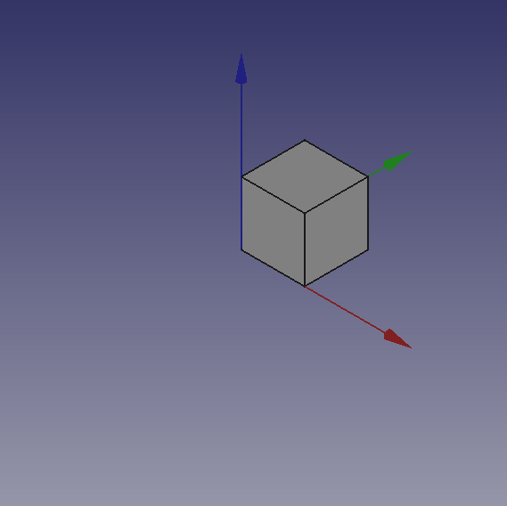
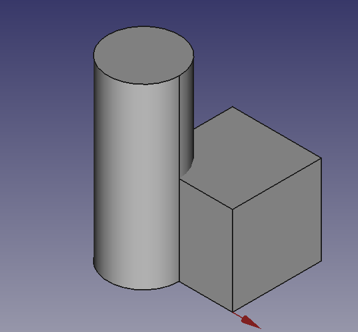
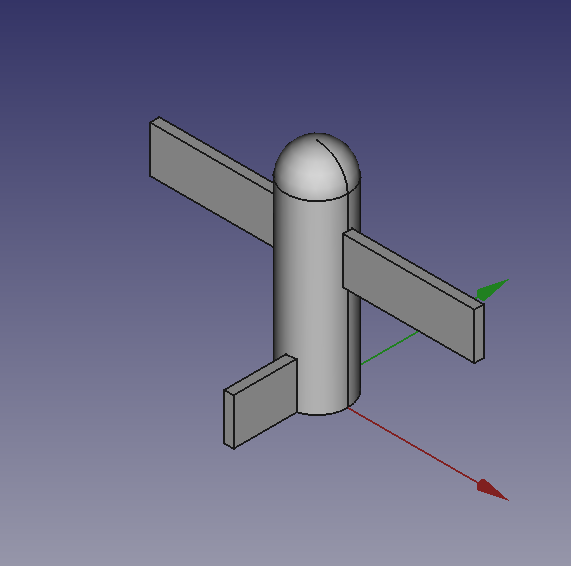
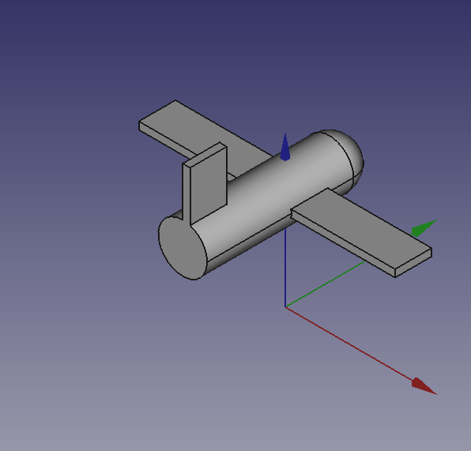
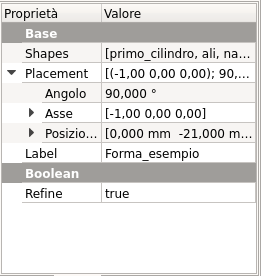

# Scripts

 


## Introduction

With Scripting we mean create topological objects using FreeCAD\'s Python interpreter. FreeCAD could be used a \"very good\" replacement of OpenSCAD, manìinly beacause it has a real Python interpreter, that means that it has a real programming language on board, almost everything you could do with the GUI, is doable with a Python Script.

Sadly information about scripting in the documentation, and even in this wiki are scattered around and lacks of \"writing\" uniformity and most of them are explained in a too technical manner.

## Whetting your appetite 

The first obstacle in an easy way to scripting is that there is no direct way to access the FreeCAD internal Python editor through a menu item or a icon on the toolbar area, but knowing that FreeCAD opens a file with a `.py` extension in the internal Python editor, the most simple trick is create in your favorite text editor and then open it with the usual command **File → Open**.

To make the things in a polite way, the file has to be written with some order, FreeCAD Python editor have a good \"Syntax HIghlighting\" that lacks in many simple editors like Windows Notepad or some basic Linux editors, so it is sufficient to write these few lines:

 
```python
"""script.py

   Primo script per FreeCAD

"""

```

Save them with a meaningfull name with `.py` extension and load the resulting file in FreeCAD, with the said **File - Open** command.

A minimal example of what is necessary to have in a script is shown in this portion of code that you could be use as a template for almost any future script:

 
```python
"""filename.py

   Here a short but significant description of what the script do 

"""


import FreeCAD
from FreeCAD import Base, Vector
import Part
from math import pi, sin, cos

DOC = FreeCAD.activeDocument()
DOC_NAME = "Pippo"

def clear_doc():
    """
    Clear the active document deleting all the objects
    """
    for obj in DOC.Objects:
        DOC.removeObject(obj.Name)

def setview():
    """Rearrange View"""
    FreeCAD.Gui.SendMsgToActiveView("ViewFit")
    FreeCAD.Gui.activeDocument().activeView().viewAxometric()


if DOC is None:
    FreeCAD.newDocument(DOC_NAME)
    FreeCAD.setActiveDocument(DOC_NAME)
    DOC = FreeCAD.activeDocument()

else:

    clear_doc()

# EPS= tolerance to use to cut the parts
EPS = 0.10
EPS_C = EPS * -0.5

```

Some tricks are incorporated in the above code:

-    `import FreeCAD`This line import FreeCAD in the FreeCAD Python interpreter, it may seem a redundant thing, but it isn\'t.

-    `from FreeCAD import Base, Vector`Base and Vector are widely used in FreeCAD scripting, import them in this manner will save you to invoke them with `FreeCAD.Vector` or `FreeCAD.Base` instead of `Base` or `Vector`, this will save many keystrokes and make codelines much smaller.

Let\'s start with a small script that does a very small job, but display the power of this approach.

 
```python
def cubo(nome, lung, larg, alt):
    obj_b = DOC.addObject("Part::Box", nome)
    obj_b.Length = lung
    obj_b.Width = larg
    obj_b.Height = alt

    DOC.recompute()

    return obj_b

# objects definition

obj = cubo("test_cube", 5, 5, 5)

setview()

```

Put these lines after the \"template\" code and press the green arrow in the **Macro toolbar**

You will see some magic things, a new document is open named \"Pippo\" (Italian name of **Goofy**) and you will see in the 3d view a [Cube](Part_Box.md), like the one in the image below.

  

## Something more\... 

Not too amazing? Yes, but we have to start somewhere, we can do the same thing with a [Cylinder](Part_Cylinder.md), add these lines of code after the `cubo(` method and before the line `# objects definition`.

 
```python
def base_cyl(nome, ang, rad, alt ):
    obj = DOC.addObject("Part::Cylinder", nome)
    obj.Angle = ang
    obj.Radius = rad
    obj.Height = altDOC.recompute()

    return obj   

```

Even here nothing too exciting. But please note some peculiarities:

-   The absence of the usual reference to the `App.`, present in many Documentation code snippets, is deliberate, this code could be used even invoking FreeCAD as a module in an external Python interpreter, the thing is not easily doable with an AppImage, but with some care it could be done. Plus in the standard Python motto that \"better explicit than implicit\" `App.` is explaining in a very \"poor\" way where the things are from.
-   Note the use of the \"constant\" name assigned to the active Document in `DOC` = `FreeCAD.activeDocument()`; activeDocument is not a \"constant\" in a strict sense, but in a \"semantical\" way is our \"active Document\", that for our use is a proper \"constant\" so the Python convention to use the \"ALL CAPS\" name for \"constants\", not to mention that `DOC` is much shorten than `FreeCAD.activeDocument()`.
-   Every method returns a geometry, this will be clear in the continuation of the page.
-   Geometry didn\'t have the `Placement` property, when using the simple geometries to make more complex geometry, managing `Placement` is a awkward thing.

Now what to do with this geometries?

Let\'s introduce boolean operations. As a starter example put these lines after `base_cyl(...`, this create a method for a **Fusion** also know as **Union** operation:

 
```python
def fuse_obj(nome, obj_0, obj_1):
    obj = DOC.addObject("Part::Fuse", nome)
    obj.Base = obj_0
    obj.Tool = obj_1
    obj.Refine = True
    DOC.recompute()

    return obj
```

Nothing exceptional also here, note however the uniformity in method coding; This approach is more linear that those seen around other tutorial on scripting, this \"linearity\" help greatly in readability and also with cut-copy-paste operations.

Let\'s use the geometries, delete lines below the code section starting with `# objects definition`, and insert the following lines:

 
```python

# objects definition

obj = cubo("cubo_di_prova", 5, 5, 5)

obj1 = base_cyl('primo cilindro', 360,2,10)

fuse_obj("Fusione", obj, obj1)

setview()

```

Launch the script with the green arrow and we will see in the 3D view something like:

  

## Placement

Placement Concept is relatively complex, see [Aeroplane Tutorial](Aeroplane.md) for a more deep explanation.

We usually are in need of placing geometries respect each other, when building complex object this is a recurring task, the most common way is to use the geometry `Placement` property.

FreeCAD offer a wide choice of ways to set this property, one is more tailored to another depending the knowledge and the background of the user, but the more plain writing is explained in the cited Tutorial, it use a peculiar definition of the `Rotation` portion of `Placement`, quite easy to learn.

 
```python 
FreeCAD.Placement(Vector(0,0,0), FreeCAD.Rotation(10,20,30), Vector(0,0,0))
```

But over other consideration, one thing is crucial, geometry **reference point**, in other word the point from which the object is modeled by FreeCAD, as described in this table, copied from [Placement](Placement.md):

  Object                           Reference Point
   
  Part.Box                         left (minx), front (miny), bottom (minz) vertex
  Part.Sphere                      center of the sphere (ie centre of bounding box)
  Part.Cylinder                    center of the bottom face
  Part.Cone                        center of bottom face (or apex if bottom radius is 0)
  Part.Torus                       center of the torus
  Features derived from Sketches   the Feature inherits the Position of the underlying Sketch. Sketches always start with Position = (0,0,0). This position corresponds to the origin in the sketch.

This information has to be kept in mind especially when we have to apply a rotation.

Some examples may help, delete all the line after `base_cyl` method and insert the portion of code below:

 
```python

def sfera(nome, rad):
    obj = DOC.addObject("Part::Sphere", nome)
    obj.Radius = radDOC.recompute()

    return obj   


def mfuse_obj(nome, objs):
    obj = DOC.addObject("Part::MultiFuse", nome)
    obj.Shapes = objs
    obj.Refine = True
    DOC.recompute()

    return obj


def aeroplano():

    lung_fus = 30
    diam_fus = 5
    ap_alare = lung_fus * 1.75
    larg_ali = 7.5
    spess_ali = 1.5   
    alt_imp = diam_fus * 3.0  
    pos_ali = (lung_fus*0.70)
    off_ali = (pos_ali - (larg_ali * 0.5))

    obj1 = base_cyl('primo cilindro', 360, diam_fus, lung_fus)

    obj2 = cubo('ali', ap_alare, spess_ali, larg_ali, True, off_ali)

    obj3 = sfera("naso", diam_fus)
    obj3.Placement = FreeCAD.Placement(Vector(0,0,lung_fus), FreeCAD.Rotation(0,0,0), Vector(0,0,0))

    obj4 = cubo('impennaggio', spess_ali, alt_imp, larg_ali, False, 0)
    obj4.Placement = FreeCAD.Placement(Vector(0,alt_imp * -1,0), FreeCAD.Rotation(0,0,0), Vector(0,0,0))

    objs = (obj1, obj2, obj3, obj4)

    obj = mfuse_obj("Forma esempio", objs)
    obj.Placement = FreeCAD.Placement(Vector(0,0,0), FreeCAD.Rotation(0,0,-90), Vector(0,0,pos_ali))

    DOC.recompute()

    return obj

# objects definition

aeroplano()

setview()

```

Let\'s explain something in the code:

-   We have used a method to define a sphere, using the most easy definition, using only the radius.
-   We have introduced a second writing for the **Union** or **Fusion**, using multiple objects, not more distant from the usual **Part::Fuse** it uses **Part:Multifuse**. We only use one property `Shapes`. We have passed a **tuple** as arguments, but it accepts also a **list**.
-   We have defined a complex object **aeroplano** (italian word for aeroplane), but we have done it in a **\"parametric\"** way, defining some parameters and deriving other parameters, through some calculation, based on the main parameters.
-   We have used some Placement `Placement` poperties around in the method and before returning the final geometries we have used a `Rotation` property with the *Yaw-Pitch-Roll* writing. Note the last `Vector(0,0, pos_ali)`, that define a **center of rotation** of the whole geometry.


    
        
    


It can be easily noted that **aeroplano** geometry rotate around his \"barycenter\" or \"center of gravity\", that I\'ve fixed at wing center, a place that is relatively \"natural\", but could be placed wherever you want.

The first `Vector(0,0,0)` is the Translation vector, not used here, but if you substitute `aeroplano()` with these lines:

 
```python

obj_f = aeroplano()

print(obj_F.Placement)

```

You will see in the Report window this text:

 
```python
Placement [Pos=(0,-21,21), Yaw-Pitch-Roll=(0,0,-90)]
```

What has happened?

FreeCAD has translated the `Vector(0,0,0), FreeCAD.Rotation(0,0,-90), Vector(0,0,pos_ali)` in other word our `Placement` definition that specifies three components, **Translation**, **Rotation** and *center of rotation*\' in the \"internal\" values of only two components, **Translation** and **Rotation**.

you can easily visualize the value of `pos_ali` using a print statement in the `aeroplano(...` method and see that it is:

 
```python
pos ali =  21.0
```

in other word the **rotation center** of the geometry is at `Vector(0,0,21)`, but this rotation center is not shown in the GUI, it could be entered as a `Placement` value, it could not be easily retrieved.

This is the meaning of the word \"awkward\" that I\'ve used to define `Placement` property.


---
 [documentation index](../README.md) > [Developer Documentation](Category_Developer Documentation.md) > [Python Code](Category_Python Code.md) > Scripts
