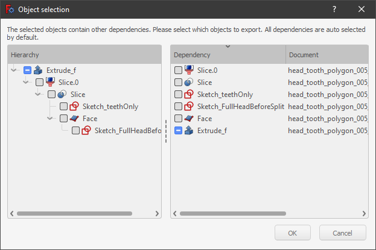

# Selection methods
## Overview

[Selection methods](Selection_methods.md) in FreeCAD allow picking objects in the [FreeCAD Interface](Interface.md): such as [3D view](3D_view.md), [tree view](Tree_view.md), [selection view](Selection_view.md), and other dialogs. Some selection methods are workbench specific and are documented in the particular workbench documentation.

## 3D view 

In the [3D view](3D_view.md) there are various ways of selecting objects.

### Simple selection 

Simple selection with the mouse (by default left-click) and pre-selection (hover) are described in the [mouse navigation](Mouse_navigation.md) page.

### Repeated clicks 

The first click selects a sub-element (vertex, edge or face) of the object under the mouse. A second click selects the whole object. <small>(v0.18)</small> 

The third click extends the selection to its container object ([PartDesign Body](PartDesign_Body.md), [Std Part](Std_Part.md), and others). Further clicks expand the selection up the container chain. <small>(v0.19)</small> 

### Selection commands 

-   To select all objects: [Std SelectAll](Std_SelectAll.md).
-   To box select multiple main objects: [Std BoxSelection](Std_BoxSelection.md).
-   To box select multiple faces: [Std BoxElementSelection](Std_BoxElementSelection.md) or [Part BoxSelection](Part_BoxSelection.md).

## Selection view 

The [selection view](Selection_view.md) shows the names of the objects being selected, including their full name within an object, for example, `Unnamed#Body.Box001.Face17`.

It also allows to perform some actions like [Std ViewFitSelection](Std_ViewFitSelection.md), and sending the object to the [Python console](Python_console.md).

### Object export 

*This should be in the [selection view](selection_view.md) page.*

Select any complex object, for example, a [PartDesign Body](PartDesign_Body.md) or [Std Part](Std_Part.md), then in the [selection view](selection_view.md) select again the object, and then press **Ctrl** + **C** in the keyboard to open the **Object selection** dialog. This allows copying the selected object together with all or only some of that object\'s dependency objects. For example, for a [Std Part](Std_Part.md) the possible objects to select include the [Std Part](Std_Part.md) itself, but also its Origin, its three base axes (XYZ), and its three base planes (XY, YZ, XZ).

After pressing **OK**, the selected objects are copied into memory, and then can be pasted in the document to duplicate these objects only.




*Object selection dialog that is launched from the [selection view](Selection_view.md).*

## Tree view 

In the [tree view](tree_view.md) items can be selected, or deselected, one at a time, by holding the **Ctrl** key and clicking with the mouse.

A range of items can be selected by clicking on the first item, holding **Shift**, and clicking on the last item.

Selecting a single item will also show its properties in the [property editor](property_editor.md).

Double clicking will open any associated [task panel](task_panel.md) containing actions. Make sure to close this task panel before executing another command or switching to any other workbench.

More methods are available by opening the context menu (right-click), depending on the object selected or the active workbench; see the information in [tree view](tree_view.md).

## Scripting

Selecting objects is inherently a graphical task and therefore it is only available when the graphical user interface is loaded.

These commands can be used in [macros](Macros.md) or from the [Python console](Python_console.md).

 
```python
import FreeCADGui as Gui

Gui.Selection.addSelection
Gui.Selection.addSelectionGate
Gui.Selection.Filter
```

The command `addSelectionGate` restricts the user from selecting objects not specified in the selection string. A symbol appears when the pointer is over an item not in the specified group.

 
```python
Gui.Selection.addSelectionGate("SELECT Part::Feature SUBELEMENT Edge")
```

See the [Source documentation](Source_documentation.md) and [Std PythonHelp](Std_PythonHelp.md) for more help on using these tools.


---
 [documentation index](../README.md) > Selection methods
