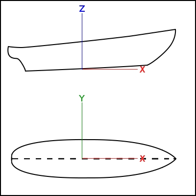

---
- GuiCommand:
   Name:Ship LoadExample
   MenuLocation:Ship design → Load an example ship geometry
   Workbenches:[Ship](Ship_Workbench.md)
   Shortcut:
   SeeAlso:
---

# Ship LoadExample

## Description

This tool loads example geometries.

Ship works over **Ship entities**, that must be created on top of provided geometry. Geometry must be a solid, or set of solids. The following criteria must be taken into account:

-   All hull geometry must be provided (including symmetric bodies).
-   Starboard geometry must be included at negatives *y* domain.
-   Origin (0,0,0) point is the **Midship section** (Midpoint between after and forward perpendicular) and **base line** intersection.

   
*Ship sign criteria*

In order to help new users, Ship includes a geometries examples loader, with the following to choose from:

-   Series 60 from Iowa University
-   Wigley Canonical Ship
-   Series 60 Catamaran
-   Wigley Catamaran

## Usage

1.  There are several ways to invoke the command:
    -   Press the ** [Load an example ship geometry](Ship_LoadExample.md)** button.
    -   Select the **Ship design →  Load‏‎ an example ship geometry** option from the menu.
2.  A task panel will display, prompting to choose one of the example ship geometries.
3.  Select the example you want to load and press **Accept**.
4.  Result: The tool loads a new document with the selected geometry.

**Warning, before editing anything! You are now working with the original example file. To preserve the original unedited example, you must first save it as a new file before editing anything.**

## Tutorials

-   [FreeCAD-Ship s60 tutorial](FreeCAD-Ship_s60_tutorial.md)
-   [FreeCAD-Ship s60 tutorial (II)](FreeCAD-Ship_s60_tutorial_(II).md)

---
 [documentation index](../README.md) > [Ship](Category_Ship.md) > Ship LoadExample
