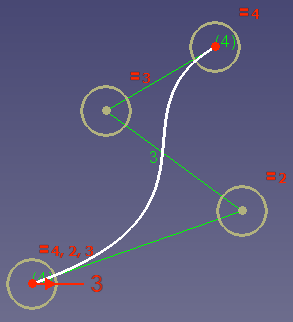

---
 GuiCommand:
   Name: Sketcher BSplinePolygon
   MenuLocation: Sketch , Sketcher visual , Show/hide B-spline information layer , Show/hide B-spline control polygon
   Workbenches: Sketcher_Workbench
   Version: 0.17
   SeeAlso: Sketcher_CreateBSpline
---

# Sketcher BSplinePolygon

## Description

The  [Sketcher BSplinePolygon](Sketcher_BSplinePolygon.md) tool shows or hides the [B-spline](B-Splines.md) control polygon in all sketches.

   
*The control polygon (green straight lines) connects the control points (marked with dark yellow weight circles).*

## Usage

1.  There are several ways to invoke the tool:
    -   Press the ** [Show/hide B-spline control polygon](Sketcher_BSplinePolygon.md)** button.
    -   Select the **Sketch → Sketcher visual → Show/hide B-spline information layer →  Show/hide B-spline control polygon** option from the menu.

 {{Sketcher_Tools_navi}}

---
⏵ [documentation index](../README.md) > [Sketcher](Sketcher_Workbench.md) > Sketcher BSplinePolygon
