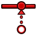

---
 GuiCommand:
   Name: Sketcher ConstrainCoincidentUnified
   MenuLocation: Sketch , Sketcher constraints , Constrain coincident
   Workbenches: Sketcher_Workbench
   Shortcut: **C**
   Version: 0.22
   SeeAlso: Sketcher_ConstrainCoincident, Sketcher_ConstrainPointOnObject
---

# Sketcher ConstrainCoincidentUnified

## Description

The  [Sketcher ConstrainCoincidentUnified](Sketcher_ConstrainCoincidentUnified.md) command creates a coincident constraint between points, fixes points on edges or axes, or creates a concentric constraint between circles, arcs and/or ellipses (by making their centers coincident).

This command replaces the [Sketcher ConstrainCoincident](Sketcher_ConstrainCoincident.md) and [Sketcher ConstrainPointOnObject](Sketcher_ConstrainPointOnObject.md) commands if the **Unify Coincident and PointOnObject** option is selected in the [Sketcher Preferences](Sketcher_Preferences#General.md).

## Usage

1.  Optionally do one of the following:
    -   Select two or more points.
    -   Select two or more edges of circles, arcs, ellipses or arcs of ellipses.
    -   Select a single point and a single edge (in any order).
    -   Select several points and a single edge (idem).
    -   Select a single point and several edges (idem).
2.  There are several ways to invoke the command:
    -   Press the ** [Constrain coincident](Sketcher_ConstrainCoincidentUnified.md)** button.
    -   Select the **Sketch → Sketcher constraints →  Constrain coincident** option from the menu.
    -   Use the keyboard shortcut: **C**.
3.  To indicate that the command has been activated the cursor shows a white cross and the command icon.
4.  Optionally keep selecting elements. You can only select two elements at a time now.
5.  To finish the command press **Esc** or the right mouse button, or start a another constraints or geometries command.

 {{Sketcher_Tools_navi}}

---
⏵ [documentation index](../README.md) > [Sketcher](Sketcher_Workbench.md) > Sketcher ConstrainCoincidentUnified
