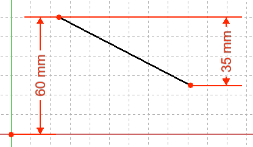

---
- GuiCommand:
   Name:Sketcher ConstrainDistanceY
   MenuLocation:Sketch → Sketcher constraints → Constrain vertical distance
   Workbenches:[Sketcher](Sketcher_Workbench.md)
   Shortcut:**Shift** + **V**
   SeeAlso:[Sketcher Constrain Horizontal Distance](Sketcher_ConstrainDistanceX.md), [Sketcher Constrain Length](Sketcher_ConstrainDistance.md)
---

## Description

Fixes the vertical distance between 2 points or line ends. If only one point is selected, the distance is set to the sketch origin.

  

## Usage

1.  Pick one or two points or one line.
2.  Invoke the command several ways:
    -   Press the ** [Constrain vertical distance](Sketcher_ConstrainDistanceY.md)** button.
    -   Use the **Shift** + **V** keyboard shortcut. (**V** is for **V**ertical)
    -   Use the **Sketch → Sketcher constraints →  Constrain vertical distance** entry from the top menu.
3.  A pop up dialog opens to edit or confirm the value. Press **OK** to validate.

**Note:** the constraint tool can also be started with no prior selection, but will require selection of two points or one line. To set the distance to the origin, the sketch origin point needs to be selected as well. By default the command will be in continue mode to create new constraints; press the right mouse button or **Esc** once to quit the command.

## Scripting

Distance from origin:

 

Distance between two vertices:

 

Vertical span of line (the GUI allows selecting the edge itself, but it is just a shorthand for using the two extremities of the same line):

 

The [Sketcher scripting](Sketcher_scripting.md) page explains the values which can be used for `Edge1`, `Edge2`, `Edge`, ` PointOfEdge1`, ` PointOfEdge2`, `PointOfEdge` and `Line`, and contains further examples on how to create constraints from Python scripts.

 {{Sketcher Tools navi}}  
