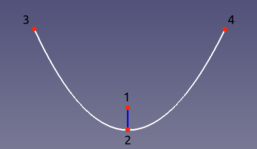

---
- GuiCommand:
   Name:Sketcher CreateArcOfParabola
   MenuLocation:Sketch → Sketcher geometries → Create an arc of parabola
   Workbenches:[Sketcher](Sketcher_Workbench.md)
   Version:0.17
   SeeAlso:[Sketcher Arc of ellipse](Sketcher_CreateArcOfEllipse.md), [Sketcher Arc of hyperbola](Sketcher_CreateArcOfHyperbola.md)
---

# Sketcher CreateArcOfParabola

## Description

This tool creates an arc of parabola by focus, vertex and endpoints.

  

## Usage

1.  Press the **[ [Arc of parabola](Sketcher_CreateArcOfParabola.md)** button.
2.  Click in the 3D view to define the focus point (labelled 1 in the picture above).
3.  Click in the 3D view to define the tip of the arc of hyperbola (labelled 2 in the picture above).
4.  Click in the 3D view to define the first end point (labelled 3 in the picture above).
5.  Click a fourth time in the 3D view to define the other end point (labelled 4 in the picture above).

 {{Sketcher Tools navi}}

---
 [documentation index](../README.md) > [Sketcher](Sketcher_Workbench.md) > Sketcher CreateArcOfParabola
