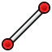

---
 GuiCommand:
   Name: Sketcher CreateLine
   MenuLocation: Sketch , Sketcher geometries , Create line
   Workbenches: Sketcher_Workbench
   Shortcut: **G** **L**
   SeeAlso: Sketcher_CreatePolyline
---

# Sketcher CreateLine

## Description

The  [Sketcher CreateLine](Sketcher_CreateLine.md) tool creates a line. <small>(v1.0)</small> : If [On-View-Parameters](Sketcher_Preferences#General.md) are enabled the tool has three modes.

  

## Usage

See also: [Drawing aids](Sketcher_Workbench#Drawing_aids.md).

Pos-OVP = Positional [On-View-Parameters](Sketcher_Preferences#General.md). <small>(v1.0)</small> 
Dim-OVP = Dimensional On-View-Parameters. <small>(v1.0)</small> 

1.  There are several ways to invoke the tool:
    -   Press the ** [Create line](Sketcher_CreateLine.md)** button.
    -   Select the **Sketcher → Sketcher geometries →  Create line** option from the menu.
    -   Use the keyboard shortcut: **G** then **L**.
2.  The cursor changes to a cross with the current tool mode icon.
3.  If [On-View-Parameters](Sketcher_Preferences#General.md) are enabled the **Line parameters** section (<small>(v1.0)</small> ) is added at the top of the [Sketcher Dialog](Sketcher_Dialog.md).
4.  Optionally press the **M** key or select from the dropdown list in the parameters section to change the tool mode:
    -    **Point, length, angle**: <small>(v1.0)</small> 
        1.  Pick the start point of the line. Or with Pos-OVP: enter its X and/or Y coordinate.
        2.  Pick the endpoint of the line. Or with Dim-OVP: enter the length and/or angle of the line. The angle is relative to the X axis of the sketch.
    -    **Point, width, height**: <small>(v1.0)</small> 
        1.  Pick the start point of the line. Or with Pos-OVP: enter its X and/or Y coordinate.
        2.  Pick the endpoint of the line. Or with Dim-OVP: enter its X and/or Y distance from the start point.
    -    **2 points**:
        1.  Pick the start point of the line. Or with Pos-OVP: enter its X and/or Y coordinate.
        2.  Pick the endpoint of the line. Or with Pos-OVP: enter its X and/or Y coordinate.
5.  The line is created and applicable Pos-OVP and Dim-OVP based constraints are added.
6.  If the tool runs in [continue mode](Sketcher_Workbench#Continue_modes.md):
    1.  Optionally keep creating lines.
    2.  To finish, right-click or press **Esc**, or start another geometry or constraint creation tool.

 {{Sketcher Tools navi}}

---
⏵ [documentation index](../README.md) > [Sketcher](Sketcher_Workbench.md) > Sketcher CreateLine
