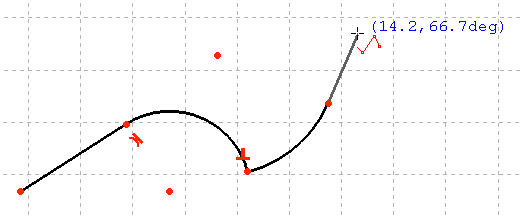

---
 GuiCommand:
   Name: Sketcher CreatePolyline
   MenuLocation: Sketch , Sketcher geometries , Create polyline
   Workbenches: Sketcher_Workbench
   Shortcut: **G** **M**
   SeeAlso: Sketcher_CreateLine
---

# Sketcher CreatePolyline

## Description

The  [Sketcher CreatePolyline](Sketcher_CreatePolyline.md) tool creates a series of line and arc segments connected by their endpoints. The tool has several modes.

  

*Polyline started with a line, a tangent arc, a perpendicular arc then a tangent line.*

## Usage

See also: [Drawing aids](Sketcher_Workbench#Drawing_aids.md).

1.  There are several ways to invoke the tool:
    -   Press the ** [Create polyline](Sketcher_CreatePolyline.md)** button.
    -   Select the **Sketcher → Sketcher geometries →  Create polyline** option from the menu.
    -   Right-click in the [3D view](3D_view.md) and select the ** Create polyline** option from the context menu.
    -   Use the keyboard shortcut: **G** then **M**.
2.  The cursor changes to a cross with the tool icon.
3.  The modes of the tool require a previous segment. Do one of the following:
    -   Pick two points to define a line segment.
    -   Pick the endpoint of an existing line or arc segment ([Auto constraints](Sketcher_Workbench#Auto_constraints.md) must be enabled).
4.  Optionally press the **M** key one or more times to cycle through the modes for the next segment. The available modes are:
    -   Line perpendicular to the previous segment.
    -   Line tangential to the previous segment (this is the initial mode if the previous segment is an arc).
    -   Arc tangential to the previous segment.
    -   Arc perpendicular (left) to the previous segment.
    -   Arc perpendicular (right) to the previous segment.
    -   Line only connected to the previous segment.
5.  While in any of the arc modes, optionally hold down the **Ctrl** key to snap the arc to increments of 45° relative to the previous segment.
6.  Pick the endpoint of the segment.
7.  Optionally repeat this to create more segments.
8.  To finish the input do one of the following:
    -   Snap to the start point to create a closed polyline.
    -   Right-click or press **Esc** to create an open polyline.
9.  The polyline segments have been created and applicable constraints have been added.
10. If the tool runs in [continue mode](Sketcher_Workbench#Continue_modes.md):
    1.  Optionally keep creating polylines.
    2.  To finish, right-click or press **Esc**, or start another geometry or constraint creation tool.

 {{Sketcher_Tools_navi}}

---
⏵ [documentation index](../README.md) > [Sketcher](Sketcher_Workbench.md) > Sketcher CreatePolyline
