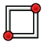

---
 GuiCommand:
   Name: Sketcher CreateRectangle
   MenuLocation: Sketch , Sketcher geometries , Create rectangle
   Workbenches: Sketcher_Workbench
   Shortcut: **G** **R**
   SeeAlso: Sketcher_CreatePolyline
---

# Sketcher CreateRectangle

## Description

The  [Sketcher CreateRectangle](Sketcher_CreateRectangle.md) tool creates a rectangle. <small>(v1.0)</small> : The tool has four modes, two of which can also produce parallelograms. Rounded corners and creating an offset copy are optional features.

  

## Usage

See also: [Drawing aids](Sketcher_Workbench#Drawing_aids.md).

Pos-OVP = Positional [On-View-Parameters](Sketcher_Preferences#General.md). <small>(v1.0)</small> 
Dim-OVP = Dimensional On-View-Parameters. <small>(v1.0)</small> 

1.  There are several ways to invoke the tool:
    -   Press the ** [Rectangle](Sketcher_CreateRectangle.md)** button.
    -   Select the **Sketcher → Sketcher geometries →  Create rectangle** option from the menu.
    -   Right-click in the [3D view](3D_view.md) and select the ** Create rectangle** option from the context menu.
    -   Use the keyboard shortcut: **G** then **R**.
2.  The cursor changes to a cross with the current tool mode icon.
3.  The **Rectangle parameters** section (<small>(v1.0)</small> ) is added at the top of the [Sketcher Dialog](Sketcher_Dialog.md).
4.  Optionally press the **U** key or check the **Rounded corners** checkbox to apply fillets to the rectangle. <small>(v1.0)</small> 
5.  Optionally press the **J** key or check the **Frame** checkbox to create a second offset shape. <small>(v1.0)</small> 
6.  Optionally press the **M** key or select from the dropdown list in the parameters section to change the tool mode:
    -    **Corner, width, height**:
        1.  Pick the first corner of the rectangle. Or with Pos-OVP: enter its X and/or Y coordinate.
        2.  Pick the opposite corner of the rectangle. Or with Dim-OVP: enter the width and/or height of the rectangle.
    -    **Center, width, height**: <small>(v1.0)</small> 
        1.  Pick the center of the rectangle. Or with Pos-OVP: enter its X and/or Y coordinate.
        2.  Pick a corner of the rectangle. Or with Dim-OVP: enter the width and/or height of the rectangle.
    -    **3 corners**: <small>(v1.0)</small> 
        1.  Pick the first corner of the rectangle. Or with Pos-OVP: enter its X and/or Y coordinate.
        2.  Pick the endpoint of the first edge of the rectangle. Or with Dim-OVP: enter the length and/or angle of the first edge. The angle is relative to the X axis of the sketch.
        3.  Pick the third corner, opposite the first, of the rectangle. Or with Dim-OVP: enter the length and/or angle of the second edge. The angle is relative to the first edge. Only if this angle is 90° will the result be a rectangle.
    -    **Center, 2 corners**: <small>(v1.0)</small> 
        1.  Pick the center of the rectangle. Or with Pos-OVP: enter its X and/or Y coordinate.
        2.  Pick the first corner of the rectangle. Or with Pos-OVP: enter its X and/or Y coordinate.
        3.  Pick the second corner of the rectangle. Or with Dim-OVP: enter the length and/or angle of the edge between the first and the second corner. The angle is relative to the other edge connected to the first corner. Only if this angle is 90° will the result be a rectangle.
7.  If **Rounded corners** is selected: Pick a point to define the fillet radius. Or with Dim-OVP: enter it.
8.  If **Frame** is selected: Pick a point to define the offset distance. Or with Dim-OVP: enter it. If the offset is inward and larger than the radius, the offset shape will not have fillets.
9.  The geometry is created and applicable Pos-OVP and Dim-OVP based constraints are added.
10. If the tool runs in [continue mode](Sketcher_Workbench#Continue_modes.md):
    1.  Optionally keep creating rectangles.
    2.  To finish, right-click or press **Esc**, or start another geometry or constraint creation tool.

---
⏵ [documentation index](../README.md) > [Sketcher](Sketcher_Workbench.md) > Sketcher CreateRectangle
