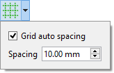

---
 GuiCommand:
   Name: Sketcher Grid
   Workbenches: Sketcher_Workbench
   Version: 0.21
   SeeAlso: Sketcher_Snap
---

# Sketcher Grid

## Description

The  [Sketcher Grid](Sketcher_Grid.md) tool toggles the grid in the sketch currently being edited. Settings can be changed in the related menu.

## Usage

See also: [Sketcher Preferences](Sketcher_Preferences#Grid.md).

1.  Press the ** [Toggle grid](Sketcher_Grid.md)** button to toggle the grid. The grid can also be toggled by changing the **Show Grid** property of the sketch.
2.  Optionally click on the down arrow to the right of the button to open the menu:
    
    -   If the **Grid auto spacing** checkbox is checked, grid spacing is automatically adapted based on the view dimensions. Stored in the **Grid Auto** property of the sketch.

    -   
        **Spacing**
        
        specifies the distance between two subsequent grid lines. Used as a base value if **Grid auto spacing** is enabled. Stored in the **Grid Size** property of the sketch.

 {{Sketcher_Tools_navi}}

---
⏵ [documentation index](../README.md) > [Sketcher](Sketcher_Workbench.md) > Sketcher Grid
