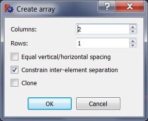

---
- GuiCommand:
   Name:Sketcher RectangularArray
   MenuLocation:Sketch → Sketcher tools → Rectangular array
   Workbenches:[Sketcher](Sketcher_Workbench.md)
   Version:0.16
---

# Sketcher RectangularArray

## Description

Creates an array of selected sketcher elements.

## Usage

1.  Select sketcher elements in [task panel](task_panel.md) or in [3D view](3D_view.md).
2.  There are several ways to invoke the command:
    -   Press the ** [Rectangular array](Sketcher_RectangularArray.md)** button.
    -   Select the **Sketch → Sketcher tools →  Rectangular array** option from the menu.
3.  Specify the options for the array in the dialog that opens.
4.  Press the **OK** button.
5.  Select a reference point in the [3D view](3D_view.md) to create the array.

   *Array options.*

 {{Sketcher Tools navi}}

---
[documentation index](../README.md) > [Sketcher](Sketcher_Workbench.md) > Sketcher RectangularArray
