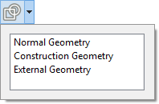

---
- GuiCommand:
   Name:Sketcher RenderingOrder
   Workbenches:[Sketcher](Sketcher_Workbench.md)
   Version:0.21
---

# Sketcher RenderingOrder

## Description

The **Sketcher RenderingOrder** command itself currently does not do anything. But in the related menu the rendering order of all sketches can be changed.

In case of coincident objects, the rendering order determines which elements appear on top, and are therefore selected first, in the [3D view](3D_view.md).

## Usage

1.  Click on the down arrow to the right of the ** [Configure rendering order](Sketcher_RenderingOrder.md)** button.
2.  The rendering order list opens:
    
3.  Drag individual list items to change the rendering order.
4.  The button will change to match the first item in the list.
5.  Click outside the list to finish.

 {{Sketcher_Tools_navi}}

---
 [documentation index](../README.md) > [Sketcher](Sketcher_Workbench.md) > Sketcher RenderingOrder
