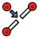

---
 GuiCommand:
   Name: Sketcher Split
   MenuLocation: Sketch , Sketcher tools , Split edge
   Workbenches: Sketcher_Workbench
   Shortcut: **G** **Z**
   Version: 0.20
   SeeAlso: Sketcher_Trimming
---

# Sketcher Split

## Description

The  [Sketcher Split](Sketcher_Split.md) tool splits an edge. If the edge is a closed curve (i.e. a circle, an ellipse or a periodic B-spline) it is converted to an open curve (an arc, an arc of ellipse or a non-periodic B-spline respectively).

## Usage

See also: [Drawing aids](Sketcher_Workbench#Drawing_aids.md).

1.  There are several ways to invoke the tool:
    -   Press the ** [Split edge](Sketcher_Split.md)** button.
    -   Select the **Sketcher → Sketcher tools →  Split edge** option from the menu.
    -   Use the keyboard shortcut: **G** then **Z**.
2.  If there is a previous selection it is cleared. The tool does not accept a pre-selection.
3.  The cursor changes to a cross with the tool icon.
4.  Click an edge at the point where it should be split.
5.  If the original edge is a line or an open curve, two new edges are created connected by a [Coincident constraint](Sketcher_ConstrainCoincident.md). For closed curves a new open curve is created, the new point then does not receive a Coincident constraint. Existing applicable constraints are transferred to the new edge(s). See [Notes](#Notes.md).
6.  This tool always runs in continue mode: optionally keep splitting edges.
7.  To finish, click in an empty area in the [3D view](3D_view.md), right-click or press **Esc**, or start another geometry or constraint creation tool.

## Notes

-   A [Coincident](Sketcher_ConstrainCoincident.md) constraint is applied to the center points of new arcs.
-   [Radius](Sketcher_ConstrainRadius.md) and [Diameter](Sketcher_ConstrainDiameter.md) constraints are copied to new arcs (resulting in a redundancy).
-   Coincident constraints and [Point on object](Sketcher_ConstrainPointOnObject.md) constraints are transferred to the closest new edge.
-   [Horizontal](Sketcher_ConstrainHorizontal.md) and [Vertical](Sketcher_ConstrainVertical.md) constraints between points are transferred to the closest new edge.
-   Horizontal and Vertical constraints attached to lines are copied to new line segments.
-   [Parallel](Sketcher_ConstrainParallel.md) and [Perpendicular](Sketcher_ConstrainPerpendicular.md) constraints are copied to new line segments, for new arcs they are only copied to the closest.
-   [Horizontal distance](Sketcher_ConstrainDistanceX.md), [Vertical distance](Sketcher_ConstrainDistanceY.md) and [Distance](Sketcher_ConstrainDistance.md) constraints are transferred to the closest new edge.
-   [Angle](Sketcher_ConstrainAngle.md), [Symmetric](Sketcher_ConstrainSymmetric.md) and [Block](Sketcher_ConstrainBlock.md) constraints are currently not transferred.

 {{Sketcher_Tools_navi}}

---
⏵ [documentation index](../README.md) > [Sketcher](Sketcher_Workbench.md) > Sketcher Split
