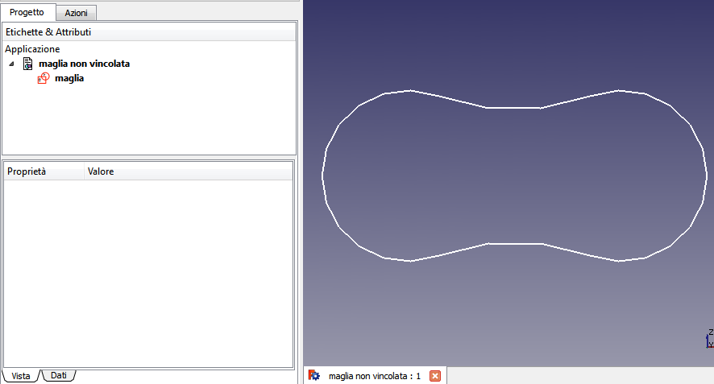

# Soluzione1
**pagina in costruzione**

# Costruzione di contorno non vincolato 

\_\_\_TOC\_\_\_

## Preparare l\'ambiente 

-   Avviare l\'ambiente **Sketcher**
-   Creare un **Nuovo file** (documento)
-   Cliccare sull\'icona **Crea un nuovo sketch**. Si apre il dialogo per l\'orientamento
-   Scegliere il piano **XZ**
-   Impostare una griglia con maglie di **10 mm**
-   Ruotare la rotella del mouse per ingrandire la griglia
-   Premere **Ctrl+Alt** + **destro del mouse** e spostare la griglia
-   Attivare **Snap alla griglia**
-   Attivare **Vincoli automatici**

## Disegnare le linee di costruzione 

-   Selezionare lo strumento **Polilinea** e tracciare un rombo
-   Con lo strumento **Linea** tracciare la diagonale minore
    -   Fissare i punti quando quelli presenti assumono il colore **bianco**

-   Selezionare tutte i segmenti del rombo
-   Cliccare sullo strumento **Linea di costruzione**
-   Notare che tutti gli oggetti assumono il colore **blu**

## Disegnare il contorno 

-   Avviare lo strumento **Arco** e con centro nei vertici del poligono tracciare gli archi del contorno
    -   Notare il prodursi dei vincoli automatici

-   Chiudere lo strumento Schizzo
    -   Notare che è visibile solo il contorno

-   Rinominare lo schizzo in **Maglia**
    -   Notare che attribuire dei **nomi descrittivi** agli oggetti è molto utile

Torna a [Esercitazioni](Esercitazioni.md)

{{languages/it | }}

---
 [documentation index](../README.md) > Soluzione1
