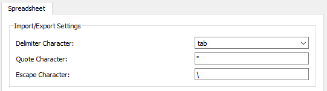

# Spreadsheet Preferences
The preferences for the  [Spreadsheet Workbench](Spreadsheet_Workbench.md) (<small>(v0.20)</small> ) can be found in the [Preferences Editor](Preferences_Editor.md). In the menu select **Edit → Preferences...** and then **Spreadsheet**. This section is only available after opening a document containing a spreadsheet object, after visiting the workbench or after loading the workbench via the *Available Workbenches* tab in the **Workbenches** section.

There is only one tab: *Spreadsheet* in the **Spreadsheet** section. On this tab you can specify the following:

+++
| Name                                | Description                                                              |
+=====================================+==========================================================================+
|                      | The character used as field delimiter.                                   |
| **Delimiter Character** |                                                                          |
|                                  |                                                                          |
+++
|                      | The character used to delimit strings.                                   |
| **Quote Character**     |                                                                          |
|                                  |                                                                          |
+++
|                      | The character used to prevent the following character from being parsed. |
| **Escape Character**    |                                                                          |
|                                  |                                                                          |
+++
|                                     |                                                                          |
+++

 
*The Spreadsheet tab*

 {{Spreadsheet_Tools_navi}}

---
 [documentation index](../README.md) > [Preferences](Category_Preferences.md) > [Spreadsheet](Spreadsheet_Workbench.md) > Spreadsheet Preferences
