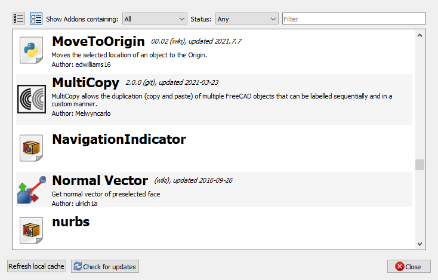

---
- GuiCommand   *
   Name   *Std AddonMgr
   MenuLocation   *Tools → Addon manager
   Workbenches   *All
   Version   *0.17
   SeeAlso   *[External workbenches](External_workbenches.md), [Macros](Macros.md)
---

# Std AddonMgr

## Description

The **Std AddonMgr** command opens the Addon manager. With the Addon manager you can install and manage [external workbenches](external_workbenches.md) and [macros](macros.md) provided by the FreeCAD community. The available workbenches and macros are taken from two repositories, [FreeCAD-addons](https   *//github.com/FreeCAD/FreeCAD-addons/) and [FreeCAD-macros](https   *//github.com/FreeCAD/FreeCAD-macros/), and from the [Macros recipes](Macros_recipes.md) page.

Due to changes to the GitHub platform in the year 2020 the Addon manager no longer works if you use FreeCAD version 0.17 or earlier. You need to upgrade to version [0.18.5](https   *//github.com/FreeCAD/FreeCAD/releases/tag/0.18.5) or a recent [0.19](https   *//github.com/FreeCAD/FreeCAD/releases/tag/0.19_pre) version. Alternatively you can install addons manually, see [Notes](#Notes.md) below.

   
*The v0.19.x Addon manager dialog box*

## Usage

1.  Select the **Tools →  Addon manager** option from the menu.
2.  If you are using the Addon manager for the first time, a dialog box will open warning you that the addons in the Addon manager are not officially part of FreeCAD. Press the **OK** button to confirm and continue.
3.  The Addon manager dialog box opens. For more information see [Options](#Options.md).
4.  The ** Update all** button does not work at this time.
5.  Press the ** Close** button to close the dialog box.
6.  If you have installed or updated a workbench a new dialog box will open informing you that you have to restart FreeCAD for the changes to take effect.

## Options

The Addon manager dialog box has two tabs on the left, one listing the available workbenches and the other listing the available macros. The information panel on the right will display the homepage of the selected addon.

### Uninstall

1.  Select an installed addon on the  **Workbenches** tab or the  **Macros** tab.
2.  Press the ** Uninstall selected** button.

### Install/update

1.  Select an addon on the  **Workbenches** tab or the  **Macros** tab.
2.  Press the ** Install/update selected** button.
3.  If you want to add a macro to a custom toolbar then don\'t forget to manually download the icon image file, if available, by clicking on the link on the homepage in the information panel. See [Interface Customization](Interface_Customization#Toolbars.md).
4.  To change the position of an addon workbench in the [Workbench selector](Std_Workbench.md) list see [Interface Customization](Interface_Customization#Workbenches.md).

### Configuration

1.  Press the ** Configure...** button.
2.  The Addon manager options dialog box opens.
3.  Optionally check the {{CheckBox|TRUE|Automatically check for updates at start (requires GitPython)}} checkbox.
4.  Optionally add repositories to the **Custom repositories** list. Addons from these repositories will be added on the  **Workbenches** tab or the  **Macros** tab.
5.  Optionally choose proxy settings.
6.  Press the **OK** button or the **Cancel** button to close the dialog box.

## Notes

-   The use of addons is not restricted to the FreeCAD version they were installed from. You will also be able to use them in any other FreeCAD version, supported by the addon, that you may have on your system.
-   The addons available in the Addon manager are not part of the official FreeCAD program and are not supported by the core FreeCAD development team. You should read the provided information carefully to make sure you know what you are installing.
-   Bug reports and feature requests should be made directly to the creator of the addon by visiting the indicated website. Many addon developers are regular users of the [FreeCAD forum](https   *//forum.freecadweb.org), and can also be contacted there.
-   If the [GitPython](https   *//github.com/gitpython-developers/GitPython) package is installed on your computer the Addon manager will make use of it, making downloads faster.
-   You can also install addons manually. See [How to install additional workbenches](How_to_install_additional_workbenches.md) and [How to install macros](How_to_install_macros.md).

## Information for developers 

See [Addon](Addon#Information_for_developers.md).

## Changes coming in FreeCAD 0.20 

The Addon Manager saw a major revision in 0.20, most notably adding support for modern SSL standards, but also undergoing a visual refresh and some added user-interface features. The preferences for Addon Manager can be found in the [Preferences Editor](Preferences_Editor#Addon_manager_options.md).

<table>

<tr>

<td>

</td>

<td>

1.  \"Condensed\" and \"Expanded\" views available. \"Expanded\" view is shown here.
2.  Three different types of addons are now supported   * Workbenches, Macros, and Preference Packs. You can choose to show just one type, or all of them in a single list.
3.  The list can be limited to show just installed packages, just packages with available updates, or just packages that are not yet installed.
4.  The list can be filtered, searching for a keyword in the title, description, and tags (description and tags must be specified by the addon developer in their addon\'s metadata). The filter can even be a regular expression, for fine-grained control of the exact search term.
5.  The expanded view shows available version information, description, maintainer information, and installation version information, for packages that provide a [Package\_Metadata](Package_Metadata.md) file (or for macros with embedded metadata).
6.  Metadata and icons are cached locally, with a variable cache update frequency set in the user preferences.
7.  Update checks may be set up to be automatic, or done manually via a button click. Configured in user preferences.

</td>

</tr>

</table>

 {{Std Base navi}}

---
 [documentation index](../README.md) > Std AddonMgr
