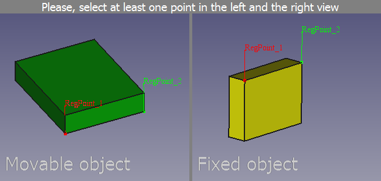

---
- GuiCommand:
   Name: Std Alignment
   MenuLocation: Edit -> Alignment...
   Workbenches: All
   SeeAlso: Std_Placement
---

# Std Alignment

## Description

The **Std Alignment** command aligns an object in relation to a fixed reference object using one or more point pairs.

   
*The command interface after two point pairs have been defined*

## Usage

1.  Select the reference object. This will be the fixed object and not be changed.
2.  Hold down the **Ctrl** key while you select the object whose placement you want to change.
3.  Select the **Edit → Alignment...** option from the menu.
4.  A new window will appear in the [Main view area](Main_view_area.md). This window consists of two views: on the left the movable object is displayed and on the right the fixed object.
5.  Define the first point pair by clicking a point in each view. This point pair is used to move the movable object.
6.  Define one or two more point pairs if you also want to rotate the movable object.
7.  Right-click one of the views and select the **Align** option from the context menu to complete the command.

## Options

The following additional options are available in the context menu:

-   Select the **Remove last point** option to remove the last point in the view.
-   Select the **Cancel** option to abort the command.
-   Check the **Syncronize views** option if any view changes (pan, rotate and zoom) should be applied to both views.

 {{Std Base navi}}

---
⏵ [documentation index](../README.md) > Std Alignment
