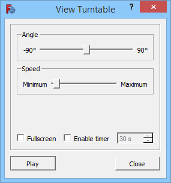

---
 GuiCommand:
   Name: Std DemoMode
   MenuLocation: Tools , View turntable...
   Workbenches: All
---

# Std DemoMode

## Description

The **Std DemoMode** command will continuously rotate the camera in a [3D view](3D_view.md).

   
*The View Turntable dialog box*

## Usage

1.  Select the **Tools →  View turntable...** option from the menu.
2.  The View Turntable dialog box opens.
3.  Move the **Angle** slider to tilt the camera\'s virtual turn table.
4.  Move the **Speed** slider to adjust the rotation speed of the camera.
5.  Check the {{CheckBox|TRUE|Fullscreen}} checkbox to switch the 3D view to fullscreen mode.
6.  The {{CheckBox|FALSE|Enable timer}} option is not supported at this time.
7.  Press the **Play** button. The button will stay pushed in and its text will change to **Stop**.
8.  In fullscreen mode the dialog will disappear after ca. 5 seconds. It will reappear if the mouse is moved over the 3D view.
9.  Press the **Stop** button to stop the camera rotation.
10. Optionally change settings and restart.
11. Press the **Close** button to close the dialog box.

## Notes

-   For more information about fullscreen mode see the [Std ViewFullscreen](Std_ViewFullscreen.md) command.

 {{Std Base navi}}

---
⏵ [documentation index](../README.md) > Std DemoMode
