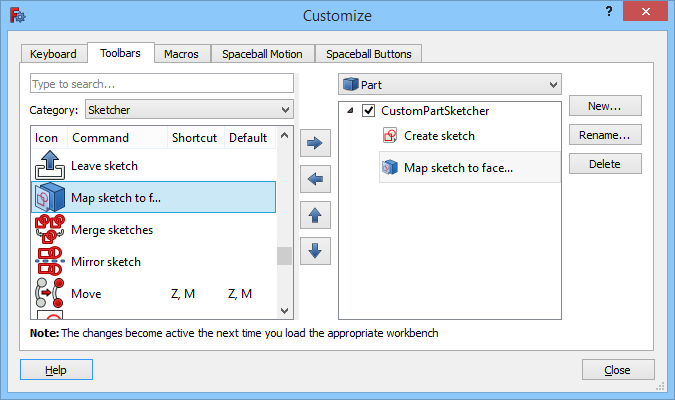

---
- GuiCommand:
   Name:Std DlgCustomize
   MenuLocation:Tools → Customize...
   Workbenches:All
   SeeAlso:[Interface Customization](Interface_Customization.md)
---

# Std DlgCustomize

## Description

The **Std DlgCustomize** command opens the Customize dialog box giving access to several customization options.

  

*The Customize dialog box*

## Usage

1.  The commands available in the Customize dialog box depend on the workbenches that have been loaded in the current FreeCAD session. So you should first load all workbenches whose commands you want to have access to.
2.  There are several ways to invoke the command:
    -   Select the **Tools →  Customize...** option from the menu.
    -   Right-click a toolbar area and choose ** Customize...** from the context menu.
3.  The Customize dialog box opens. For more information see [Interface Customization](Interface_Customization#Options.md).
4.  The **Help** button does not work at this time.
5.  Press the **Close** button to close the dialog box.

 {{Std Base navi}}

---
 [documentation index](../README.md) > Std DlgCustomize
