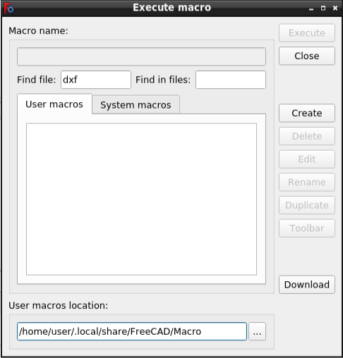

---
- GuiCommand:
   Name: Std DlgMacroExecute
   MenuLocation: Macro -> Macros...
   Workbenches: All
   SeeAlso: Std_DlgMacroExecuteDirect
---

# Std DlgMacroExecute

## Description

The **Std DlgMacroExecute** command opens the Execute macro dialog box. From this dialog box macros can be executed, edited and managed.

   
*The Execute macro dialog box*

## Usage

1.  There are several ways to invoke the command:
    -   Press the ** [Std DlgMacroExecute](Std_DlgMacroExecute.md)** button.
    -   Select the **Macro →  Macros...** option from the menu.
2.  The Execute macro dialog box opens. See [Options](#Options.md).

## Options

### User macros 

1.  The **User macros** tab lists the macros available in the **User macros location**.
2.  Click a macro to select it.
3.  The name of the selected macro will appear in the **Macro name** box.

### System macros 

:   The **System macros** tab is not used at this time.

### User macros location 

1.  Press the **...** button to change the user macros location.
2.  Browse to a different folder and select it.

### Execute

1.  To execute a macro do one of the following:
    -   Select the macro in the list and press the **Execute** button.
    -   Double-click the macro in the list.
2.  The dialog box closes.
3.  The macro is executed.

### Close

1.  Press **Esc** or the **Close** button to close the dialog box.

### Create

1.  Press the **Create** button to create a new macro file.
2.  Enter a name in the dialog box that pops up. You do not have to include the **.FCMacro** extension.
3.  Press **Enter** or the **OK** button.
4.  Both dialog boxes close.
5.  The new file is opened in the Macro editor.

### Delete

1.  Select the macro you want to delete in the list.
2.  Press the **Delete** button.
3.  Press the **Yes** button in the confirmation dialog box that pops up.

### Edit

1.  Select the macro you want to edit in the list.
2.  Press the **Edit** button.
3.  The dialog box closes.
4.  The selected file is opened in the Macro editor.

### Rename

1.  Select the macro you want to rename in the list.
2.  Press the **Rename** button.
3.  Enter a new name in the dialog box that pops up. You do not have to include the **.FCMacro** extension.
4.  Press **Enter** or the **OK** button.

### Duplicate

1.  Select the macro you want to duplicate in the list.
2.  Press the **Duplicate** button.
3.  Enter a new name in the dialog box that pops up. You do not have to include the **.FCMacro** extension.
4.  Press **Enter** or the **OK** button.

### Toolbar

1.  Select the macro you want to add to a custom toolbar in the list.
2.  Press the **Toolbar** button.
3.  Two \'walkthrough\' dialogs will guide you through the required steps. See [Interface Customization](Interface_Customization.md) for more information.

### Download

1.  Press the **Download** button to start the [Addon manager](Std_AddonMgr.md).

## Notes

-   To learn more about macros see the [Macros](Macros.md) page.

## Preferences

-   The user macros location can also be changed in the preferences: **Edit → Preferences... → Python → Macro → Macro path**. See [Preferences Editor](Preferences_Editor#Macro.md).

 {{Std Base navi}}

---
⏵ [documentation index](../README.md) > Std DlgMacroExecute
