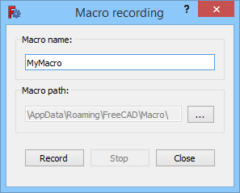

---
 GuiCommand:
   Name: Std DlgMacroRecord
   MenuLocation: Macro , Macro recording...
   Workbenches: All
   SeeAlso: Std_MacroStopRecord
---

# Std DlgMacroRecord

## Description

The **Std DlgMacroRecord** command starts a [macro](Macros.md) recording session during which user actions are stored in a FreeCAD macro, a file with the **.FCMacro** extension. A macro can later be replayed, executed, to repeat the recorded actions.

   
*The Macro recording dialog box*

## Usage

1.  There are several ways to invoke the command:
    -   Press the ** [Macro recording...](Std_DlgMacroRecord.md)** button.
    -   Select the **Macro →  Macro recording...** option from the menu.
2.  The **Macro recording** dialog box opens.
3.  Enter a name for the macro in the **Macro name** input box.
4.  Optionally change the **Macro path** by pressing the **...** button.
5.  The **Stop** button does not work at this time.
6.  Press the **Record** button to close the dialog box and start the recording session.
7.  The button image of the command changes to **** and the menu text changes to **Stop macro recording**.
8.  Perform the actions you want to record.
9.  To end the recording session do one of the following:
    -   Press the ** [Stop macro recording](Std_DlgMacroRecord.md)** button.
    -   Select the **Macro →  Stop macro recording** option from the menu.

## Options

-   When the Macro recording dialog box is displayed: press **Esc** or the **Close** button to abort the command.

## Notes

-   To execute the recorded macro use the [Std DlgMacroExecute](Std_DlgMacroExecute.md) command.
-   To learn more about macros see the [Macros](Macros.md) page.

## Preferences

See also: [Preferences Editor](Preferences_Editor.md).

-   The macro path can also be changed in the preferences: **Edit → Preferences... → Python → Macro → Macro path**.
-   In most cases it is undesirable to record actions that do not change the model: under **Edit → Preferences... → Python → Macro → GUI commands** do one of the following:
    -   To exclude these actions uncheck the **Record GUI commands** checkbox.
    -   To include them as comments only, check both the **Record GUI commands** and **Record as comment** checkboxes.

 {{Std_Base_navi}}

---
⏵ [documentation index](../README.md) > Std DlgMacroRecord
