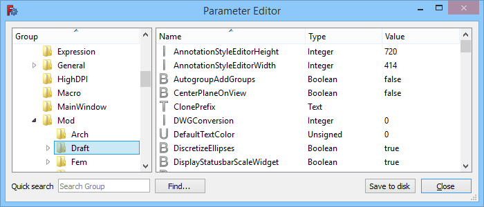

---
- GuiCommand:
   Name:Std DlgParameter
   MenuLocation:Tools → Edit parameters...
   Workbenches:All
   SeeAlso:[Preferences Editor](Preferences_Editor.md)
---

# Std DlgParameter

## Description

The **Std DlgParameter** command opens the Parameter Editor. In the Parameter Editor the parameters that control the behavior of FreeCAD and its workbenches can be inspected and optionally removed, added or changed. The parameters are stored in a file called **user.cfg**, the location of this file depends on your OS.

Working with the Parameter Editor requires some experience. For the most common parameters you can also use the more convenient [Preferences Editor](Preferences_Editor.md).

   
*The Parameter Editor dialog box*

## Usage

1.  Select the **Tools →  Edit parameters...** option from the menu.
2.  The Parameter Editor dialog box opens. For more information see [Options](#Options.md).
3.  Optionally press the **Save to disk** button to immediately update the **user.cfg** file. This is not required as FreeCAD will automatically update that file when the application closes.
4.  Press the **Close** button to close the Parameter Editor.

## Options

### Left panel 

The left panel shows a tree with parameter groups and sub-groups.

*The following options are available in the panel\'s context menu:*

#### Expand/Collapse

1.  If a selected group has one or more sub-groups it can be expanded or collapsed by choosing this option from the context menu. But you can also expand and collapse the tree in the usual manner.

#### Add sub-group 

1.  Select a group.
2.  Select the **Add sub-group** option from the context menu.
3.  Enter a name for the new sub-group in the dialog box that opens.
4.  Press the **OK** button.

#### Remove group 

1.  Select a group.
2.  Select the **Remove group** option from the context menu.
3.  Press the **Yes** button in the dialog box that opens to confirm you want to remove the group (including all its sub-groups, and all parameters in the group and its sub-groups).

#### Rename group 

1.  Select a group.
2.  Select the **Rename group** option from the context menu.
3.  Enter a new name.
4.  A group can also be renamed by double-clicking it.

#### Export parameter 

1.  Select a group.
2.  Select the **Export parameter** option from the context menu.
3.  Enter a filename in the dialog box.
4.  Press the **Save** button.

#### Import parameter 

1.  Select a group that does not contain any sub-groups or remove them first. Any existing parameters in the group will be lost.
2.  Select the **Import parameter** option from the context menu.
3.  Select a \*.FCParam file in the dialog box.
4.  Press the **Open** button.

### Right panel 

The right panel shows the parameters in the group selected in the left panel. If this group only contains sub-groups the right panel will be empty.

*The following options are available in the panel\'s context menu:*

#### Change value 

1.  Select a parameter.
2.  Select the **Change value** option from the context menu.
3.  Enter a new value in the dialog box that opens.
4.  Press the **OK** button.
5.  A parameter\'s value can also be changed by double-clicking its \'Type\' or \'Value\' field.

#### Remove key 

1.  Select a parameter.
2.  Select the **Remove key** option from the context menu.

#### Rename key 

1.  Select a parameter.
2.  Select the **Rename key** option from the context menu.
3.  Enter a new name.
4.  A parameter can also be renamed by double-clicking its \'Name\' field.

#### New string item 

1.  Select the **New string item** or **New → New string item** option from the context menu.
2.  Enter a name in the dialog box that opens.
3.  Press the **OK** button.
4.  Enter a value in the next dialog box.
5.  Press the **OK** button.

#### New float item 

1.  Select the **New float item** or **New → New float item** option from the context menu.
2.  The next steps are similar to those for a [New string item](#New_string_item.md)

#### New integer item 

1.  Select the **New integer item** or **New → New integer item** option from the context menu.
2.  The next steps are similar to those for a [New string item](#New_string_item.md)

#### New unsigned item 

1.  Select the **New unsigned item** or **New → New unsigned item** option from the context menu.
2.  The next steps are similar to those for a [New string item](#New_string_item.md)

#### New Boolean item 

1.  Select the **New Boolean item** or **New → New Boolean item** option from the context menu.
2.  The next steps are similar to those for a [New string item](#New_string_item.md)

### Sorting

By default the groups in each tree level in the left panel are sorted alphabetically, and the parameters in the right panel are sorted alphabetically as well. But the order in each panel can be reversed by clicking the \'Group\' or \'Name\' header respectively.

### Quick search 

Typing a (partial) string in this input box will fully expand the tree in the left panel and highlight all groups with names that match the entered value. If no matches are found the background of the input box will turn red.

### Find

1.  In the left panel select the group where you want to start your search. The search direction is down. The search is not restricted to the group and its sub-groups, but rather the selected group and everything below it in the tree will be searched.
2.  Press the **Find...** button.
3.  Enter a string in the **Find what** input box. The search is case-insensitive.
4.  Check one or more of the {{CheckBox|TRUE|Groups}}, {{CheckBox|TRUE|Names}} and {{CheckBox|TRUE|Values}} checkboxes. Note that only string values will be searched.
5.  Optionally (un)check the {{CheckBox|TRUE|Match whole string only}} checkbox.
6.  Press the **Find Next** button to select the first group with a match. Matching parameters are not individually highlighted. Optionally repeat this until no further matches can be found.
7.  It is possible to start a new search without closing the dialog box. Again selecting the group from which to start searching is then usually required.
8.  Use the **Cancel** button to close the dialog box.

## Notes

-   The [Fine-tuning](Fine-tuning.md) page lists a number of parameters that may be of interest.

## Scripting


**See also:**

[FreeCAD Scripting Basics](FreeCAD_Scripting_Basics.md).

Preferences can be accessed from Python scripts using their corresponding path in the [Parameter Editor](Std_DlgParameter.md). For example, the  
```python
# get:
App.ParamGet("User parameter:BaseApp/Preferences/Mod/Draft").GetBool('dxfCreatePart')
# set:
App.ParamGet("User parameter:BaseApp/Preferences/Mod/Draft").SetBool('dxfCreatePart', True)
```

Finding which parameter is used to store which option from the Preferences editor can require searching a bit, but the [Parameter Editor](Std_DlgParameter.md) offers a search facility, which should help.

It is likely a bad idea to modify the preferences of other parts of FreeCAD unless doing so at the user\'s request. The setter can however be used to set parameters for your own workbench, and the getter can be used to obey existing parameters.


 {{Std Base navi}}


---
 [documentation index](../README.md) > Std DlgParameter
